# 功能测试 Bug 报告

## 1. 报告范围

本报告记录当前已经实际执行的登录、注册、小组管理、成员权限、任务管理、讨论实时消息、文件资料共享、通知、Dashboard、个人资料与密码及管理员模块测试中发现的问题。各模块结果见对应 `test-execution-*.md`；管理员模块结果见 [`test-execution-admin.md`](./test-execution-admin.md)。未执行场景和仅通过源码推测的问题不列入本报告；没有明确需求依据的问题会标注为“业务规则缺口 / 可疑缺陷”或“需求待确认 / 权限与隐私风险候选”。

| 记录编号 | 问题标题 | 关联场景 | 问题性质 | 严重程度 | 优先级 | 状态 |
| --- | --- | --- | --- | --- | --- | --- |
| BUG-LR-001 | 重复用户名或邮箱注册返回 500 | REGISTER-003、REGISTER-004 | 已确认缺陷 | 中 | P2 | 待修复 |
| BUG-LR-002 | 后端允许设置 1 位密码并成功登录 | REGISTER-011、PWD-005、ADMIN-005 | 已确认缺陷 | 高 | P1 | 待修复 |
| BUG-LR-003 | 后端用户接口缺少邮箱格式校验，可写入非法邮箱 | REGISTER-010、PROF-005、ADMIN-005 | 已确认缺陷 | 中 | P1 | 待修复 |
| BUG-PROF-001 | 旧用户资料接口数据库失败仍返回 HTTP 200 | PROF-005 | 已确认缺陷 | 中 | P2 | 待修复 |
| BUG-TASK-001 | 普通任务接口缺少小组成员权限校验 | TASK-006～TASK-010 | 已确认缺陷 | 高 | P0 | 待修复 |
| BUG-TASK-002 | 后端允许纯空格任务内容落库 | TASK-012 | 已确认缺陷 | 中 | P1 | 待修复 |
| BUG-TASK-003 | 普通任务接口错误状态码语义不正确 | TASK-013-B～TASK-013-E | 已确认缺陷 | 中 | P2 | 待修复 |
| BUG-TASK-004 | 非法 group_id 未提前校验并暴露数据库错误 | TASK-013-F | 已确认缺陷 | 中 | P1 | 待修复 |
| BUG-DISC-001 | 讨论REST接口缺少小组成员授权校验 | DISC-007、DISC-008、DISC-MENTION-006 | 已确认缺陷 | 高 | P0 | 待修复 |
| BUG-DISC-002 | Socket.IO缺少认证与房间成员授权 | DISC-006 | 已确认缺陷 | 高 | P0 | 待修复 |
| BUG-DISC-003 | 讨论group id及资源存在性校验不完整 | DISC-011、DISC-012 | 已确认缺陷 | 中 | P2 | 待修复 |
| BUG-FILE-001 | 普通文件REST接口缺少认证、小组成员与资源所有权授权 | FILE-005、FILE-006、FILE-012、FILE-013、FILE-014 | 已确认缺陷 | 高 | P0 | 待修复 |
| BUG-FILE-002 | 上传接口信任客户端uploader_id，允许匿名伪造资源归属 | FILE-007 | 已确认缺陷 | 高 | P0 | 待修复 |
| BUG-FILE-003 | 公开uploads静态资源缺少认证与小组授权 | FILE-008；FILE-010增强影响 | 已确认缺陷 | 高 | P0 | 待修复 |
| BUG-FILE-004 | 文件类型与MIME安全校验缺失 | FILE-010 | 已确认缺陷 | 高 | P0 | 待修复 |
| BUG-FILE-005 | groupId与fileId参数格式校验过宽 | FILE-011-B、FILE-014 | 已确认缺陷 | 中 | P1 | 待修复 |
| BUG-FILE-006 | 上传失败后未回滚物理文件 | FILE-011-A | 已确认缺陷 | 中 | P1 | 待修复 |
| BUG-FILE-007 | 资料集锦获取链接使用错误origin | FILE-004-B | 已确认缺陷 | 中 | P1 | 待修复 |
| BUG-NOTIF-001 | notification id使用宽松整数解析 | NOTIF-009 | 已确认缺陷 | 中 | P1 | 待修复 |
| BUG-ADMIN-001 | 管理员用户接口使用宽松整数ID解析 | ADMIN-005 | 已确认缺陷 | 中 | P1 | 待修复 |
| BUG-ADMIN-002 | 管理员强制解散小组后残留物理上传文件 | ADMIN-008 | 已确认缺陷 | 中 | P1 | 待修复 |
| BUG-GR-001 | 系统允许创建重复名称的小组 | GROUP-003 | 业务规则缺口 / 可疑缺陷 | 低（待确认） | P3 | 待产品确认 |
| RISK-GM-001 | 非成员可读取小组成员邮箱等信息 | GROUP-PERM-001-3 | 需求待确认 / 权限与隐私风险候选 | 待确认 | 待确认 | 待需求确认 |
| RISK-FILE-001 | 系统允许上传并保存零字节文件 | FILE-009-B | 需求待确认 / 风险候选 | 待确认 | 待确认 | 待需求确认 |
| RISK-FILE-002 | 文件上传未配置单文件大小限制 | FILE-017 | 需求待确认 / 安全风险候选 | 待确认 | 待确认 | 待需求确认 |
| RISK-PROF-001 | 密码修改后既有 token 仍然有效 | PWD-004 | 会话安全规则待确认 / 风险候选 | 待确认 | 待确认 | 待需求确认 |
| RISK-DISC-MENTION-001 | 讨论区允许用户提及自己 | DISC-MENTION-003 | 业务规则待确认 / 风险候选 | 待确认 | 待确认 | 待需求确认 |
| RISK-DISC-MENTION-002 | 后端不校验mention用户真实性和成员关系 | DISC-MENTION-004 | 真实性校验风险候选 | 待确认 | 待确认 | 待需求确认 |
| RISK-DISC-MENTION-003 | 重复mention和重复消息不去重 | DISC-MENTION-005 | 业务规则待确认 / 风险候选 | 待确认 | 待确认 | 待需求确认 |
| RISK-NOTIF-001 | pending邀请已读后仍计入“未读消息” | NOTIF-003 | 业务语义待确认 / 风险候选 | 待确认 | 待确认 | 待需求确认 |
| RISK-ADMIN-001 | 第二管理员的列表、登录权限与重启后角色不一致 | ADMIN-006 | 管理员角色规则待确认 / 风险候选 | 待确认 | 待确认 | 待需求确认 |

## BUG-LR-001：重复用户名或邮箱注册返回 500

### 基本信息

| 项目 | 内容 |
| --- | --- |
| 所属模块 | 注册 |
| 关联用例 | REGISTER-003、REGISTER-004 |
| 严重程度 | 中 |
| 优先级 | P2 |
| 状态 | 待修复 |
| 执行环境 | Windows；前端 `http://localhost:5173`；后端端口 `3001`；本地 MySQL |

### 前置条件

- 场景一：数据库中已存在用户名 `qa_user01`，并准备一个未使用的邮箱。
- 场景二：数据库中已存在邮箱 `qa.user01@example.com`，并准备一个未使用的用户名。
- 前端、后端和数据库均已启动。

### 测试数据

| 字段 | 数据 |
| --- | --- |
| 重复用户名场景 | 用户名 `qa_user01`（已存在）；邮箱 `qa.user02@example.com`（未使用） |
| 重复邮箱场景 | 用户名 `qa_new_name`（未使用）；邮箱 `qa.user01@example.com`（已存在） |
| 密码 | 合法非空密码，截图中已遮罩 |

### 复现步骤

1. 打开注册页面。
2. 分别使用“已存在用户名 + 新邮箱”和“新用户名 + 已存在邮箱”填写注册信息。
3. 输入合法非空密码。
4. 点击“注册”。
5. 在浏览器 Network 面板查看每次 `register` 请求。

### 预期结果

- 系统不创建重复用户。
- 页面提示用户名或邮箱已存在。
- 接口使用 `409 Conflict` 表示唯一字段冲突，使客户端能够区分业务冲突和服务器内部错误。

### 实际结果

- 重复用户名与重复邮箱两次测试中，页面均显示“注册失败，用户名或邮箱可能已存在”。
- 两次 `register` 请求均实际返回 `500 Internal Server Error`。
- REGISTER-003 和 REGISTER-004 均判定为 Fail。

### 影响

- 客户端和接口测试无法通过状态码准确区分“用户输入重复”和“服务器内部异常”。
- 服务器监控中可能把正常的业务冲突统计为服务错误。
- 当前注册页虽然能显示提示，但其专门处理 409 的分支没有被使用。

### 代码关联

普通注册接口捕获所有数据库异常后统一返回 500，见 [`server/index.js`](../server/index.js#L499)；注册页已经存在针对 409 的处理，见 [`src/pages/Register.jsx`](../src/pages/Register.jsx#L33)。

### 测试证据

重复用户名注册提示和 Network 中 `register` 的 500 状态：

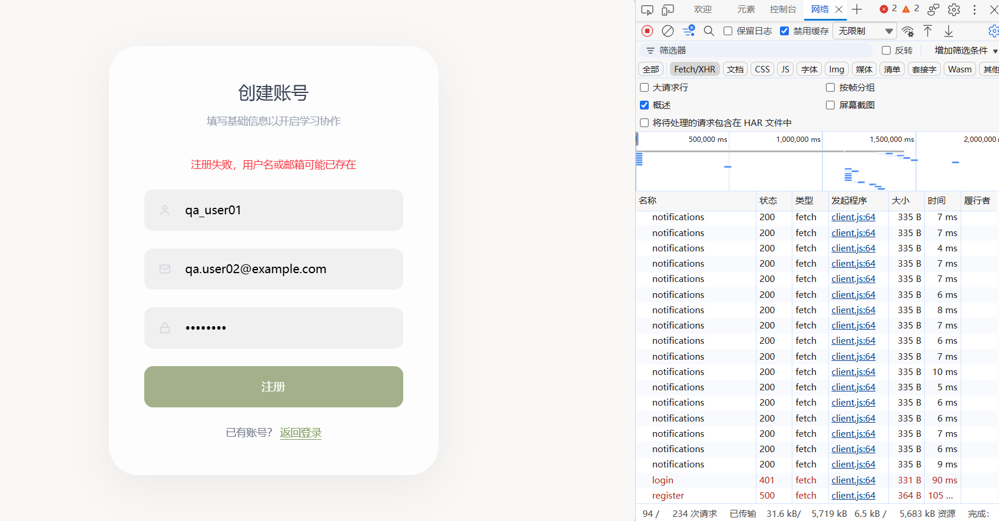

重复邮箱注册提示和 Network 中 `register` 的 500 状态：

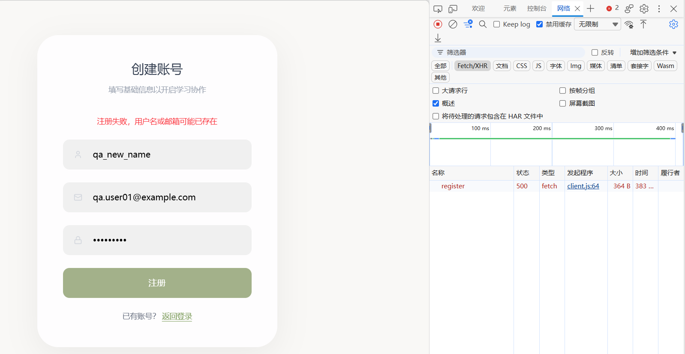

## BUG-LR-002：后端允许设置 1 位密码并成功登录

### 基本信息

| 项目 | 内容 |
| --- | --- |
| 所属模块 | 注册、登录、个人密码修改、管理员用户管理 |
| 关联用例 | REGISTER-011、PWD-005、ADMIN-005 |
| 严重程度 | 高 |
| 优先级 | P1 |
| 状态 | 待修复 |
| 执行环境 | Windows；前端 `http://localhost:5173`；后端端口 `3001`；本地 MySQL |

### 前置条件

- 测试用户名和邮箱尚未注册。
- 前端、后端和数据库均已启动。

### 测试数据

| 字段 | 数据 |
| --- | --- |
| 用户名 | `qa_pwd1` |
| 邮箱 | 本轮截图未记录 |
| 密码 | `1` |

### 复现步骤

1. 打开注册页面。
2. 输入未使用的用户名和邮箱。
3. 密码只输入 `1`。
4. 点击“注册”。
5. 在 Network 面板观察 `register` 请求。
6. 注册后，在登录页使用用户名 `qa_pwd1` 和密码 `1` 登录。
7. 在 Network 面板观察 `login` 请求和登录后的页面。

### 预期结果

- 注册时应执行密码最小长度校验。
- 对 1 位密码应拒绝注册并给出明确提示。
- 不应生成可使用 1 位密码登录的有效账号。

### 实际结果

- 1 位密码注册成功，`register` 返回 201。
- 随后使用该账号和密码 `1` 登录成功，`login` 返回 200。
- 页面进入“学习空间总览”，显示当前用户 `qa_pwd1`。
- PWD-005 中绕过个人设置页面直接调用 `PUT /api/user/profile`，接口同样接受1位新密码并返回200；随后使用该密码登录成功。
- ADMIN-005 中管理员通过 `POST /api/admin/users` 创建1位密码用户，接口返回201；使用密码 `1` 可以实际登录。
- 注册、个人改密和管理员新增用户三个独立入口均确认缺少后端最小长度校验；相关场景均按同一根因合并记录。

### 影响

- 用户可以设置极弱密码，账号更容易被猜中或被他人尝试登录。
- 注册规则与个人资料页面已有的“新密码至少 4 位”前端提示不一致。

### 代码关联

注册页面只有必填校验，注册接口只判断密码是否为空；个人设置页面要求新密码至少4位，但 profile 后端只判断是否非空；管理员新增用户接口同样只判断密码是否为空。三个后端入口都没有执行最小长度校验，见 [`server/index.js`](../server/index.js#L476)、[`server/index.js`](../server/index.js#L577) 和 [`server/index.js`](../server/index.js#L1318)。

### 测试证据

注册请求返回 201：

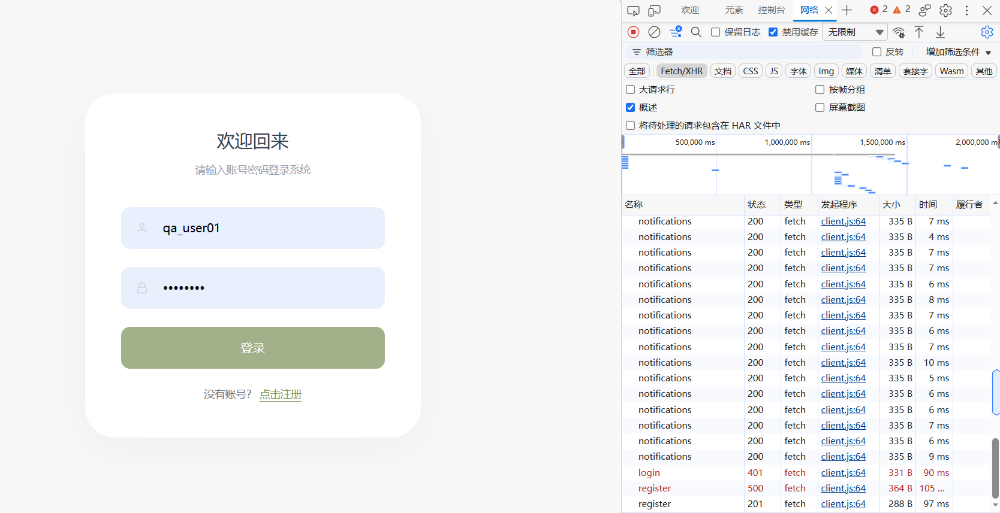

同一账号随后登录返回 200 并进入学习空间：

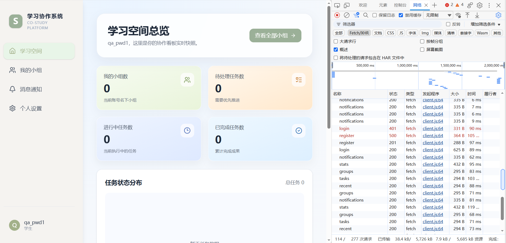

个人改密接口接受1位密码并返回200：

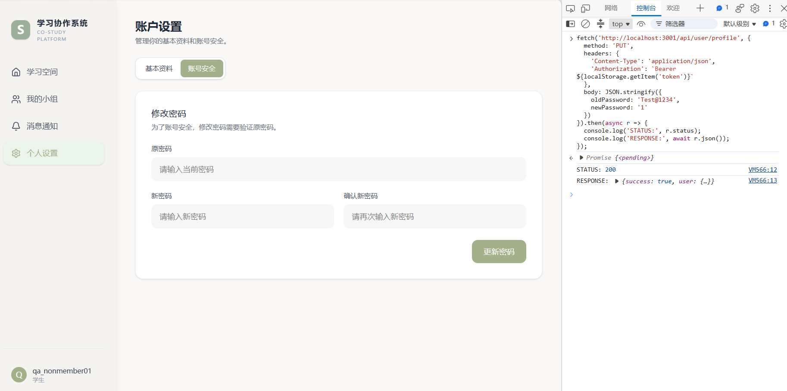

使用修改后的1位密码可以实际登录：

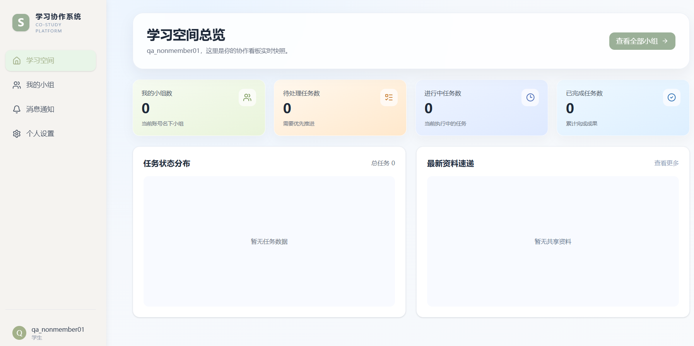

管理员新增用户接口接受1位密码并返回201：

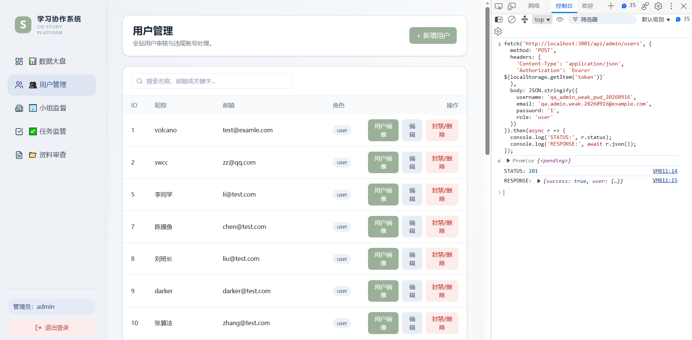

使用该1位密码可以实际登录：

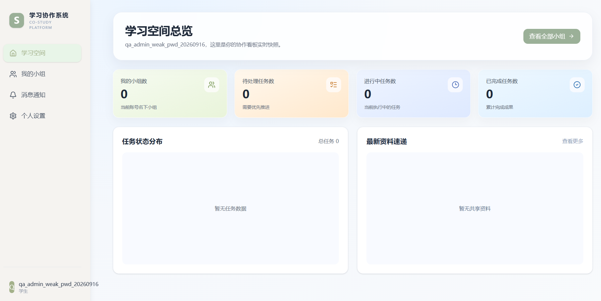

### 修复与定向回归追加记录（2026-09-17，BUG-LR-002）

> 上面的“待修复”、原始描述、测试结果及6张修复前截图为发现阶段记录，完整保留。以下追加修复过程，不否认1位密码曾被接受并实际登录的历史。

| 项目 | 内容 |
| --- | --- |
| 当前修复状态 | **已修复并验证** |
| 修复日期 | 2026-09-17（UTC+8） |
| 验证批次 | `20260917124504`，真实后端 `http://localhost:3001` |
| 修改文件 | `server/index.js`，增加共享长度校验及四个密码写入处理器的调用 |
| 统一规则 | 设置新密码至少4位，沿用已有前端的JavaScript字符串 `.length` 语义；不增加复杂度或最大长度策略 |
| 修复 commit | [`bbbccb9a4eb4b61eb9b052de7e946bdba805d672`](https://github.com/volcano-77/graduation-study-system/commit/bbbccb9a4eb4b61eb9b052de7e946bdba805d672) — `fix: enforce minimum password length` |

**实际影响入口与原有规则：**

| 入口 | 前端原有规则 | 后端原有规则 / 本次处理 |
| --- | --- | --- |
| `POST /api/register`、兼容路由 `POST /register` | 注册密码仅必填，没有最小长度 | 同一 `handleRegister` 只检查非空；现在必填检查后统一校验长度 |
| `PUT /api/user/profile` | 个人改密先trim，非空、至少4位、确认密码一致 | 后端接受 `newPassword` 和兼容字段 `password`，trim后只检查非空；现在在查原密码及调用bcrypt前校验新密码长度 |
| `POST /api/admin/users` | 新增仅检查trim后的密码非空 | 原后端只检查非空；现在新增统一长度校验 |
| `PUT /api/admin/users/:id` 的 `password` 字段 | 编辑密码留空表示不修改，无最小长度限制 | 原后端任何非空密码均可写入；现在非空密码统一校验，留空仍不改密码 |

另检查了全部password写入位置：启动时的演示账号初始化、历史明文迁移、登录成功时的旧密码哈希升级属于初始化或保留已有凭据的兼容逻辑，本次不改变；默认演示密码本身超过4位。旧 `PUT /api/users/:id` 不写密码。没有现成的password validator可复用，也没有 `password_hash` 列，当前存储列名为 `users.password`。

**根因与最小修复：** 后端四个写入处理器均未执行最小长度校验，个人改密页面的4位限制可以被直接HTTP请求绕过。新增 `MIN_PASSWORD_LENGTH = 4` 和共享 `isValidPasswordLength()`，各处理器在处理非空新密码时调用。1～3位密码统一返回400、`success:false`、`message:"密码至少需要 4 位"`，不调用bcrypt，也不进入目标业务数据库读写。鉴权中间件读取当前用户仍属于正常认证流程。登录函数未修改；不强制重置历史弱密码，不修改BUG-LR-003邮箱校验。

**空值及既有差异保留：** 注册、管理员创建的空密码仍返回原必填错误；个人只提交空新密码、没有其他资料字段时仍返回400“没有可更新的字段”，并非新增required规则；若同时提交资料字段，仍按原资料更新逻辑处理。管理员编辑空密码仍为“不修改密码”。个人改密沿用trim后的值，注册和管理员后端仍按原字符串处理。前端注册、管理员页面仍未主动执行4位限制，但对应后端现已拒绝短密码；本轮没有扩展空白规范、复杂度或最大长度策略。

**服务与数据基线：** 首先核实并停止旧3001后端进程，使用包含BUG-ADMIN-001修复的clean-main代码启动，admin正常登录返回200；未重新回归BUG-ADMIN-001。密码修复完成后再次加载工作区源码到3001，本轮全部HTTP验证在该修复版完成。源码初始化本来包含幂等DDL/角色兜底和迁移逻辑，重启前只读检查确认无需凭据迁移或账号补建，并以内存中的8张表全量快照核对两次重启及最终清理后原有记录与字段全部一致。没有额外执行SQL更新、重置账号或数据库；3001当前保持运行修复后的代码。

| 定向验证 / 小范围回归 | 空字符串 | 1位 / 3位 | 恰好4位 / 大于最小长度（16位） | 数据 / 登录验证 |
| --- | --- | --- | --- | --- |
| `/api/register` | 400，原必填提示 | 均400，统一长度提示 | 均201 | 拒绝用户count=0；合法用户登录200 |
| `/register` 兼容路由 | 400，原必填提示 | 均400 | 均201 | 拒绝用户count=0；合法用户登录200 |
| 个人改密 `newPassword` | 400，没有可更新字段 | 均400 | 均200 | 失败后存储密码不变、原密码登录200；成功后新密码登录200 |
| 个人改密兼容字段 `password` | 400，没有可更新字段 | 均400 | 均200 | 与主字段相同；兼容字段不能绕过长度校验 |
| 管理员创建用户 | 400，原必填提示 | 均400 | 均201 | 拒绝用户count=0；合法用户登录200 |
| 管理员编辑密码 | 200，不改密码 | 均400 | 均200 | 空值/短密码后字段不变；合法设置后新密码登录200 |

本批共59次真实HTTP请求，全部满足预期；其中17次参数错误请求返回400。另直接执行实际路由回调，对5条处理路径（含个人兼容字段）的1位/3位新密码共10次检查，均为400，bcrypt及目标业务数据库调用数均为0。临时用户输入错误的1位登录密码仍返回401，确认登录保持认证语义。没有扩测旧token注销风险，没有执行REG-001～REG-014或重复124条正式功能测试；这些定向请求不加入历史功能测试累计数量。

**SQL副作用与清理：** 所有验证使用 `FIX-PWD-20260917124504-*` 专用临时用户，合法创建的6个用户id为34～39。9个拒绝创建场景以精确用户名查询确认count=0；个人/管理员改密的9次失败或空值场景在内存中逐值比较存储密码及用户全部字段，均保持不变，原密码均仍可登录；6次合法密码变更确认存储字段改变且新密码登录成功。最后通过正常管理员DELETE按精确id删除6个临时用户，SQL只读确认 `LEFT(username, 8) = 'FIX-PWD-'` 的记录为0。users、groups_table、group_members、tasks、discussions、notifications、shared_files、group_files均与初始基线逐行全字段一致，包含qa_user01、demo_user、qa_nonmember01、admin在内的正式账号无变化，无临时通知、成员或其他关联残留。自增序列正常递增，不回拨。

**修复后证据：** 下列为真实HTTP/SQL执行日志可视化页面截图，不冒充DevTools或数据库客户端原生截图。完整脱敏记录及受测源码SHA-256见 [FIX-LR-002-results.json](./screenshots/FIX-LR-002-results.json)。只记录密码长度和比较布尔结果，密码、JWT均脱敏，不保存存储密码哈希；原6张修复前截图全部保留且与HEAD中字节一致。

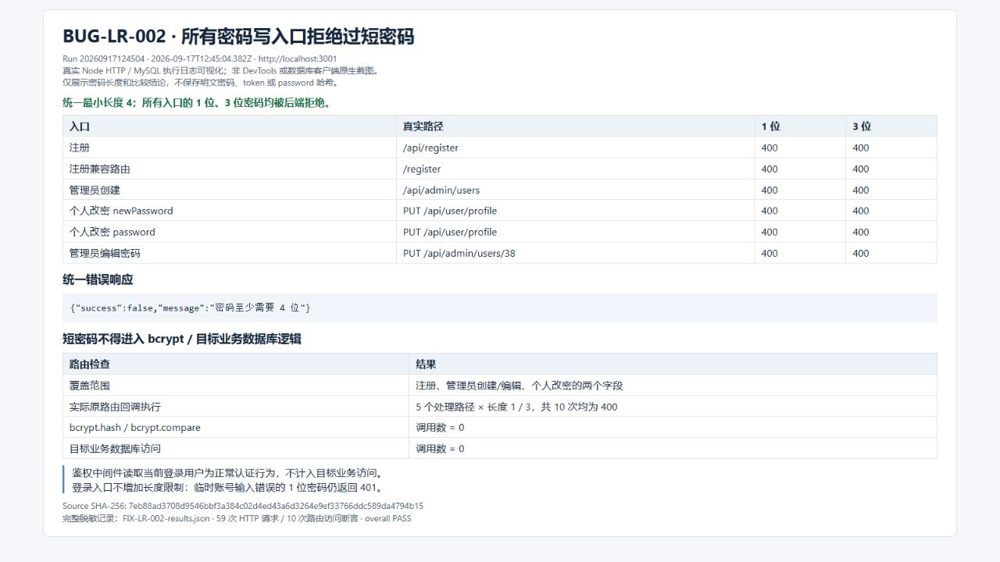

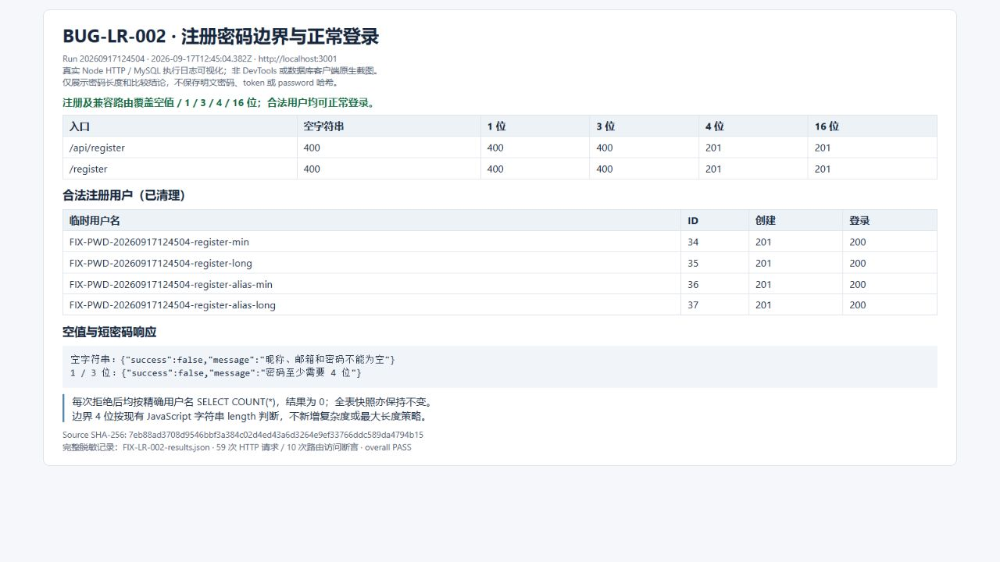

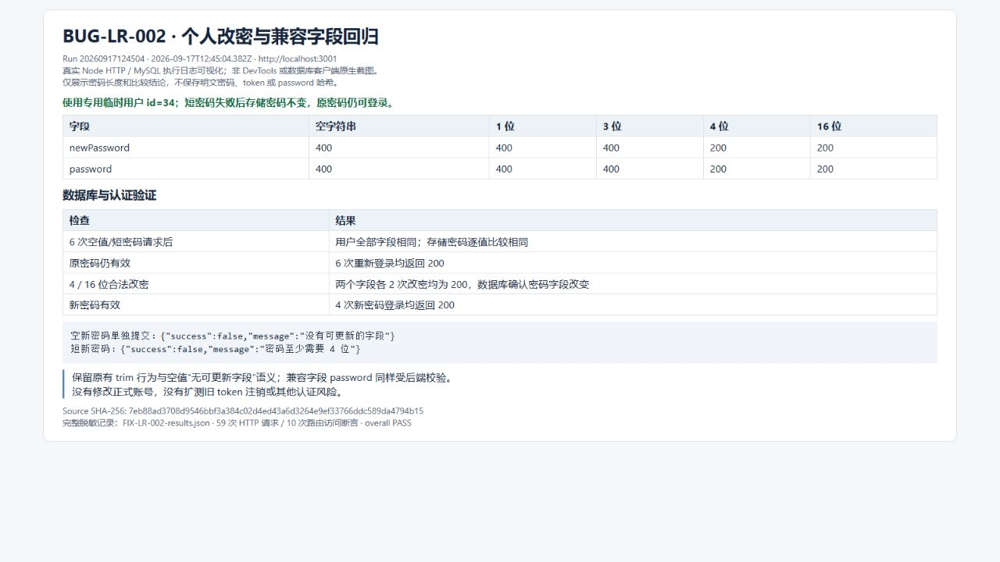

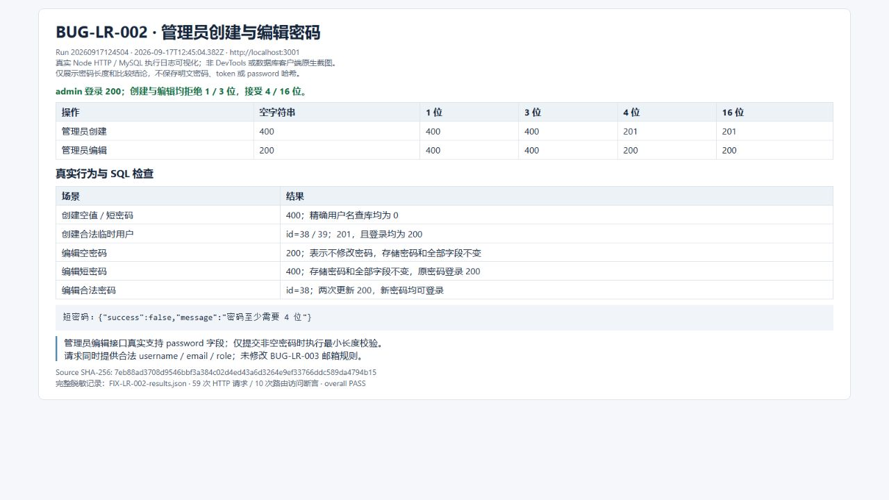

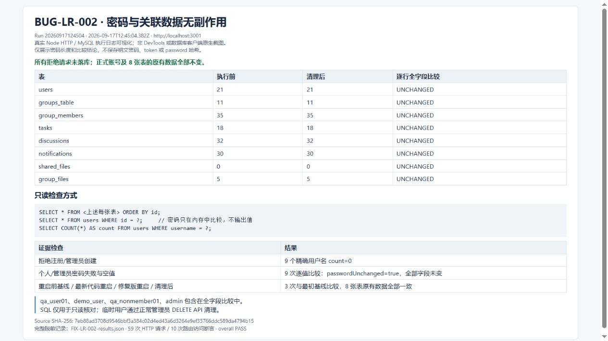

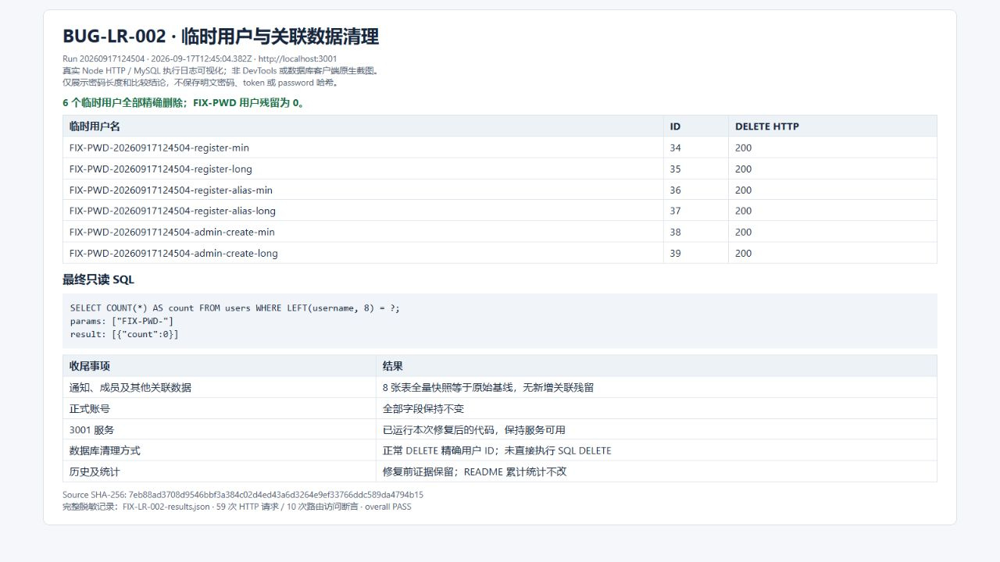

## BUG-LR-003：后端用户接口缺少邮箱格式校验，可写入非法邮箱

### 基本信息

| 项目 | 内容 |
| --- | --- |
| 所属模块 | 注册接口、旧用户资料更新接口、管理员用户管理 |
| 关联用例 | REGISTER-010、PROF-005、ADMIN-005 |
| 问题性质 | 已确认缺陷 |
| 严重程度 | 中 |
| 优先级 | P1 |
| 状态 | 待修复 |
| 执行环境 | Windows；前端 `http://localhost:5173`；后端端口 `3001`；本地 MySQL |

### 缺陷描述

注册页面会利用浏览器的 `type="email"` 校验阻止明显的非法邮箱提交，但注册接口、旧 `PUT /api/users/:id` 更新接口和管理员 `POST /api/admin/users` 都没有独立校验邮箱格式。REGISTER-010 已确认注册接口可创建非法邮箱账号；PROF-005 确认旧资料接口接受 `not-an-email`；ADMIN-005 又确认管理员新增用户接口返回201并把非法邮箱写入users。三者属于同一后端输入校验缺失，合并记录。

### 前置条件

- 用户名 `qa_bad_email_api` 和邮箱 `invalid-email` 尚未被使用。
- 后端和数据库已启动。
- 可通过浏览器开发者工具直接发送 HTTP 请求。

### 测试数据

```json
{
  "username": "qa_bad_email_api",
  "email": "invalid-email",
  "password": "Test@1234"
}
```

### 复现步骤

1. 打开浏览器开发者工具 Console。
2. 向 `POST http://localhost:3001/api/register` 发送上述 JSON 请求。
3. 查看 HTTP 状态码和响应体。
4. 确认接口是否成功创建该非法邮箱账号。

### 预期结果

- 后端独立校验邮箱格式，不依赖浏览器页面校验。
- 对 `invalid-email` 返回 400，并给出明确的格式错误提示。
- 不创建非法邮箱账号。

### 实际结果

- 接口返回 201。
- 响应体为 `{ success: true }`。
- SQL 查询确认 `qa_bad_email_api` 已存在于 `users` 表，邮箱为 `invalid-email`，角色为 `user`。
- 非法邮箱用户不只是收到成功响应，而是已经真实写入数据库。
- PROF-005 中旧资料接口返回200和 `success:true`，SQL确认 id 26 的邮箱被更新为 `not-an-email`。
- ADMIN-005 中管理员新增用户接口接受 `invalid-email-admin-20260916`，返回201和 `success:true`，SQL确认非法邮箱真实写入id 29。
- 三个入口的场景均判定为 Fail；相关临时数据已经恢复或删除。

### 影响

- 调用者可以绕过前端校验，把格式非法的邮箱写入用户数据。
- 接口与页面的校验规则不一致，会影响数据质量和后续依赖邮箱的功能。

### 代码关联

普通注册接口只检查字段是否为空，旧用户资料接口直接更新 `email`，管理员新增用户接口也只检查字段是否为空；三处都没有邮箱格式校验，见 [`server/index.js`](../server/index.js#L478)、[`server/index.js`](../server/index.js#L577) 和 [`server/index.js`](../server/index.js#L1755)。本条缺陷已有三个独立接口的实际证据，不是仅由静态分析推断。

### 测试证据

Console 中显示向注册接口提交 `invalid-email` 后，状态码为 201，响应为 `{ success: true }`：

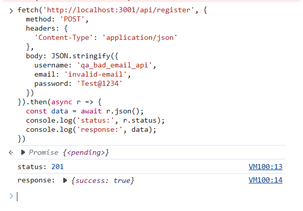

SQL 查询结果确认 `qa_bad_email_api` 的非法邮箱数据已经写入 `users` 表：

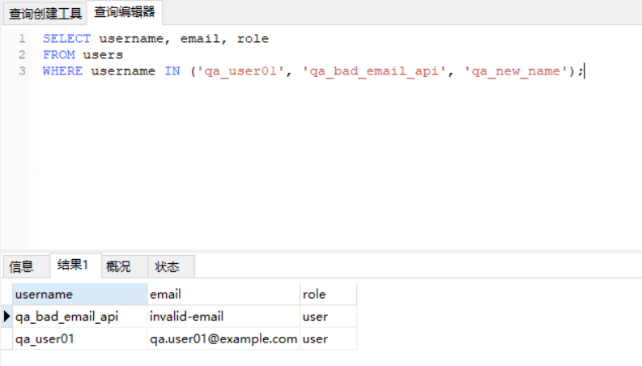

旧资料接口接受非法邮箱并返回200：

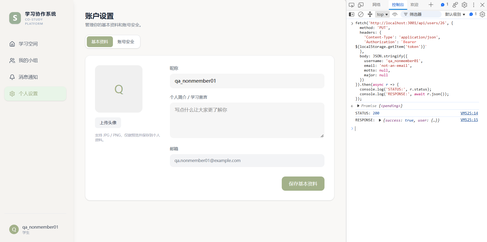

SQL确认非法邮箱真实写入现有用户：

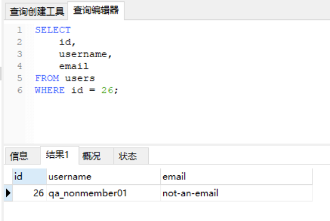

管理员新增用户接口接受非法邮箱并返回201，数据库落库结果见管理员执行报告：

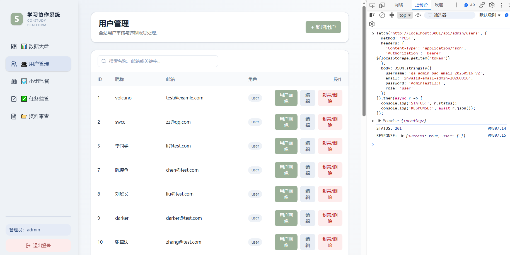

### 修复与定向回归追加记录（2026-09-17，BUG-LR-003）

> 上面的“待修复”、原始缺陷描述、实际结果及5张历史截图为发现阶段记录，完整保留。以下追加复现、修复和回归过程，不否认非法邮箱曾通过真实接口写入数据库的历史。

| 项目 | 内容 |
| --- | --- |
| 当前修复状态 | **已修复并验证** |
| 修复日期 | 2026-09-17（UTC+8） |
| 修复前复现批次 | `20260917130648`，真实后端 `http://localhost:3001` |
| 修复后验证批次 | `20260917131115`，真实后端 `http://localhost:3001` |
| 修改文件 | `server/index.js`，新增共享邮箱格式校验并接入全部实际邮箱写入口 |
| 统一规则 | trim并转为小写后必须匹配 `^[^\s@]+@[^\s@]+\.[^\s@]+$`；不增加域名可达性、MX、复杂度或最大长度策略 |
| 修复 commit | [`f0c6e03762b68cedd30f2ff0dba3d80ca1e36846`](https://github.com/volcano-77/graduation-study-system/commit/f0c6e03762b68cedd30f2ff0dba3d80ca1e36846) — `fix: validate user email formats` |

**实际影响入口与根因：** 前端注册页和管理员用户表单使用HTML `type="email"`，只能约束正常页面提交；后端没有可复用的邮箱校验器，只检查必填或直接写库。源码定位确认实际写邮箱的入口为共享处理器下的 `POST /api/register` 与兼容路由 `POST /register`、管理员创建 `POST /api/admin/users`、管理员编辑 `PUT /api/admin/users/:id`、旧资料更新 `PUT /api/users/:id`。其中管理员编辑也是同类受影响入口；`PUT /api/user/profile` 不写邮箱，其余email引用为读取、搜索或展示。

**修复前真实复现：** 使用 `FIX-EMAIL-20260917130648-*` 临时用户分别调用上述5条处理路径，注册及兼容注册、管理员创建均接受非法邮箱并返回201，旧资料更新和管理员编辑均接受非法邮箱并返回200；SQL确认非法值已写入users。共执行14次真实HTTP请求。验证结束后按精确用户id通过管理员删除接口清理5个临时用户，SQL确认 `FIX-EMAIL-` 用户数为0，8张业务表与执行前基线逐行全字段一致。完整脱敏记录见 [REPRO-LR-003-results.json](./screenshots/REPRO-LR-003-results.json)。

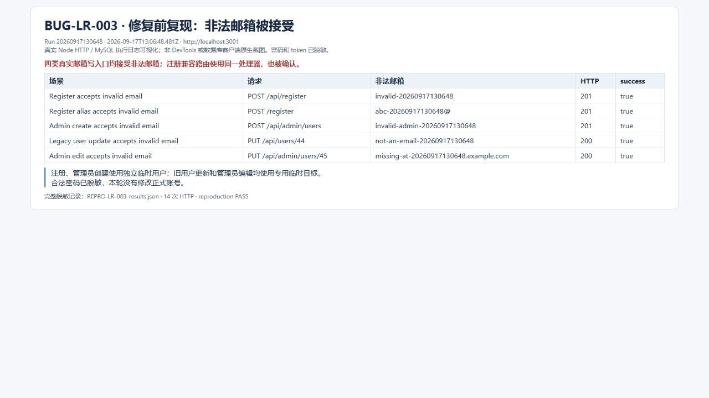

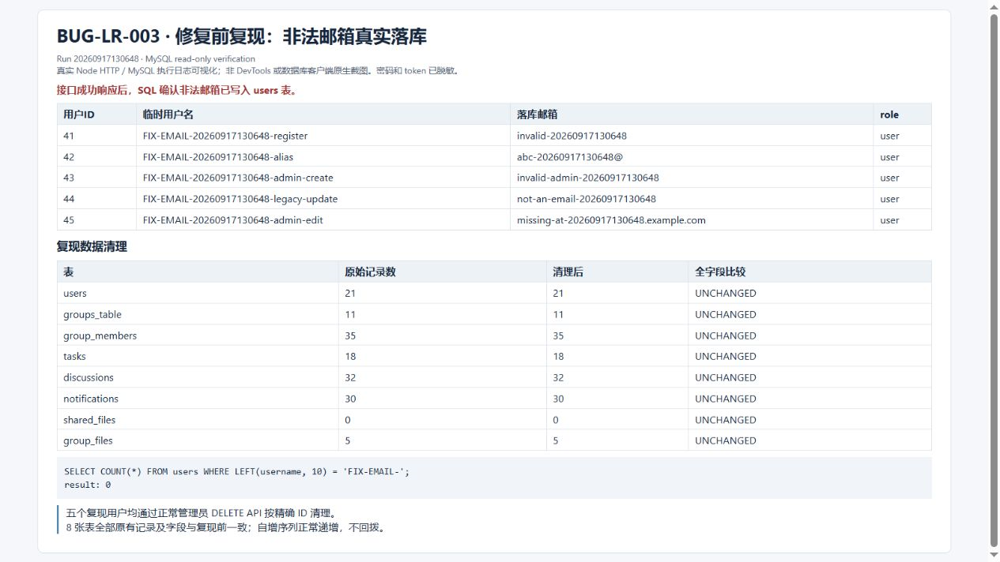

**最小修复：** 新增共享 `EMAIL_PATTERN` 和 `isValidEmail()`。注册、管理员创建及管理员编辑沿用各自已有的trim/小写标准化结果，旧资料更新补齐同样的trim/小写处理；各入口在bcrypt或目标业务数据库写入前校验，非法值统一返回400、`success:false`、`message:"邮箱格式不正确"`。空字符串在注册和管理员创建中仍保留原必填提示；登录接口、密码规则、BUG-PROF-001的异常状态码语义及其他业务逻辑均未修改。

| 定向验证 / 小范围回归 | 无效或空邮箱 | 合法邮箱 | 数据验证 |
| --- | --- | --- | --- |
| `POST /api/register` | 空值保持原必填400；6个代表性非法值均400 | 201，随后登录200 | 拒绝用户名count=0 |
| `POST /register` 兼容路由 | 空值保持原必填400；6个代表性非法值均400 | 201，随后登录200 | 拒绝用户名count=0 |
| `POST /api/admin/users` | 空值保持原必填400；6个代表性非法值均400 | 201，随后登录200 | 拒绝用户名count=0 |
| `PUT /api/users/:id` | 6个代表性非法值均400 | 200，trim/小写结果正确落库 | 每次拒绝后目标用户全字段不变 |
| `PUT /api/admin/users/:id` | 6个代表性非法值均400 | 200，trim/小写结果正确落库 | 每次拒绝后目标用户全字段不变 |

代表性非法值覆盖缺少`@`、缺少域名、缺少本地部分、域名无点、包含空格及双`@`。合法回归覆盖普通邮箱、带`+`号和子域名邮箱以及现有 `.invalid` 测试域名。共执行52次真实HTTP请求，其中33次非法或空邮箱请求全部符合预期；另直接执行4个实际路由处理器的提前拒绝检查，均返回400，bcrypt调用数和目标业务数据库调用数均为0。admin登录返回200；未执行REG-001～REG-014或重复124条正式功能测试，这些定向请求不加入历史功能测试累计数量。

**SQL副作用与清理：** 修复后验证使用 `FIX-EMAIL-20260917131115-*` 专用临时用户，合法创建的5个用户id为46～50。非法创建场景均确认未落库，两个更新入口的失败请求均确认用户全字段不变。最后按精确id通过管理员删除接口清理5个临时用户，SQL只读确认 `LEFT(username, 10) = 'FIX-EMAIL-'` 的记录为0；users、groups_table、group_members、tasks、discussions、notifications、shared_files、group_files均与执行前基线逐行全字段一致，正式账号及关联数据无变化。

**修复后证据：** 下列为真实Node HTTP/MySQL执行日志可视化页面截图，不冒充DevTools或数据库客户端原生截图。完整脱敏记录及受测源码SHA-256见 [FIX-LR-003-results.json](./screenshots/FIX-LR-003-results.json)；不保存明文合法密码、JWT或存储密码哈希。原5张历史截图保持原文件不变。

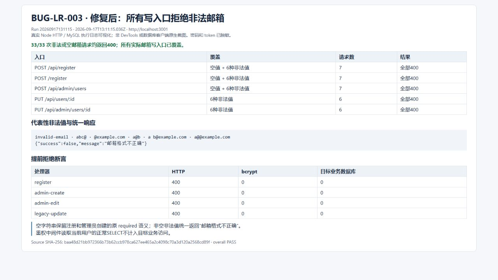

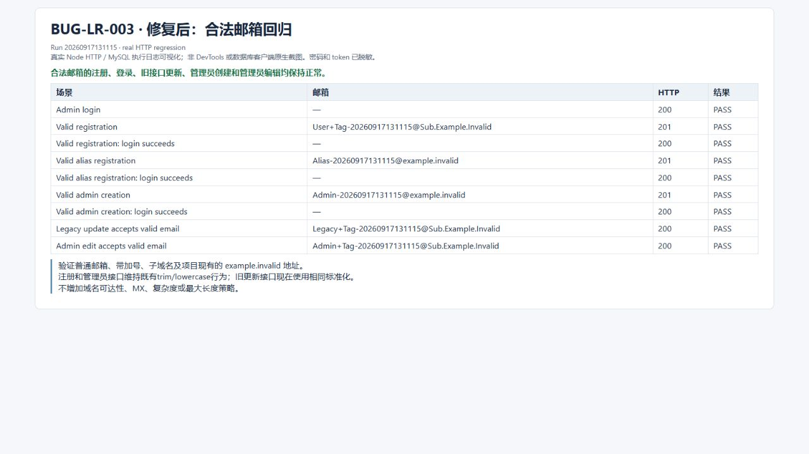

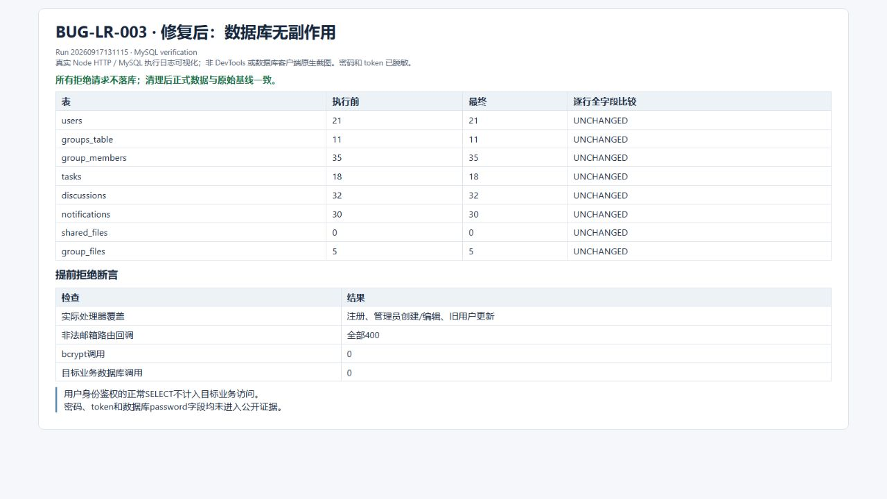

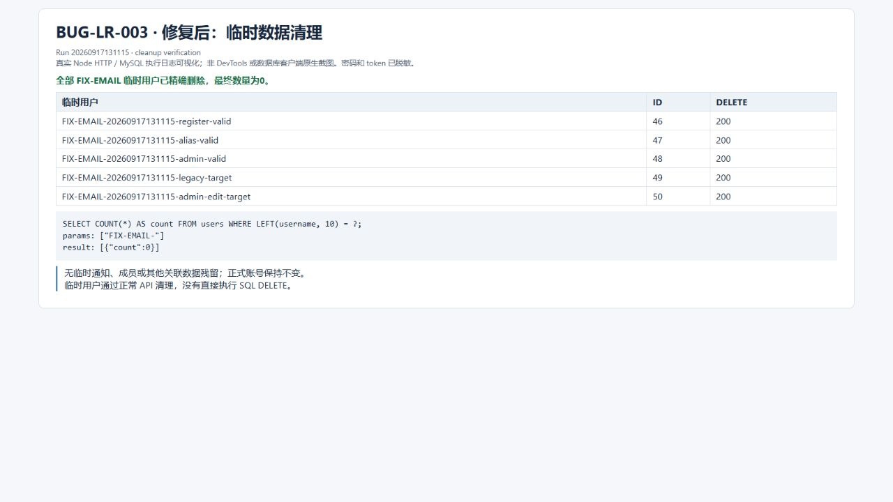

## BUG-PROF-001：旧用户资料接口数据库失败仍返回 HTTP 200

### 基本信息

| 项目 | 内容 |
| --- | --- |
| 所属模块 | 个人资料、旧用户更新接口 |
| 关联场景 | PROF-005 |
| 问题性质 | 已确认缺陷 |
| 严重程度 | 中 |
| 优先级 | P2 |
| 状态 | 待修复 |

### 缺陷描述与实际结果

C调用 `PUT /api/users/26`，把邮箱改为已由A使用的 `qa.user01@example.com`。数据库唯一约束正确阻止了重复邮箱写入，但接口的异常分支仍返回HTTP 200，响应体为 `{ success:false, message:'服务器错误' }`。

### 预期结果

- 唯一字段冲突应返回409 Conflict，并给出可理解的重复邮箱提示；
- 服务器内部异常应返回500；
- 不应使用HTTP 200表达失败结果。

### 影响

- 前端和接口测试不能只根据HTTP状态码可靠判断更新是否成功；
- 业务冲突会被笼统表示为服务器错误；
- 调用方如果忽略JSON中的 `success`，可能错误地认为资料更新成功。

### 代码关联

旧 `PUT /api/users/:id` 接口的 catch 分支使用 `res.json(...)`，没有设置错误状态码，也没有单独处理 `ER_DUP_ENTRY`，见 [`server/index.js`](../server/index.js#L1755)。

### 测试证据

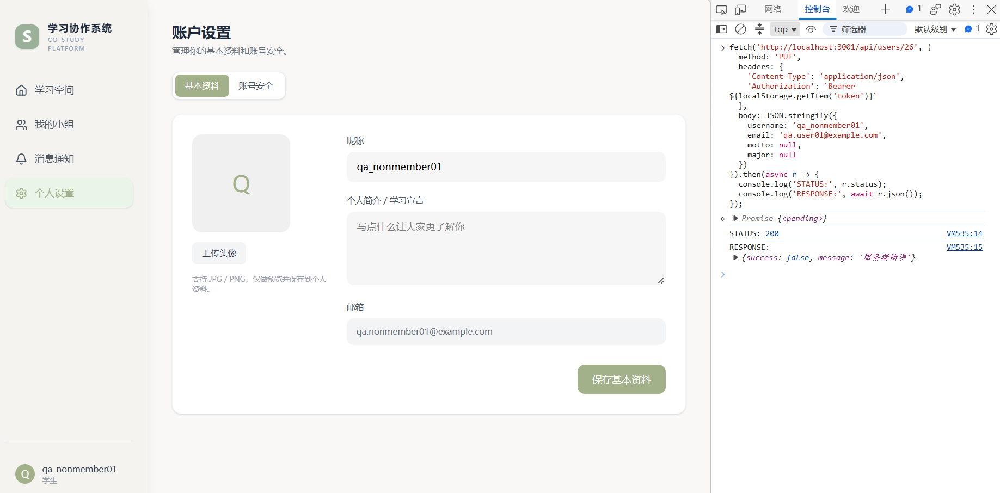

## BUG-GR-001：系统允许创建重复名称的小组

### 基本信息

| 项目 | 内容 |
| --- | --- |
| 所属模块 | 小组管理 |
| 关联用例 | GROUP-003 |
| 问题性质 | 业务规则缺口 / 可疑缺陷 |
| 严重程度 | 低（待确认） |
| 优先级 | P3 |
| 状态 | 待产品确认 |
| 执行环境 | Windows；前端 `http://localhost:5173`；后端端口 `3001`；本地 MySQL |

### 缺陷描述

已存在名为 `qa_group01` 的小组时，再次使用相同名称创建，系统仍创建成功，并生成新的 group id。第一次创建记录为 id 31，第二次创建记录为 id 32，因此不是覆盖原小组，而是保留了两个同名小组。

当前项目没有明确规定“小组名称必须唯一”，所以该问题暂不直接认定为确定的功能错误，先作为业务规则缺口 / 可疑缺陷记录。

### 前置条件

- 用户 `qa_user01` 已登录。
- 当前用户已创建小组 `qa_group01`，其 group id 为 31。
- 前端、后端和数据库均已启动。

### 测试数据

| 字段 | 数据 |
| --- | --- |
| 已有小组名称 | `qa_group01` |
| 再次创建名称 | `qa_group01` |
| 本次简介 | `重复名称测试` |
| 原 group id | `31` |
| 新 group id | `32` |

### 复现步骤

1. 使用 `qa_user01` 登录系统。
2. 进入“我的小组”。
3. 确认已经存在名称为 `qa_group01` 的小组。
4. 点击“新建小组”。
5. 小组名称再次输入 `qa_group01`。
6. 简介输入“重复名称测试”。
7. 点击“创建”。
8. 观察创建结果、详情页和 Network 请求中的 group id。

### 预期结果

项目应先明确小组名称是否允许重复：

- 如果名称必须唯一，系统应拒绝创建并提示名称已存在。
- 如果允许重名，页面应有足够的区分信息，避免用户仅凭名称无法识别小组。

在规则未确认前，不把“必须拒绝重名”描述成已经存在的项目需求。

### 实际结果

- 第二次创建成功。
- 新小组名称仍为 `qa_group01`，简介为“重复名称测试”。
- 新小组使用 group id 32，原小组 group id 31 仍然存在。
- 用例记录为 Fail / 缺陷候选。

### 影响

- 小组列表中可能出现多个同名小组，用户仅凭名称难以区分。
- 邀请、任务、讨论或资料操作时，可能因名称相同而选错小组。
- 是否需要限制重复名称，仍需根据产品规则确认。

### 代码关联

创建小组接口直接写入名称、简介和 owner id，没有查询同名记录，见 [`server/index.js`](../server/index.js#L1871)。当前运行时建表代码也没有为小组名称设置唯一约束。

### 测试证据

第一次创建的小组 `qa_group01` 使用 group id 31：

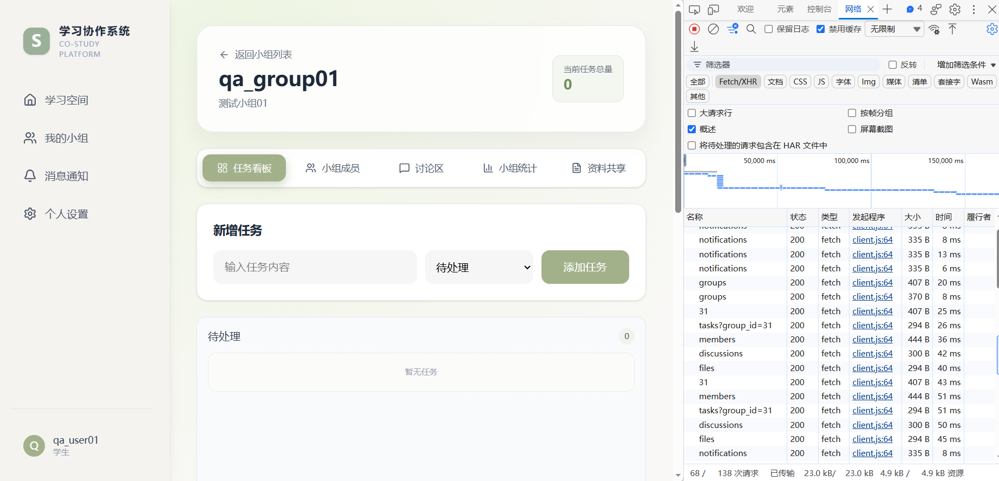

再次创建同名小组后，页面进入新 group id 32：

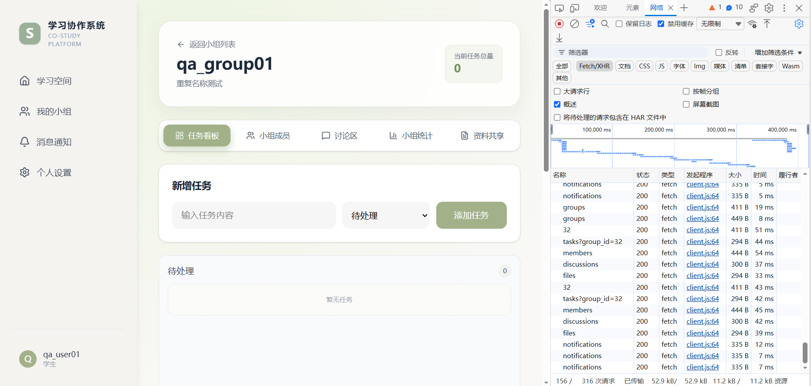

## BUG-TASK-001：普通任务接口缺少小组成员权限校验

### 基本信息

| 项目 | 内容 |
| --- | --- |
| 所属模块 | 任务管理、权限 |
| 关联场景 | TASK-006～TASK-010 |
| 问题性质 | 已确认缺陷 |
| 严重程度 | 高 |
| 优先级 | P0 |
| 状态 | 待修复 |
| 测试角色 | C：`qa_nonmember01`，user id 26 |
| 目标数据 | group 31、task 44，以及权限测试临时任务 |

### 缺陷描述

C 已登录但不属于 group 31。使用 C 的有效登录状态直接调用普通任务接口时，后端允许读取 group 31 任务、向 group 31 创建任务、修改 task 44、删除 group 31 的任务；请求列表时不传 `group_id` 还会返回全站任务。说明普通任务 API 只验证“是否登录”，没有验证调用者是否属于任务或目标小组，形成横向越权和 IDOR 风险。

### 复现步骤与实际结果

1. 用 SQL 确认 C 不属于 group 31。
2. C 请求 `GET /api/tasks?group_id=31`，返回 200 和该组任务。
3. C 向 `POST /api/tasks` 提交 `group_id=31`，返回 200 并生成 task 48；SQL 确认落库。
4. C 向 `PUT /api/tasks/44` 提交合法状态，返回 200；SQL 确认 task 44 被修改。
5. C 向 `DELETE /api/tasks/49` 发起删除，返回 200；SQL 确认记录不存在。
6. C 请求 `GET /api/tasks` 且不传 `group_id`，返回 200 和 21 条全站任务；同期 SQL 显示 group 31 只有 4 条。

### 预期结果

- 查询指定小组任务前，应验证当前用户是该组 owner 或成员。
- 创建任务前，应验证当前用户属于请求中的 `group_id`。
- 修改和删除任务前，应先查询 task 所属 group，再验证当前用户属于该组。
- 普通用户不传 `group_id` 时，不应获得全站任务；可以返回其有权访问的小组任务，或返回明确的 400。
- 无权限操作应返回 403，且数据库不得发生改变。

### 影响

- 任意已登录用户可能读取其他小组的任务内容。
- 攻击者知道小组或任务 id 后，可以跨组创建、篡改或删除任务，破坏协作数据完整性。
- 不传筛选条件即可读取全站任务，扩大信息泄露范围。

### 代码关联

普通任务 GET、POST、PUT、DELETE 路由只使用 `requireAuthUser`，没有继续校验小组成员关系，见 [`server/index.js`](../server/index.js#L1663)、[`server/index.js`](../server/index.js#L1684)、[`server/index.js`](../server/index.js#L1788)、[`server/index.js`](../server/index.js#L1820)。本缺陷已由 TASK-006～TASK-010 的真实请求和 SQL 结果确认，不是仅靠源码推测。

### 测试证据

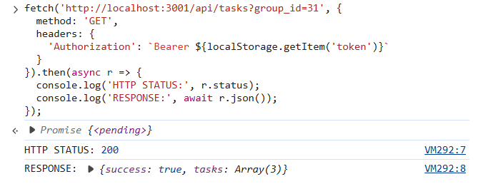

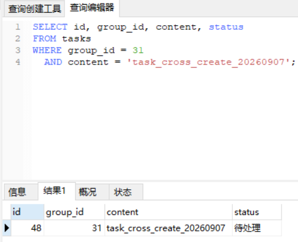

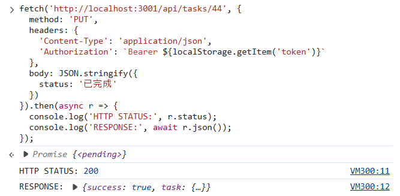

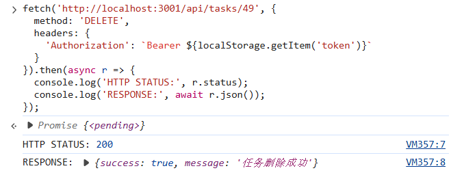

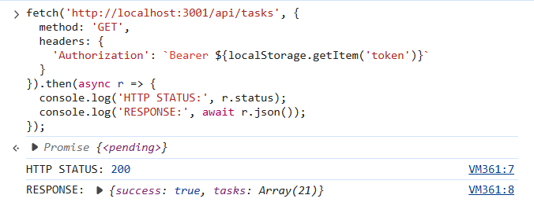

## BUG-TASK-002：后端允许纯空格任务内容落库

### 基本信息

| 项目 | 内容 |
| --- | --- |
| 所属模块 | 任务管理、输入校验 |
| 关联场景 | TASK-012 |
| 问题性质 | 已确认缺陷 |
| 严重程度 | 中 |
| 优先级 | P1 |
| 状态 | 待修复 |

### 缺陷描述与复现步骤

页面会阻止完全空的任务内容提交，但直接向 `POST /api/tasks` 提交只包含空格的 content 时，接口返回 200 和 `success: true`，并生成 task 46。SQL 查询确认该纯空格内容真实写入 tasks 表。

### 预期结果

- 后端应对 content 执行去除首尾空格后的非空校验。
- 纯空格内容应返回 400，且不能写入数据库。
- 前端提示与后端规则应保持一致。

### 影响

调用者可以绕过页面校验创建看起来没有内容的任务，影响任务列表可读性和数据质量。

### 代码关联

任务创建接口只使用普通真假判断检查 content，没有对字符串执行 `trim()` 后再判断，见 [`server/index.js`](../server/index.js#L1684)。

### 测试证据

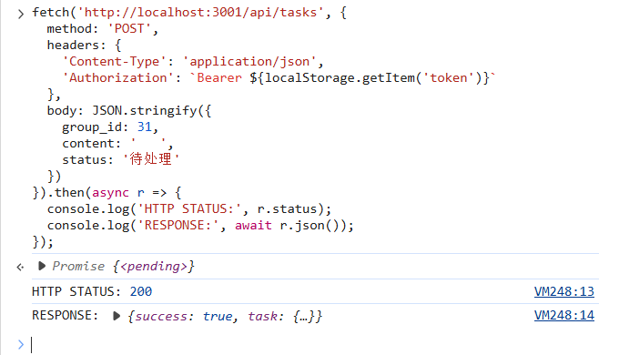

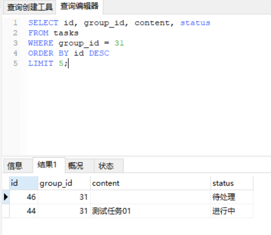

## BUG-TASK-003：普通任务接口错误状态码语义不正确

### 基本信息

| 项目 | 内容 |
| --- | --- |
| 所属模块 | 任务管理接口 |
| 关联场景 | TASK-013-B～TASK-013-E |
| 问题性质 | 已确认缺陷 |
| 严重程度 | 中 |
| 优先级 | P2 |
| 状态 | 待修复 |

### 缺陷描述与实际结果

以下四种明确失败均返回 HTTP 200，只在 JSON 中使用 `success: false`：

- 新建任务缺少 content；
- 新建任务缺少 group_id；
- PUT 修改不存在的 task 999999；
- DELETE 删除不存在的 task 999999。

### 预期结果

- 缺少必填参数应返回 400 Bad Request。
- 目标 task 不存在应返回 404 Not Found。
- 错误响应仍可保留结构化 `success: false` 和明确 message，但不能用 200 表示失败。

### 影响

- 前端、接口测试和监控不能只通过 HTTP 状态码判断请求是否成功。
- 调用方容易误把失败请求记作正常响应，增加错误处理复杂度。

### 代码关联

普通任务 POST、PUT、DELETE 路由的部分失败分支直接调用 `res.json(...)`，没有设置合适状态码，见 [`server/index.js`](../server/index.js#L1684)、[`server/index.js`](../server/index.js#L1788)、[`server/index.js`](../server/index.js#L1820)。

### 测试证据

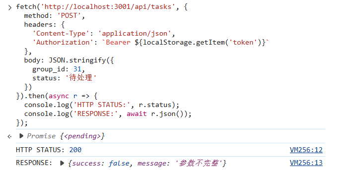

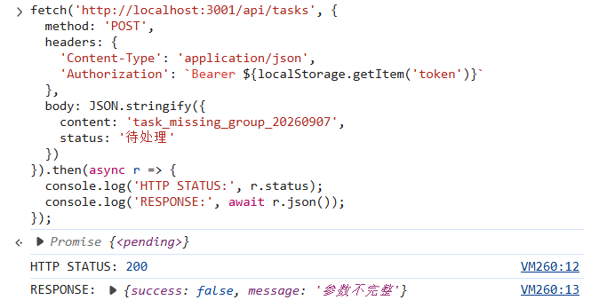

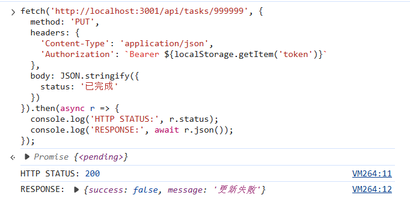

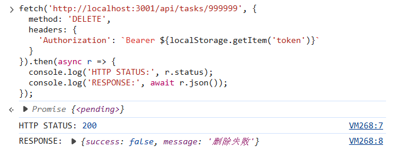

## BUG-TASK-004：非法 group_id 未提前校验并暴露数据库错误

### 基本信息

| 项目 | 内容 |
| --- | --- |
| 所属模块 | 任务管理接口、输入校验 |
| 关联场景 | TASK-013-F |
| 问题性质 | 已确认缺陷 |
| 严重程度 | 中 |
| 优先级 | P1 |
| 状态 | 待修复 |

### 缺陷描述与实际结果

向 `POST /api/tasks` 提交字符串 `abc` 作为 group_id 时，接口没有在进入数据库前拒绝该参数。请求最终使用 HTTP 200 返回 `success: false`，并在响应中暴露 MySQL 错误文本，包含具体列名、非法值和行信息。

### 预期结果

- 后端先校验 group_id 是有效的正整数，并校验目标小组存在及调用者有权访问。
- 非法类型返回 400 和面向调用者的通用提示。
- 不向客户端返回数据库驱动原始错误文本。

### 影响

- 暴露数据库类型、列名和错误细节，为外部调用者提供不必要的内部实现信息。
- HTTP 200 的错误语义还会干扰前端和监控判断。

### 代码关联

任务创建接口把请求中的 group_id 直接传给 INSERT，并在异常响应中返回原始 `err.message`，见 [`server/index.js`](../server/index.js#L1684)。

### 测试证据

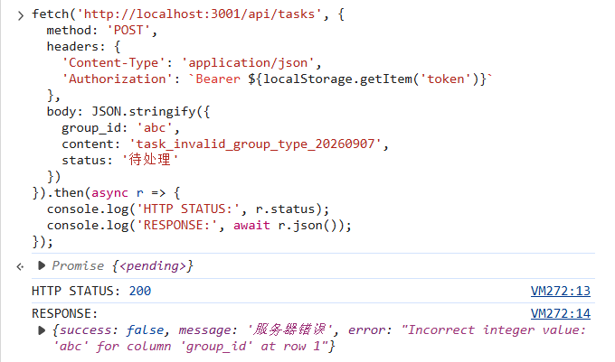

## BUG-DISC-001：讨论REST接口缺少小组成员授权校验

### 基本信息

| 项目 | 内容 |
| --- | --- |
| 所属模块 | 讨论区、成员权限 |
| 关联场景 | DISC-007、DISC-008、DISC-MENTION-006 |
| 问题性质 | 已确认缺陷 |
| 严重程度 | 高 |
| 优先级 | P0 |
| 状态 | 待修复 |
| 测试角色 | C：`qa_nonmember01`，user id 26 |
| 目标小组 | group 31；测试前C不是成员 |

### 缺陷描述

非成员C使用有效登录状态即可读取group 31的完整历史讨论。C向该组发送消息时，后端不但没有拒绝，还自动向 `group_members` 插入成员关系，再把消息写入 `discussions`。这绕过了项目已经存在的邀请、接受流程。

### 复现步骤

1. 使用SQL确认 `group_id=31/user_id=26` 没有成员记录。
2. C请求 `GET /api/groups/31/discussions`。
3. 观察接口返回200、`success:true` 和4条历史讨论。
4. C向同一路径POST `disc20260908_nonmember_autojoin_001`。
5. 观察接口返回200、`success:true`。
6. 查询 discussions 和 group_members。

### 预期结果

- GET和POST均应验证当前用户是目标小组owner或成员。
- 非成员请求应返回403，不返回讨论内容、不写入消息，也不能改变成员关系。
- 加入小组必须沿用邀请和接受流程。

### 实际结果与影响

- GET返回200并暴露4条历史讨论。
- POST返回200，discussion id 130真实写入数据库。
- group_members新增 `group_id=31/user_id=26/role=成员`。
- 自动加入使用中文 `成员`，与邀请接受流程写入的英文 `member` 不一致。
- 任意已登录用户知道group id后，可以跨组读取讨论并绕过邀请加入小组，影响隐私和成员关系完整性。
- DISC-MENTION-006 使用带 `@[demo_user](20)` 标记的消息再次复现相同结果：discussion id 137落库，C再次被自动加入group 31；测试后异常成员关系已清理。

### 代码关联

GET只校验登录，未调用成员访问检查；POST发现没有成员记录时会主动插入成员，再保存消息，见 [`server/index.js`](../server/index.js#L2418) 和 [`server/index.js`](../server/index.js#L2454)。本缺陷由实际REST响应和SQL结果确认。

### 测试证据

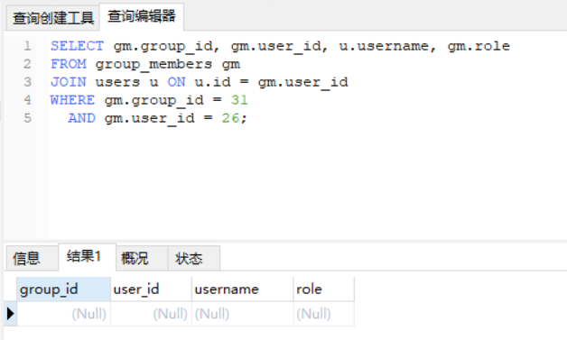

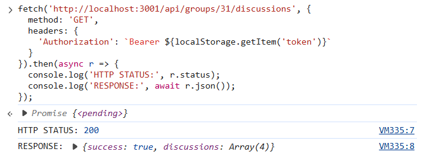

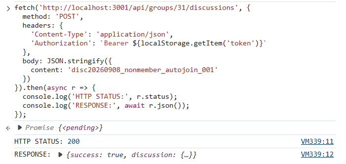

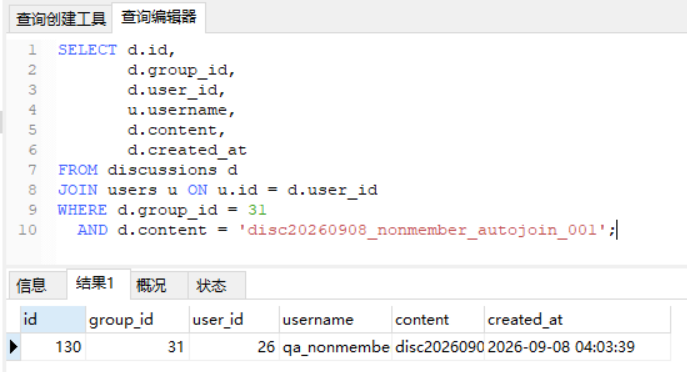

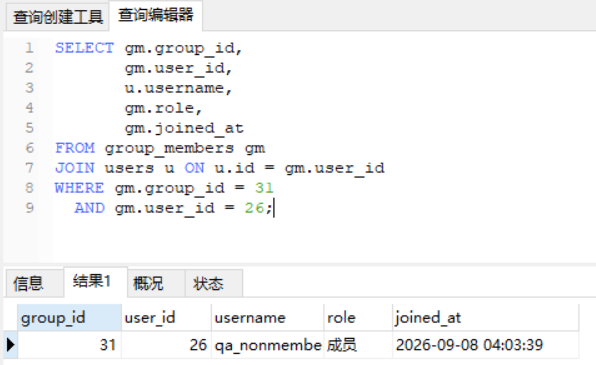

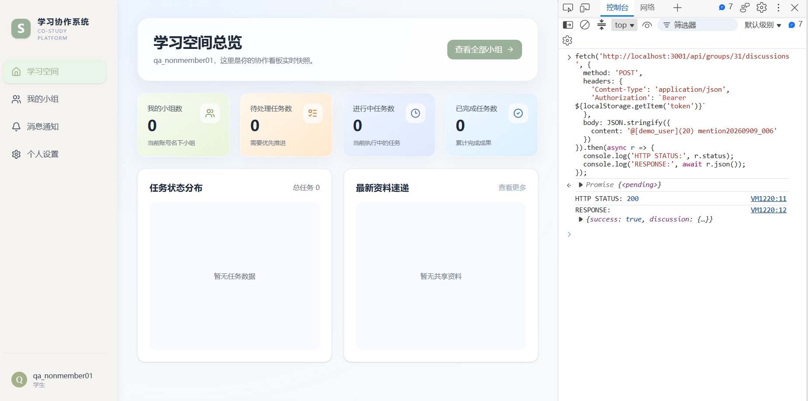

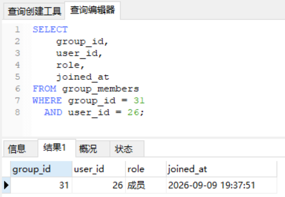

## BUG-DISC-002：Socket.IO缺少认证与房间成员授权

### 基本信息

| 项目 | 内容 |
| --- | --- |
| 所属模块 | 实时消息、Socket.IO权限 |
| 关联场景 | DISC-006 |
| 问题性质 | 已确认缺陷 |
| 严重程度 | 高 |
| 优先级 | P0 |
| 状态 | 待修复 |

### 缺陷描述与复现步骤

1. 启动一个不携带token的匿名 Socket.IO 客户端。
2. 连接 `http://localhost:3001`，发送 `join_group(31)`。
3. 客户端成功连接并显示已经加入room 31。
4. A通过正常讨论页面发送 `disc20260908_socket_probe_001`。
5. 匿名客户端收到完整的 `new_message`，其中包含group id、user id、用户名、内容和时间。

### 预期结果

- Socket握手必须验证有效登录身份。
- `join_group` 必须检查当前Socket用户是否属于目标小组。
- 未登录或非成员客户端不能加入房间，也不能接收实时消息。

### 实际结果与影响

- 匿名客户端无token即可连接并加入room 31。
- A合法发送后，匿名端成功收到group 31实时消息。
- 外部调用者只要知道group id即可监听组内后续讨论，REST接口的登录校验无法保护Socket广播内容。

### 代码关联

Socket服务没有认证中间件；`join_group` 只把参数解析为正整数后执行 `socket.join`，没有用户或成员查询，见 [`server/index.js`](../server/index.js#L60)。

### 测试证据

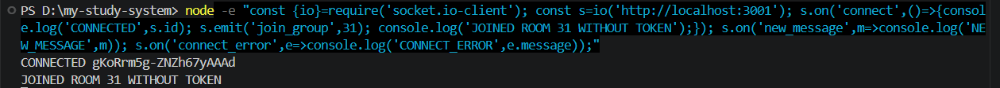

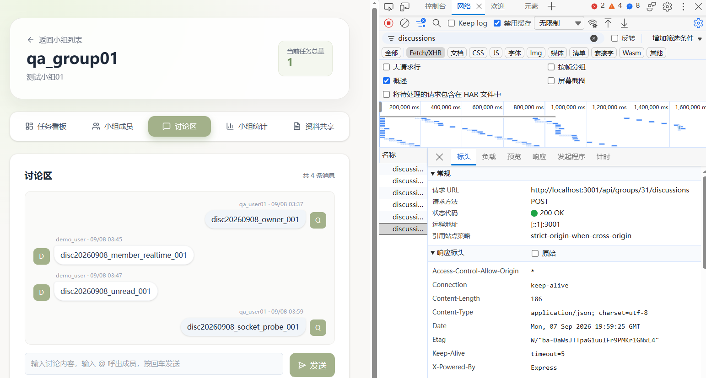

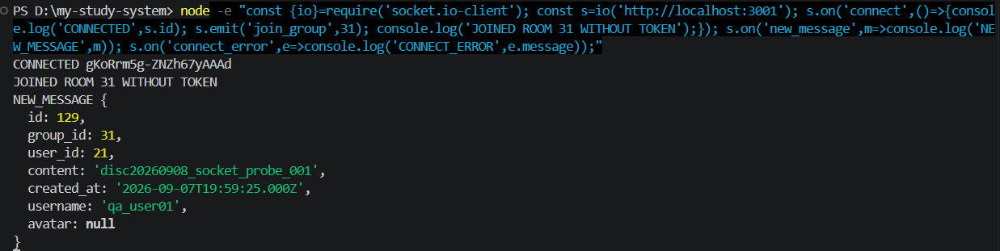

## BUG-DISC-003：讨论group id及资源存在性校验不完整

### 基本信息

| 项目 | 内容 |
| --- | --- |
| 所属模块 | 讨论REST接口、资源ID校验 |
| 关联场景 | DISC-011、DISC-012 |
| 问题性质 | 已确认缺陷 |
| 严重程度 | 中 |
| 优先级 | P2 |
| 状态 | 待修复 |

### 缺陷描述

讨论GET接口对group id使用宽松整数解析，并且查询历史前不确认小组是否存在。这导致 `31abc` 被当作group 31，同时不存在小组999999返回HTTP 200空数组；同一不存在小组的POST却正确返回404。

### 复现步骤与实际结果

1. 请求 `GET /api/groups/31abc/discussions`，实际返回200和group 31的5条讨论。
2. 请求 `GET /api/groups/999999/discussions`，实际返回200、`success:true` 和空数组。
3. 向 `/api/groups/999999/discussions` POST消息，实际返回404和“小组不存在”。

### 预期结果

- group id必须是完整的正整数字符串，`31abc` 应返回400。
- GET和POST都应先确认小组存在；不存在资源应统一返回404。

### 影响

- 非法路径可能被映射到真实小组，造成请求目标与调用者输入不一致。
- 客户端无法根据GET结果区分“不存在的小组”和“存在但没有讨论的小组”。

### 代码关联

GET和POST都使用 `Number.parseInt`；GET随后直接查询 discussions，没有查询 groups_table，而POST会先检查小组存在性，见 [`server/index.js`](../server/index.js#L2418) 和 [`server/index.js`](../server/index.js#L2454)。

### 测试证据

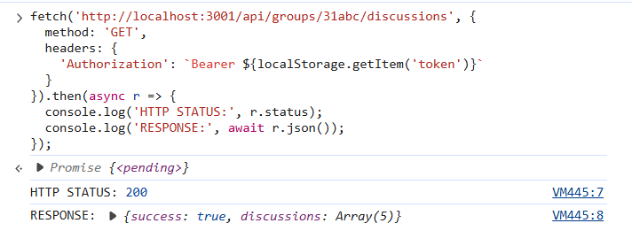

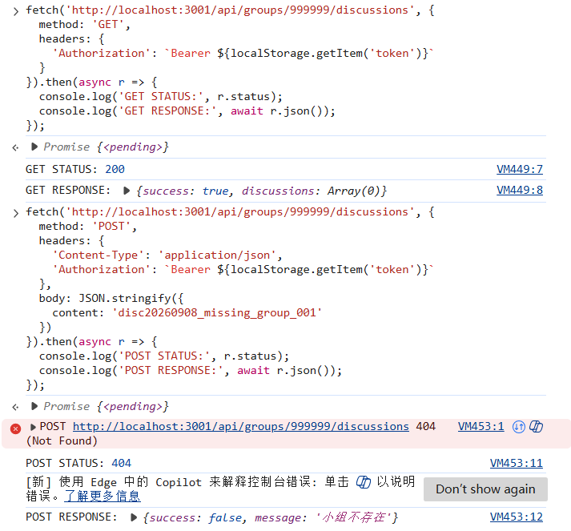

## BUG-FILE-001：普通文件REST接口缺少认证、小组成员与资源所有权授权

### 基本信息

| 项目 | 内容 |
| --- | --- |
| 所属模块 | 文件列表、上传、删除、成员权限 |
| 关联场景 | FILE-005、FILE-006、FILE-012、FILE-013、FILE-014 |
| 问题性质 | 已确认缺陷 |
| 严重程度 | 高 |
| 优先级 | P0 |
| 状态 | 待修复 |

### 缺陷描述与实际结果

普通 `group_files` REST 接口没有统一执行登录、小组成员和资源所有权校验，前端隐藏按钮无法形成有效的服务端权限边界：

- C 不是 group 31 成员，仍可 GET 文件列表并获得 3 条资料；
- C 可向 group 31 上传，SQL id 17 和物理文件均真实写入；
- B 看不到 A 文件的删除按钮，但直接 DELETE id 13 返回 200；
- C 可删除 B 的 id 14；
- 匿名用户可删除 id 20。以上删除均影响数据库和物理文件。

### 预期结果

- 列表、上传和删除均应先验证登录身份。
- 调用者应属于目标小组；删除还应按明确规则校验上传者、组长或管理员身份。
- 未登录返回 401，无组权限返回 403，不得读写数据库或物理文件。

### 代码关联

普通上传、列表和删除路由没有使用 `requireAuthUser`，删除逻辑也没有校验当前用户与文件的关系，见 [`server/index.js`](../server/index.js#L2632)。FILE-014 同时暴露 file id 格式校验问题，另记为 BUG-FILE-005。

### 测试证据

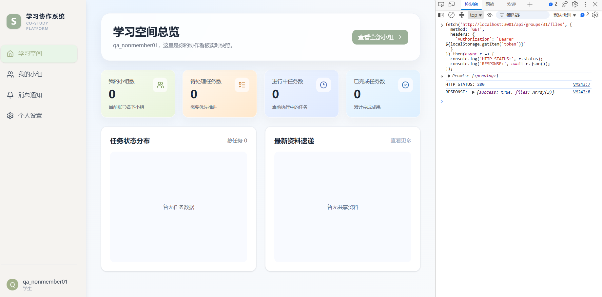

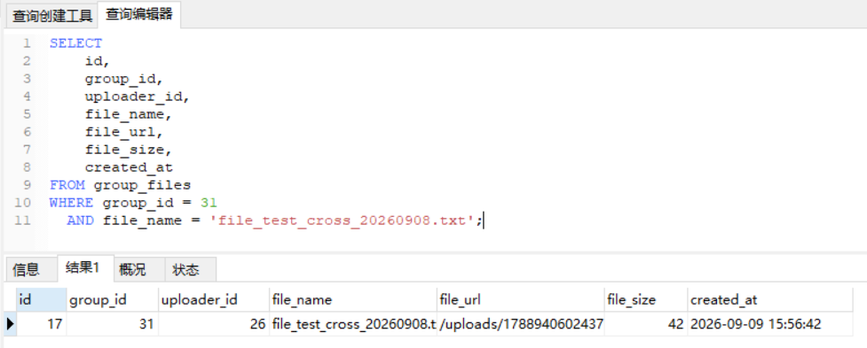

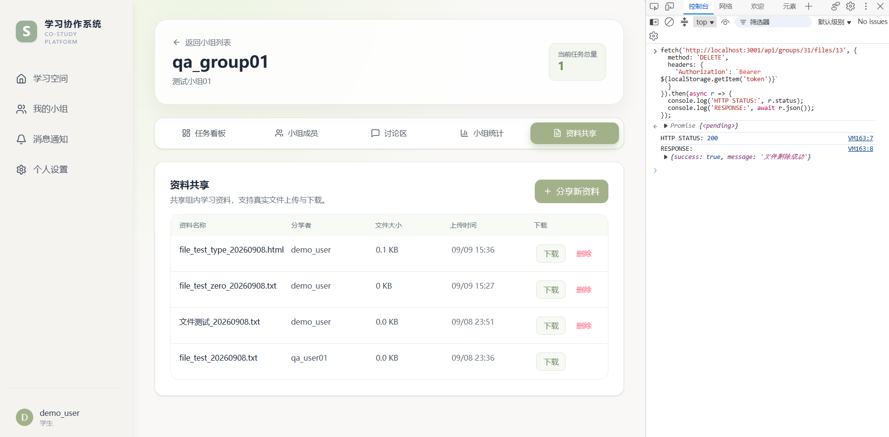

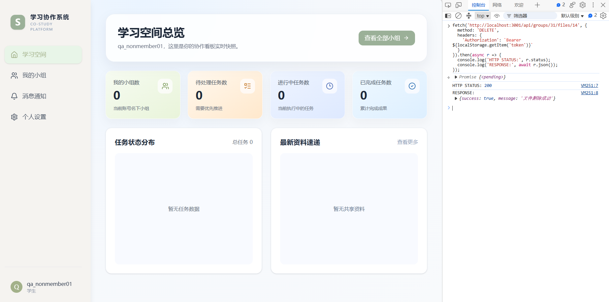

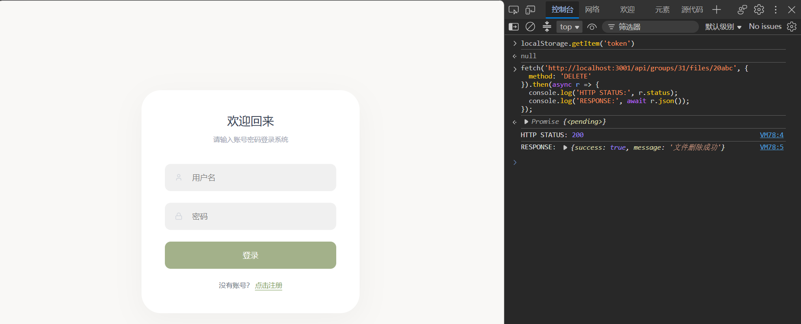

## BUG-FILE-002：上传接口信任客户端uploader_id，允许匿名伪造资源归属

### 基本信息

| 项目 | 内容 |
| --- | --- |
| 所属模块 | 文件上传、身份可信性 |
| 关联场景 | FILE-007 |
| 问题性质 | 已确认缺陷 |
| 严重程度 | 高 |
| 优先级 | P0 |
| 状态 | 待修复 |

### 缺陷描述与实际结果

无痕窗口中 `localStorage` 没有 token。匿名调用者在 multipart 请求中传入 `uploader_id=21` 后，上传接口返回 200，数据库把文件记录归属到 `qa_user01`，物理文件也真实生成。外部调用者可以伪造合法用户发布资料。

### 预期结果

上传者身份必须从服务端验证后的 token 获得，不能接受客户端指定的任意用户 ID；匿名请求应返回 401，且不写数据库和磁盘。

### 代码关联

上传路由直接解析 `req.body.uploader_id`，未从认证上下文取得用户 ID，见 [`server/index.js`](../server/index.js#L2632)。接口缺少认证的共性同时归入 BUG-FILE-001，本条聚焦身份伪造根因。

### 测试证据

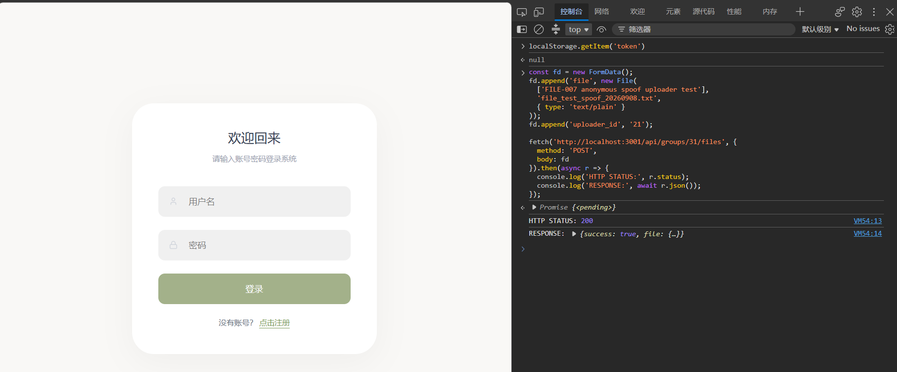

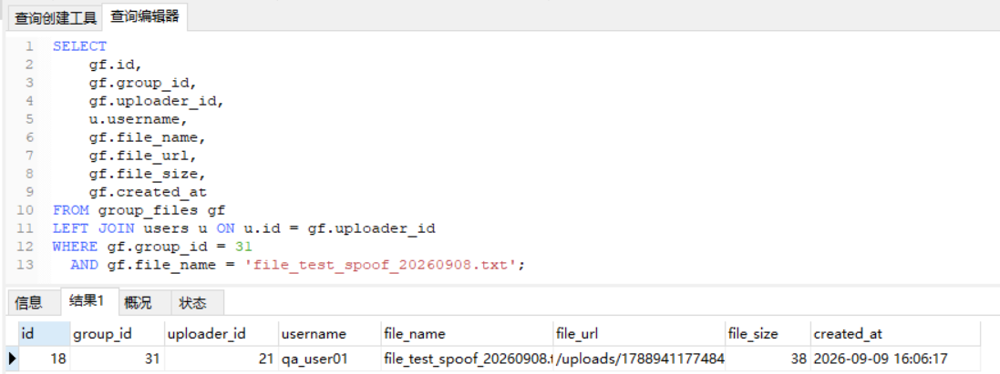

## BUG-FILE-003：公开uploads静态资源缺少认证与小组授权

### 基本信息

| 项目 | 内容 |
| --- | --- |
| 所属模块 | 文件获取、静态资源权限 |
| 关联场景 | FILE-008；FILE-010增强影响 |
| 问题性质 | 已确认缺陷 |
| 严重程度 | 高 |
| 优先级 | P0 |
| 状态 | 待修复 |

### 缺陷描述与实际结果

未登录用户只要知道静态 URL，就能直接访问 `http://localhost:3001/uploads/...`。FILE-008 中无痕窗口得到 HTTP 200 和完整组内 TXT 内容；FILE-010 还确认上传的 HTML 会从同一公开目录以 `text/html` 提供。

### 预期结果

组内文件下载应经过认证和小组授权，未登录用户不能仅凭可猜测或泄露的 URL 获得内容。危险类型控制属于另一根因，另记为 BUG-FILE-004。

### 代码关联

服务将整个上传目录直接挂载为 Express 静态资源，见 [`server/index.js`](../server/index.js#L46)，该路径不经过业务 API 的认证与成员检查。

### 测试证据

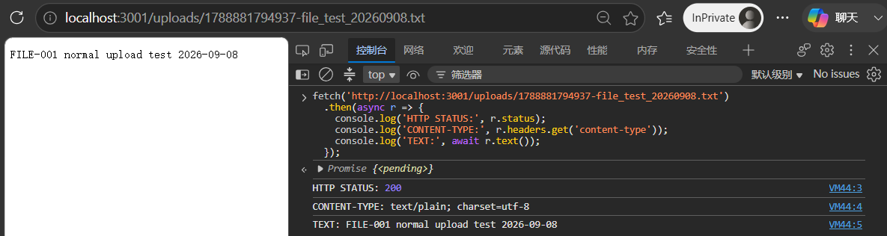

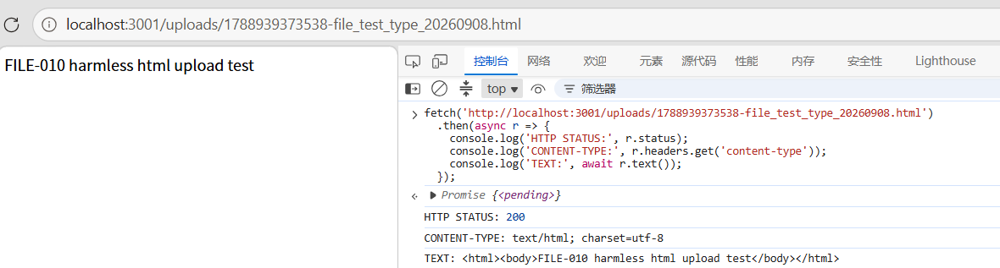

## BUG-FILE-004：文件类型与MIME安全校验缺失

### 基本信息

| 项目 | 内容 |
| --- | --- |
| 所属模块 | 文件上传、内容安全 |
| 关联场景 | FILE-010 |
| 问题性质 | 已确认缺陷 |
| 严重程度 | 高 |
| 优先级 | P0 |
| 状态 | 待修复 |

### 缺陷描述与实际结果

无害测试 HTML 文件上传返回 200，数据库记录 id 16、size 65；随后静态服务以 `text/html; charset=utf-8` 返回并由浏览器正常渲染。当前上传入口没有文件类型白名单或 MIME 限制。

### 预期结果

应依据项目允许的资料类型建立服务端校验；至少不应把用户上传的主动内容直接作为同源可执行 HTML 提供。允许类型范围仍应由需求明确，但当前“任意类型上传并公开渲染”的安全结果已经实际确认。

### 代码关联

multer 仅配置磁盘存储和文件名，没有 `fileFilter`、MIME/扩展名校验或大小限制，见 [`server/index.js`](../server/index.js#L48)。

### 测试证据

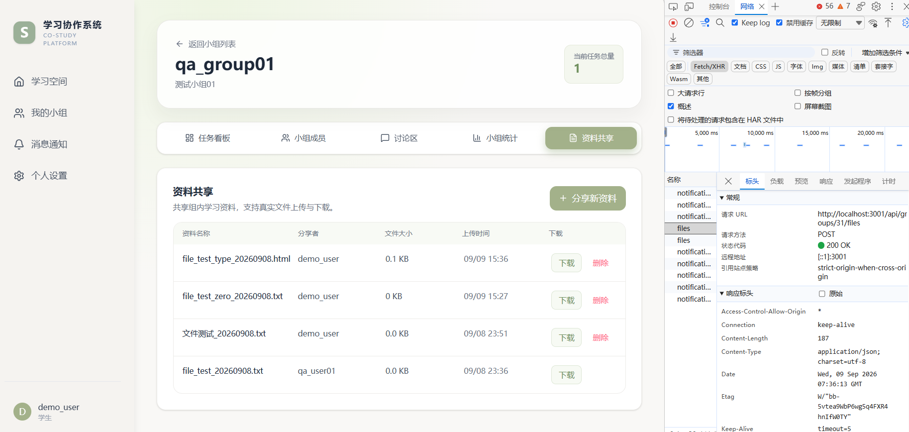


## BUG-FILE-005：groupId与fileId参数格式校验过宽

### 基本信息

| 项目 | 内容 |
| --- | --- |
| 所属模块 | 文件API、路径参数校验 |
| 关联场景 | FILE-011-B、FILE-014 |
| 问题性质 | 已确认缺陷 |
| 严重程度 | 中 |
| 优先级 | P1 |
| 状态 | 待修复 |

### 缺陷描述与实际结果

- 上传路径中的 `groupId=31abc` 被当作 31，接口返回 200，SQL id 19 和物理文件均写入 group 31。
- 删除路径中的 `fileId=20abc` 被当作 20，匿名请求成功删除真实 id 20。

### 预期结果

路径 ID 应匹配完整的正整数字符串；包含字母或其他后缀时应返回 400，并且不得读写数据库或文件系统。

### 代码关联

普通文件路由对 `groupId` 和 `fileId` 使用 `Number.parseInt`，未验证原字符串被完整解析，见 [`server/index.js`](../server/index.js#L2632) 和 [`server/index.js`](../server/index.js#L2715)。FILE-014 的匿名删除权限问题同时归入 BUG-FILE-001。

### 测试证据

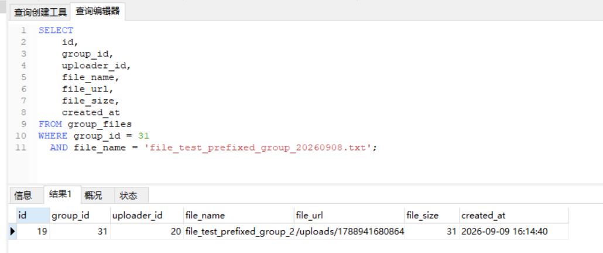


## BUG-FILE-006：上传失败后未回滚物理文件

### 基本信息

| 项目 | 内容 |
| --- | --- |
| 所属模块 | 文件上传、DB与文件系统一致性 |
| 关联场景 | FILE-011-A |
| 问题性质 | 已确认缺陷 |
| 严重程度 | 中 |
| 优先级 | P1 |
| 状态 | 待修复 |

### 缺陷描述与实际结果

向 `/api/groups/abc/files` 上传时，接口对非法 group id 返回 400，数据库没有有效记录，但 multer 在参数校验前已经把文件写入 `server/uploads`，留下 `1788941472033-file_test_invalid_group_20260908.txt` 孤儿文件。

### 预期结果

参数应在可行范围内先校验；若文件已经写入而后续校验或数据库操作失败，服务端应删除临时物理文件，使数据库和磁盘保持一致。

### 代码关联

`upload.single('file')` 在路由处理函数解析 `groupId` 之前运行，错误分支没有清理 `req.file`，见 [`server/index.js`](../server/index.js#L2632)。

### 测试证据

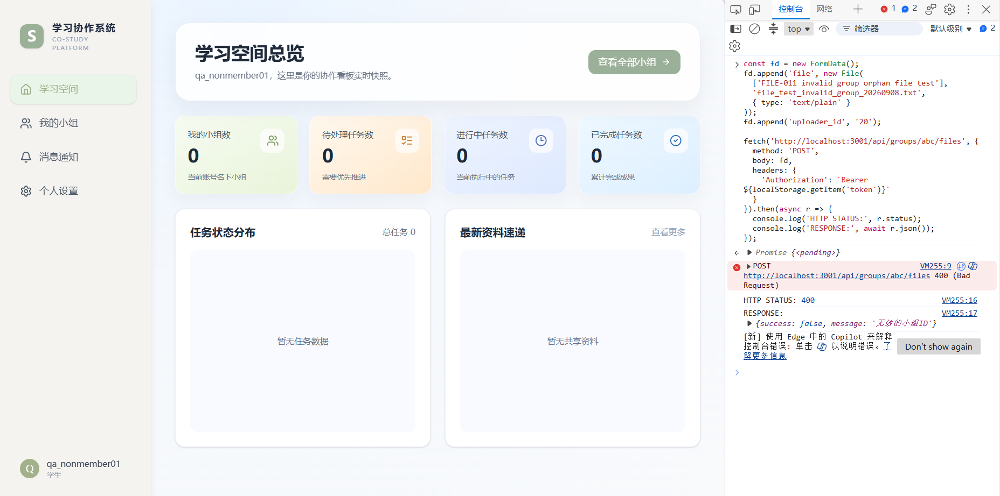

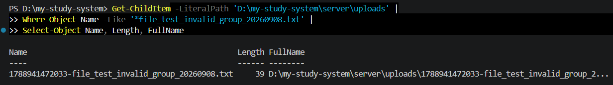

## BUG-FILE-007：资料集锦获取链接使用错误origin

### 基本信息

| 项目 | 内容 |
| --- | --- |
| 所属模块 | 资料集锦、文件获取 |
| 关联场景 | FILE-004-B |
| 问题性质 | 已确认缺陷 |
| 严重程度 | 中 |
| 优先级 | P1 |
| 状态 | 待修复 |

### 缺陷描述与实际结果

在 `/all-files` 点击“获取”后，浏览器访问 `http://localhost:5173/uploads/...`。该 URL 返回 HTTP 200 和 Vite 前端 `index.html`，并非目标 TXT 内容；正确静态文件服务实际位于 3001。

### 预期结果

“获取”应生成正确的后端文件 URL，返回所选文件内容；前端不应把相对 `file_url` 直接解析到自身 origin。

### 代码关联

资料集锦页面把数据库返回的相对 `file.file_url` 直接赋给 `<a href>`，见 [`src/pages/AllFiles.jsx`](../src/pages/AllFiles.jsx#L156)。小组详情页已有拼接后端基地址的下载 URL 构造逻辑，可以作为行为对照。

### 测试证据

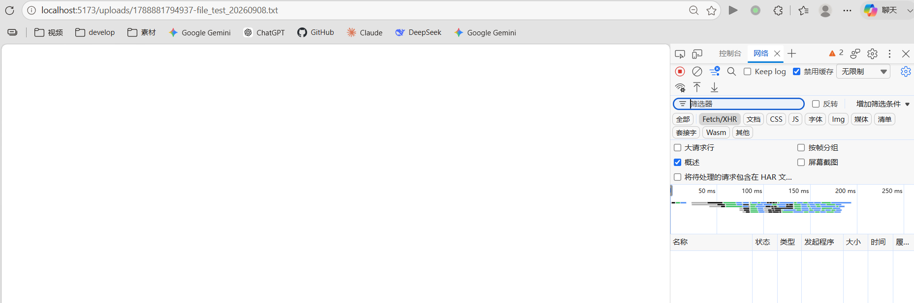

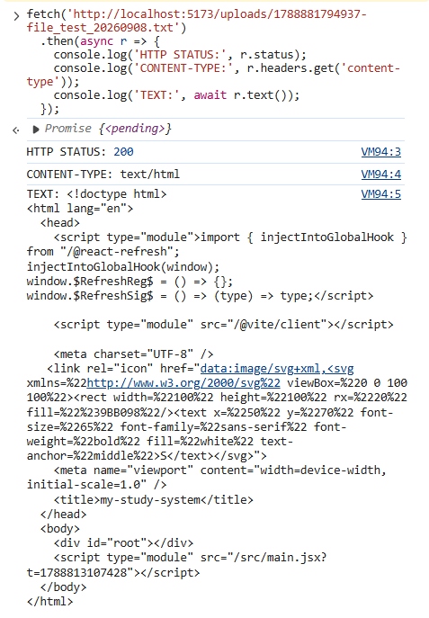

## BUG-NOTIF-001：notification id使用宽松整数解析

### 基本信息

| 项目 | 内容 |
| --- | --- |
| 关联场景 | NOTIF-009 |
| 问题性质 | 已确认缺陷 |
| 严重程度 | 中 |
| 优先级 | P1 |
| 当前状态 | 待修复 |

### 缺陷描述与复现步骤

通知respond接口使用宽松整数解析路径参数。A拥有一条真实的id 72、类型为`invite_result`的通知时，使用有效登录状态提交：

```http
POST /api/notifications/72abc/respond
Content-Type: application/json

{"action":"accept"}
```

### 预期结果

- `72abc`不是合法整数ID，应直接返回400和“无效的通知ID”。
- 不应查询或进入真实id 72的业务处理分支。

### 实际结果与影响

- 接口返回400，但消息是“暂不支持该类型通知”。
- 该消息只会在查询到真实id 72并识别出其`invite_result`类型后返回，证明`72abc`已经被解析成72。
- 本轮实测的是respond接口。源码中DELETE通知接口使用相同的`Number.parseInt`方式，因此也存在同类风险，但DELETE数字前缀行为尚未单独实测，不能算作额外执行结果。
- 宽松ID解析可能让格式错误的URL意外命中真实资源，降低接口参数边界的可靠性。

### 代码关联

- [`server/index.js`](../server/index.js#L2260)：respond接口直接使用`Number.parseInt(req.params.id, 10)`。
- [`server/index.js`](../server/index.js#L2393)：DELETE接口使用相同解析方式，属于源码风险延伸。

### 测试证据

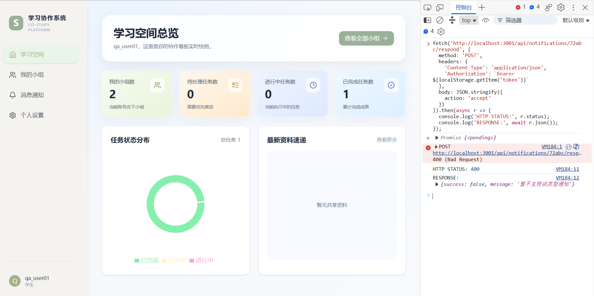

## BUG-ADMIN-001：管理员用户接口使用宽松整数ID解析

### 基本信息

| 项目 | 内容 |
| --- | --- |
| 所属模块 | 管理员用户管理 |
| 关联场景 | ADMIN-005 |
| 问题性质 | 已确认缺陷 |
| 严重程度 | 中 |
| 优先级 | P1 |
| 状态 | 待修复 |

### 缺陷描述

管理员使用合法token调用 `PUT /api/admin/users/29abc` 时，接口没有把整个路径参数判为非法，而是返回200并修改真实id 29用户。SQL确认不是只返回了成功响应，目标记录的数据已经实际改变。

### 预期结果

- 用户ID路径参数必须是完整的正整数。
- `29abc` 应返回400和“无效的用户ID”。
- 不应查询或修改真实id 29。

### 实际结果与影响

- 请求返回HTTP 200和 `success:true`。
- SQL确认真实id 29用户被修改。
- 格式错误的URL可以意外命中真实用户资源，降低接口参数边界的可靠性；在管理员权限下还可能修改错误目标。

### 代码关联

管理员更新用户接口直接使用 `Number.parseInt(req.params.id, 10)`，只检查解析结果是否为正整数，没有验证原字符串是否被完整解析，见 [`server/index.js`](../server/index.js#L626)。

### 测试证据

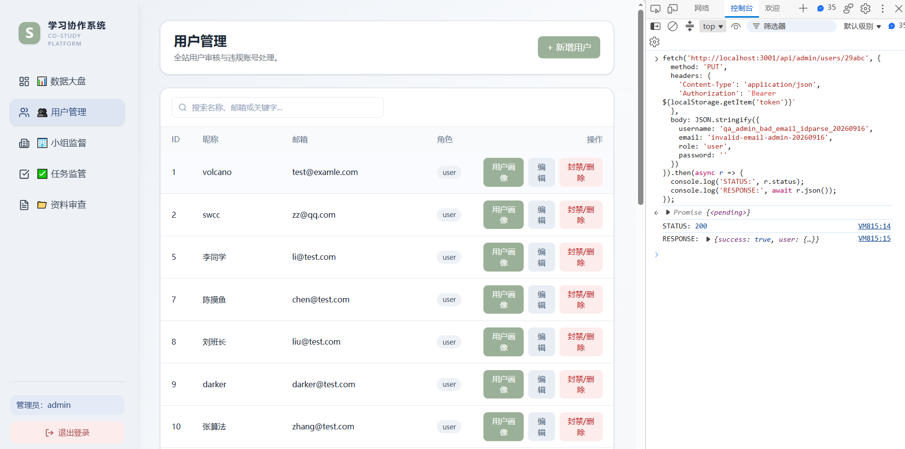

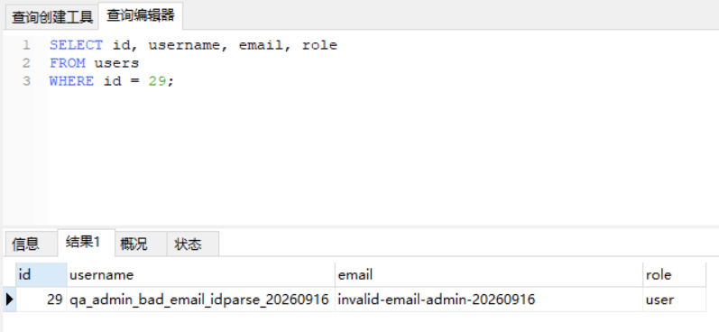

### 修复与定向回归追加记录（2026-09-17）

> 上面的“待修复”、缺陷描述、实际结果和截图是发现阶段的原始记录，完整保留。以下为后续修复记录，不改变该缺陷曾实际发生的事实。

| 项目 | 内容 |
| --- | --- |
| 当前修复状态 | **已修复并验证** |
| 修复日期 | 2026-09-17（UTC+8） |
| 验证批次 | `20260917053942`，13:39:42～13:39:49 |
| 修改文件 | `server/index.js`，管理员用户 PUT / DELETE 两处 ID 校验 |
| 修复 commit | [`0cc03e0c75932d712e0dd79451821c2864844ab6`](https://github.com/volcano-77/graduation-study-system/commit/0cc03e0c75932d712e0dd79451821c2864844ab6) — `fix: validate admin user ids strictly` |

**根因与修复方式：** PUT 和 DELETE 都使用 `Number.parseInt(req.params.id, 10)`，数字前缀会被截取成真实 ID。项目没有可复用的严格 ID helper；本次仅将这两处改为 `Number(req.params.id)`，并同时要求原始参数匹配 `/^[1-9]\d*$/`、转换结果满足 `Number.isSafeInteger()`。非法参数在目标用户查询、更新或删除前返回 HTTP 400、`success:false`、`message:"无效的用户ID"`。鉴权中间件正常读取当前登录管理员不属于目标用户业务查询。没有 GET `/api/admin/users/:id` 接口；现有 GET 为用户列表，不需要添加 ID 校验。

**修复后预期：** 非法 ID 统一拒绝；合法但不存在的 ID 保持 404“用户不存在”；合法真实 ID 的更新、删除和列表读取保持正常。

**验证环境与方式：** 先使用用户提供的当前管理员测试凭据调用原服务 `POST /api/login`，返回 200，admin id=3、role=admin。随后从修复后的源码启动临时服务 `http://localhost:3002`，仅将运行副本中的端口由 3001 改为 3002；路由、鉴权和业务代码不变，连接同一本地 MySQL。原 3001 服务未重启，仍为旧运行实例；日后要在 3001 使用修复版，需要正常重启后端。本次回归为真实 HTTP/API 与 SQL 层验证，不宣称完成前端页面回归或全项目回归。

| 定向验证 / 回归项 | 实际结果 | 结论 |
| --- | --- | --- |
| 管理员正常登录 | 修复版 `POST /api/login` 返回 200、`success:true`、role=admin | Pass |
| 管理员用户列表 | 新增前、修改后、清理后共3次 GET，均为200；修改后的值在列表中可读，清理后20个普通用户 | Pass |
| `29abc` 非法 PUT / DELETE | 均返回400、`success:false`、“无效的用户ID” | Pass |
| 其他非法 ID | `abc29`、`29.5`、`0`、`-1`、`029`、`+29`、尾随空格、尾随换行、`1e2`、`0x1d`、`9007199254740992`，PUT / DELETE 均返回400 | Pass |
| 现存真实目标的数字前缀 | 临时用户真实id=33，`33abc` 的 PUT / DELETE 均返回400；记录仍存在且全部字段未变 | Pass |
| 合法但不存在 ID | SQL先确认 `2147483647` 的count=0；PUT / DELETE 均返回404“用户不存在”，没有错误返回400 | Pass |
| 合法真实 ID CRUD | 新增临时普通用户返回201；`PUT /api/admin/users/33` 返回200，SQL确认用户名、邮箱修改成功；正常 DELETE 返回200 | Pass |
| 无副作用与数据清理 | 非法请求前后8张表全字段一致；清理后原有记录与初始基线全字段一致；临时记录count=0 | Pass |

修复版共执行35次真实HTTP请求，其中26次非法ID请求（13种值 × PUT/DELETE）；另有24次直接执行原路由回调的数据库访问断言，全部返回400且目标业务数据库调用数为0。PUT使用完整有效的用户名、邮箱、角色请求体，排除必填项错误导致的假通过。以上属于本缺陷的修复验证，不计入此前124条正式功能测试的历史统计。

**数据库与清理：** 本轮开始时历史id=29已不存在，非法请求前后均为0条；因此另用本轮创建的 `FIX-ADMIN-ID-20260917053942`（id=33）验证现存资源不会被数字前缀误命中。只有该临时用户执行正常修改和删除。通过只读SQL快照对比 users、groups_table、group_members、tasks、discussions、notifications、shared_files、group_files 的全部记录与字段，正式账号及关联数据均未改变。最终以精确id和精确临时用户名查询，残留count=0；没有直接执行SQL清理语句，没有重置数据库或修改管理员密码。自增序列正常递增，不回拨。临时后端进程及运行副本已清理。

**回归边界：** 仅覆盖管理员登录、用户列表、用户正常CRUD、不存在语义及非法ID拒绝。未执行REG-001～REG-014或全部124条回归。其他用户、小组、任务、文件、通知接口仍可见同类宽松解析代码，本轮只做源码定位，未扩修、未新增其缺陷结论；BUG-LR-002、BUG-LR-003、BUG-ADMIN-002均未处理。

**修复后证据：** 以下四张截图为真实HTTP/SQL执行日志的可视化页面截图，明确区别于DevTools或数据库客户端原生截图。完整脱敏请求、响应、SQL检查及受测源码SHA-256见 [FIX-ADMIN-001-results.json](./screenshots/FIX-ADMIN-001-results.json)。不保存密码、完整token或原始数据库私密字段。原有两张 `ADMIN-005-loose-id-parse-*` 截图未删除、未覆盖，修复前后SHA-256一致。

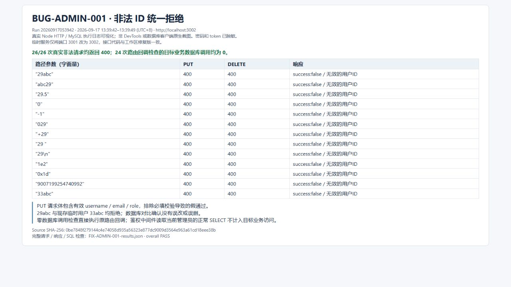

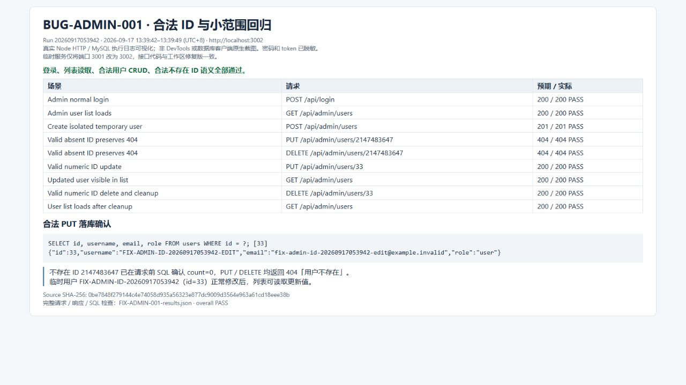

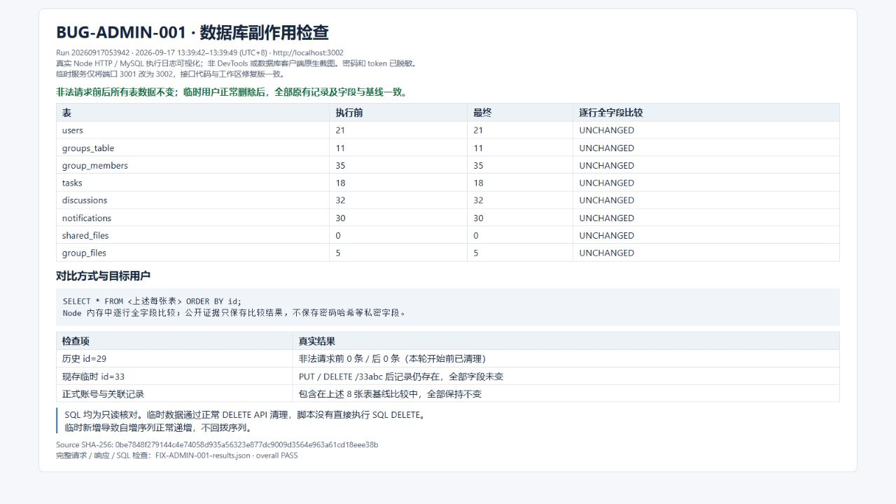

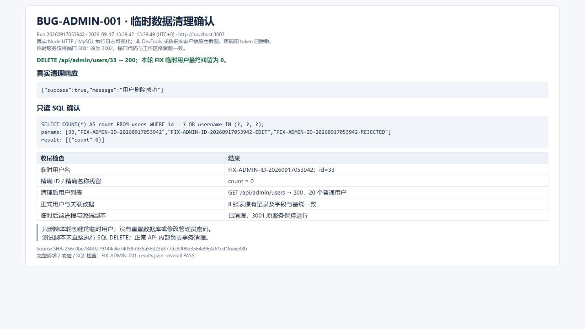

## BUG-ADMIN-002：管理员强制解散小组后残留物理上传文件

### 基本信息

| 项目 | 内容 |
| --- | --- |
| 所属模块 | 管理员小组监督、文件存储一致性 |
| 关联场景 | ADMIN-008 |
| 问题性质 | 已确认缺陷 |
| 严重程度 | 中 |
| 优先级 | P1 |
| 状态 | 待修复 |

### 缺陷描述

管理员强制解散包含真实上传文件的group 33后，接口返回200，页面移除小组，所有相关数据库记录也已经清零；但 `server/uploads` 中仍存在 `1789572361032-ADMIN-GROUP-FILE-001.txt`。数据库已无法追踪该文件，形成孤儿物理文件。

### 预期结果

- 强制解散前应取得该小组所有 `group_files.file_url`。
- 数据库事务成功后应同步删除对应物理文件，或使用可恢复的清理机制。
- 页面、数据库和文件系统应保持一致。

### 实际结果与影响

- `DELETE /api/admin/groups/33` 返回200。
- groups、members、tasks、discussions、notifications、shared_files、group_files均为0。
- 上传目录仍保留目标TXT，测试收尾时只能手工删除。
- 长期使用可能积累不可从数据库管理的文件，占用磁盘，并使“强制解散已清理全部关联数据”的结果不完整。

### 根因归并说明

本问题没有合并到BUG-FILE-006。BUG-FILE-006是“上传请求失败后未回滚已经落盘的文件”；本问题是“管理员删除小组时从未执行关联物理文件清理”，发生阶段和修复位置不同，因此单独记录。

### 代码关联

管理员强制解散只删除数据库关联数据后删除小组，没有读取 `group_files.file_url` 或调用文件系统删除；`group_files`记录通过外键级联清理，但物理目录不受数据库事务管理，见 [`server/index.js`](../server/index.js#L1237)。

### 测试证据

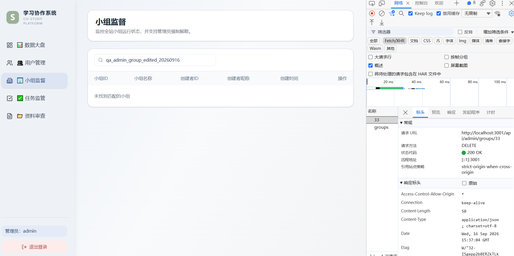

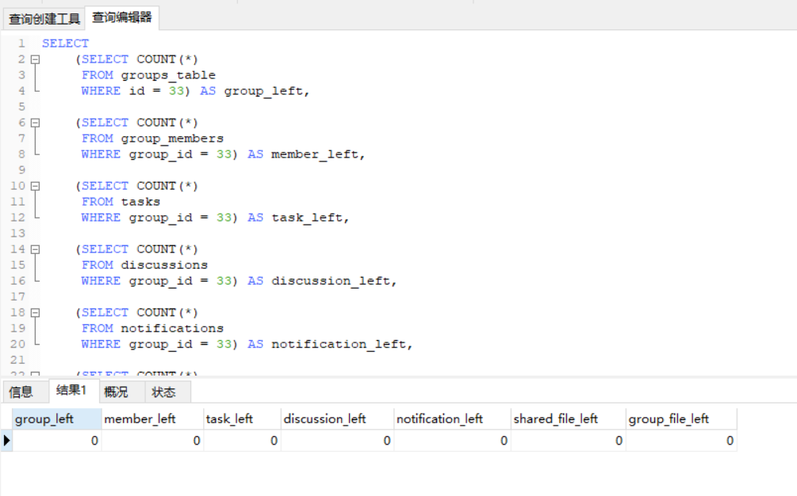

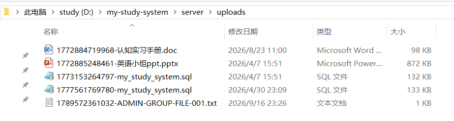

## 2. 需求待确认 / 权限与隐私风险候选

### RISK-ADMIN-001：第二管理员的列表、登录权限与重启后角色不一致

#### 基本信息

| 项目 | 内容 |
| --- | --- |
| 所属模块 | 管理员用户管理、角色生命周期 |
| 关联场景 | ADMIN-006 |
| 问题性质 | 管理员角色规则待确认 / 风险候选 |
| 严重程度 | 待确认 |
| 优先级 | 待确认 |
| 状态 | 待需求确认 |

#### 实际执行结果

- 管理员页面允许创建role为admin的第二账号，POST返回201，SQL确认role=admin。
- 该账号不会显示在管理员用户列表中。
- 后端重启前可以登录管理员概览。
- 后端完整重启后，SQL显示其role自动变成user，登录后只能进入普通用户Dashboard。
- 主admin删除自己返回400，当前管理员自删除保护符合预期。

#### 风险说明

项目没有明确说明是“只允许一个固定管理员”还是“支持创建多个管理员”。当前UI/API提供admin角色选择，但列表查询和启动初始化又按单管理员规则处理，容易让管理员误判账号权限状态。在需求明确前不直接判确认缺陷；若产品确认支持多管理员，应转为功能缺陷。

#### 测试证据

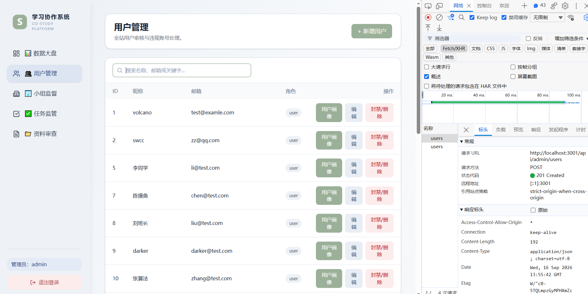

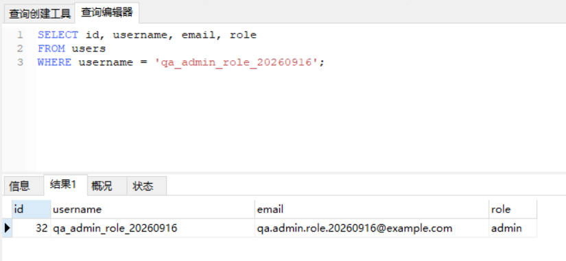

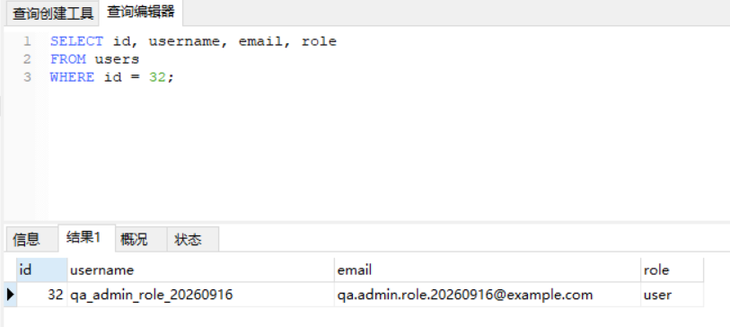

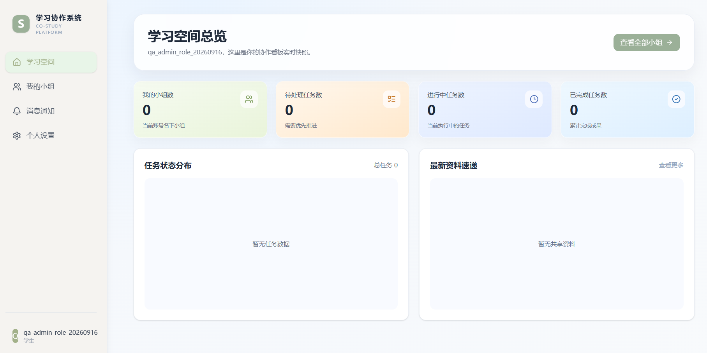

### RISK-PROF-001：密码修改后既有 token 仍然有效

#### 基本信息

| 项目 | 内容 |
| --- | --- |
| 所属模块 | 个人密码修改、登录会话 |
| 关联场景 | PWD-004 |
| 问题性质 | 会话安全规则待确认 / 风险候选 |
| 严重程度 | 待确认 |
| 优先级 | 待确认 |
| 状态 | 待需求确认 |

#### 实际执行结果

- 保留C修改密码前签发的旧token；
- 密码修改成功后继续使用该token请求 `GET /api/user/profile`；
- 接口返回HTTP 200和 `success:true`，旧会话未被撤销。

#### 判定边界

当前token只按签名和过期时间验证，没有密码版本、会话表或改密时间校验。项目需求未明确规定“修改密码后注销全部既有会话”，因此本场景不直接判确认缺陷。如果产品要求在密码泄露后通过改密收回旧会话，则该行为应升级为安全缺陷。

#### 测试证据

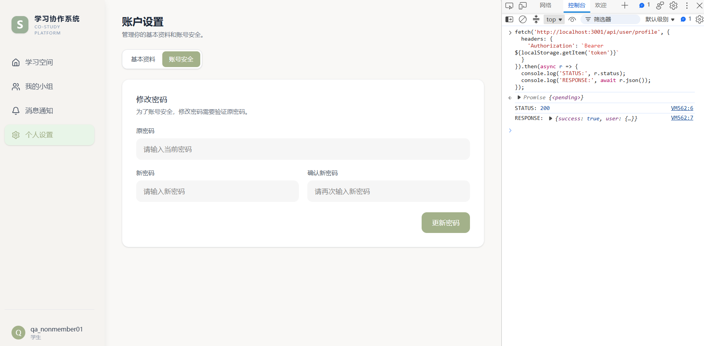

### RISK-GM-001：非成员可读取小组成员邮箱等信息

#### 基本信息

| 项目 | 内容 |
| --- | --- |
| 所属模块 | 小组成员与权限 |
| 关联场景 | GROUP-PERM-001-3 |
| 问题性质 | 需求待确认 / 权限与隐私风险候选 |
| 严重程度 | 待确认 |
| 优先级 | 待确认 |
| 状态 | 待需求确认 |
| 测试角色 | C：`qa_nonmember01`，user id 26 |
| 目标小组 | group 31；C 不属于该小组 |

#### 实际执行结果

- C 使用有效登录状态直接请求 `GET /api/groups/31/members`。
- 接口返回 200，响应中的 `members` 为包含 2 个对象的数组。
- 成员对象包含 `email`、`username`、`role`、`id`、`group_id`、`joined_at` 等字段。
- 已实际确认仅登录但不属于 group 31 的用户可以读取该小组成员邮箱及成员关系信息。

#### 风险与待确认事项

- 成员邮箱属于个人信息，向非成员返回可能扩大信息可见范围。
- 项目没有明确规定小组成员列表及邮箱是否只允许组内成员查看，因此当前不直接认定为已确认 Bug，也不判定该场景 Pass 或 Fail。
- 需要确认：非成员是否允许查看成员列表；如果允许，是否仍应隐藏邮箱、加入时间等字段。

#### 代码关联

成员列表接口要求用户登录，但没有继续校验当前用户是否为 group 31 的 owner 或成员，见 [`server/index.js`](../server/index.js#L1979)。本记录以 GROUP-PERM-001-3 的实际 200 响应为依据，不是仅由源码推测。

#### 测试证据

截图显示 C 调用成员列表接口返回 200，并在响应中看到成员邮箱等字段：


### RISK-FILE-001：系统允许上传并保存零字节文件

#### 基本信息

| 项目 | 内容 |
| --- | --- |
| 所属模块 | 文件上传、输入边界 |
| 关联场景 | FILE-009-B |
| 问题性质 | 需求待确认 / 风险候选 |
| 严重程度 | 待确认 |
| 优先级 | 待确认 |
| 状态 | 待需求确认 |

#### 实际执行结果

- B 上传 `file_test_zero_20260908.txt`，POST 返回 200。
- 页面显示文件大小 0 KB。
- SQL 确认 `group_files` id 15、group id 31、uploader id 20、`file_size=0`。

#### 风险与待确认事项

项目当前没有明确规定是否允许空文件，因此本结果不判 Fail，也不作为已确认缺陷。需要确认零字节资料是否具备业务价值，以及是否应在前端和后端统一拒绝。

#### 测试证据

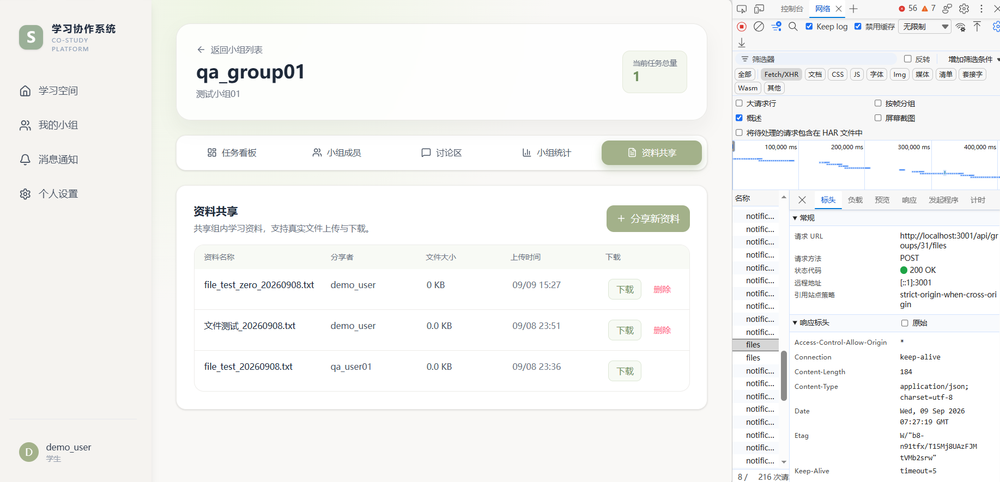

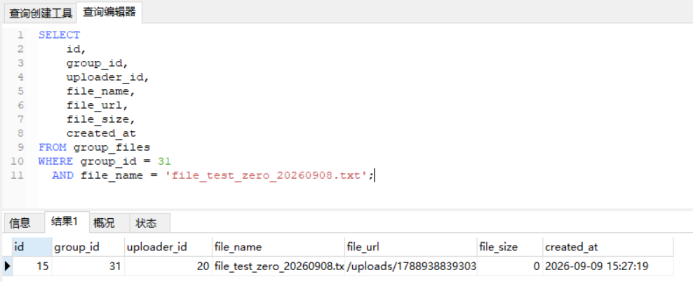

### RISK-FILE-002：文件上传未配置单文件大小限制

#### 基本信息

| 项目 | 内容 |
| --- | --- |
| 所属模块 | 文件上传、容量边界与资源安全 |
| 关联场景 | FILE-017 |
| 问题性质 | 需求待确认 / 安全风险候选 |
| 严重程度 | 待确认 |
| 优先级 | 待确认 |
| 状态 | 待需求确认 |

#### 实际执行结果

- A 上传长度为 20971520 bytes（20 MiB）的 `FILE-017-large-20MB.bin`。
- `POST /api/groups/31/files` 返回 200，页面显示 20.00 MB。
- SQL 确认 `group_files` id 22 的 `file_size=20971520`；物理目录中对应文件长度也为 20971520 bytes。
- 当前 Multer 使用 `multer({ storage })`，未配置 `limits.fileSize` 或等价单文件大小限制。
- 测试后通过正常删除接口清理，数据库 id 22 和物理文件均不存在。

#### 风险与待确认事项

项目需求没有规定文件大小上限，因此本场景不判 Fail，也不作为已确认缺陷。若部署环境长期开放上传，缺少单文件限制可能造成磁盘空间耗尽、服务资源占用或拒绝服务风险；建议先确认业务允许的最大文件大小，再在前后端实施一致限制和明确错误提示。

#### 测试证据

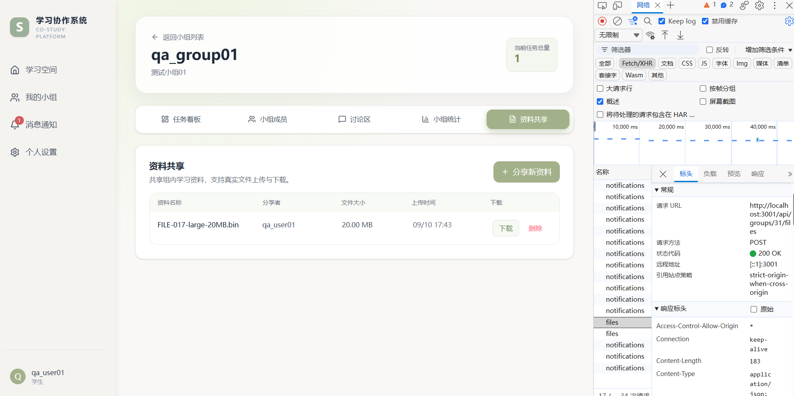

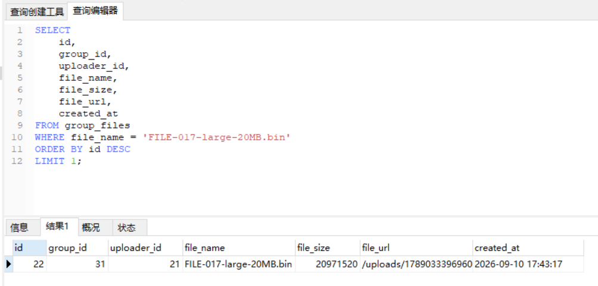

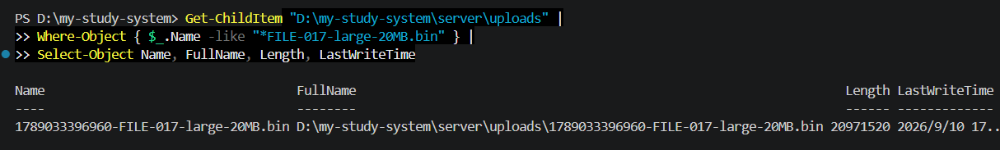

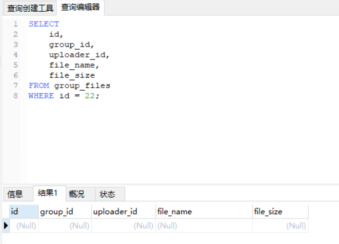

### RISK-DISC-MENTION-001：讨论区允许用户提及自己

#### 基本信息

| 项目 | 内容 |
| --- | --- |
| 所属模块 | 讨论区 `@` 提及 |
| 关联场景 | DISC-MENTION-003 |
| 问题性质 | 业务规则待确认 / 风险候选 |
| 严重程度 | 待确认 |
| 优先级 | 待确认 |
| 状态 | 待需求确认 |

#### 实际执行结果

- A 输入 `@qa` 时，候选列表包含当前账号 `qa_user01`。
- A 成功发送 `@[qa_user01](21) selfmention20260909_003`。
- 请求成功，页面按 mention 样式高亮自己。

#### 风险与待确认事项

当前没有明确需求禁止用户提及自己。该行为可能没有协作价值，但也不会自然构成功能错误，因此不判 Bug；需要产品确认候选列表是否应排除当前用户。

#### 测试证据

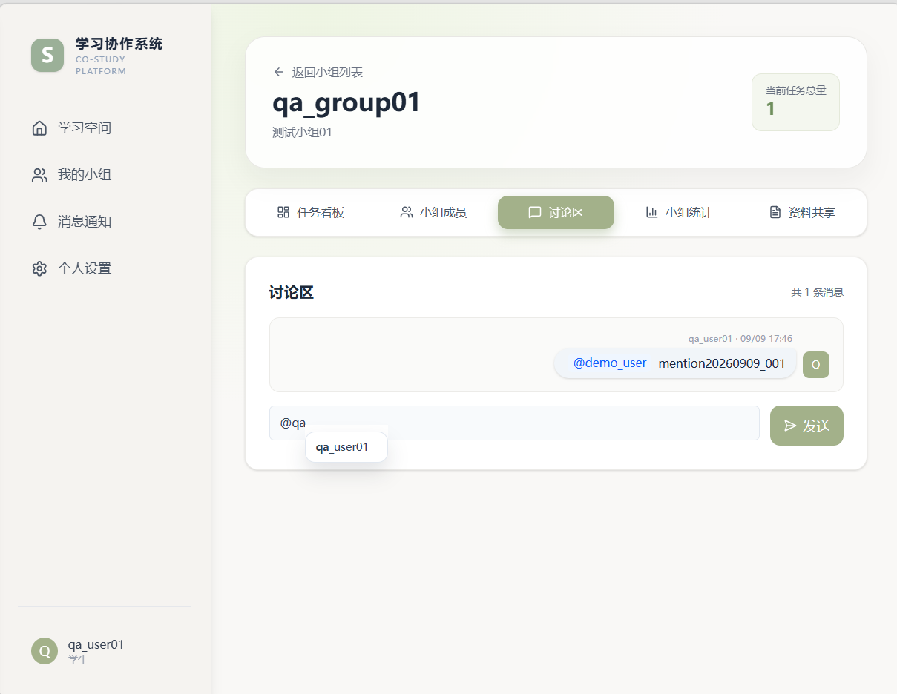

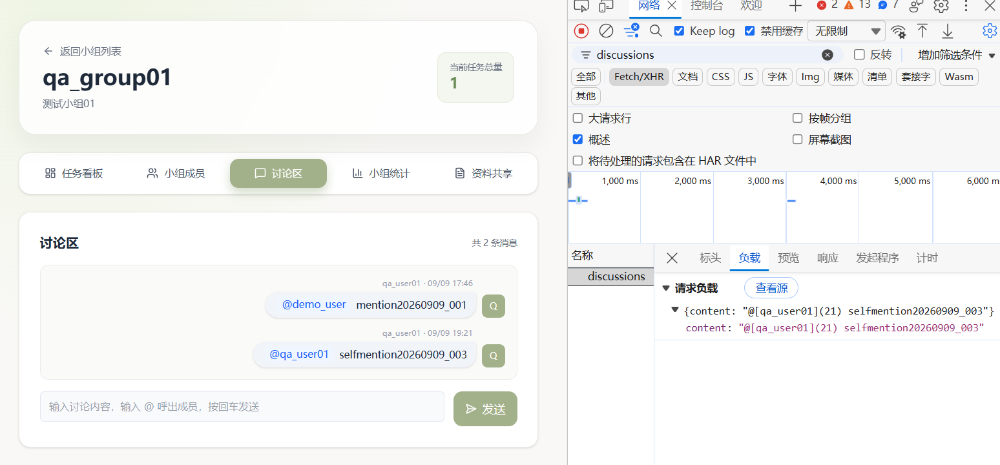

### RISK-DISC-MENTION-002：后端不校验mention用户真实性和成员关系

#### 基本信息

| 项目 | 内容 |
| --- | --- |
| 所属模块 | 讨论区 `@` 提及、数据真实性 |
| 关联场景 | DISC-MENTION-004 |
| 问题性质 | 真实性校验风险候选 |
| 严重程度 | 待确认 |
| 优先级 | 待确认 |
| 状态 | 待需求确认 |

#### 实际执行结果

- 前端候选列表正确排除了非成员 C 和不存在的用户名。
- A 绕过页面直接 POST `@[qa_nonmember01](26) mention20260909_004`，接口返回 200，页面高亮，SQL id 133 完整落库。
- A 直接 POST `@[不存在用户](999999) mention20260909_004b`，接口同样返回 200，页面高亮，SQL id 134 完整落库。
- 两种情况都没有创建 notifications 记录。

#### 风险与待确认事项

后端和展示层把 mention 标记当作可信文本，未验证用户是否存在、显示名和 ID 是否匹配、用户是否属于当前小组。当前 `@` 只承担文本高亮，不会触发通知或权限动作，因此先作为真实性校验风险候选；若以后 mention 参与通知或权限流程，应提升处理优先级。

#### 代码关联

讨论 POST 只对完整 content 执行 `trim()` 后落库；页面展示仅用正则解析 `@[显示名](id)`，见 [`server/index.js`](../server/index.js#L2454) 和 [`src/pages/GroupDetail.jsx`](../src/pages/GroupDetail.jsx#L749)。

#### 测试证据

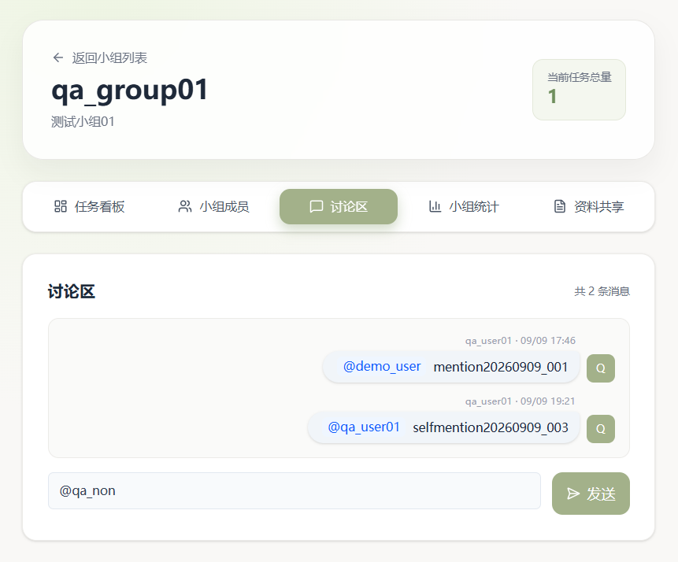

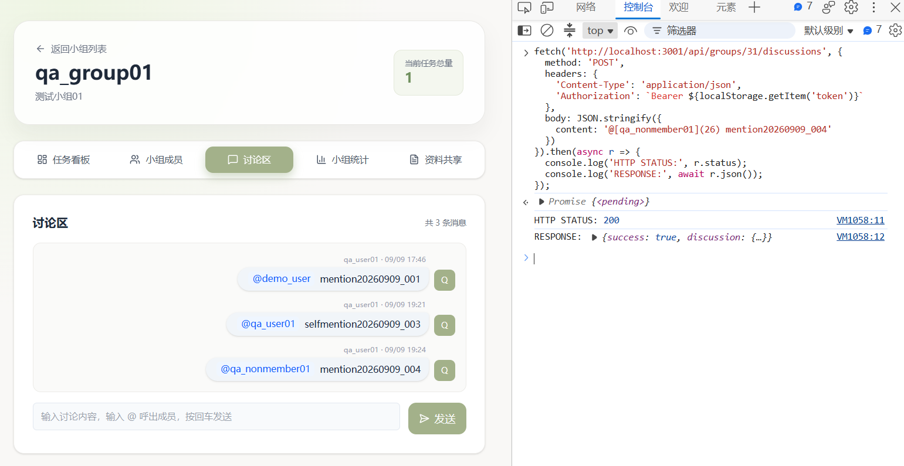

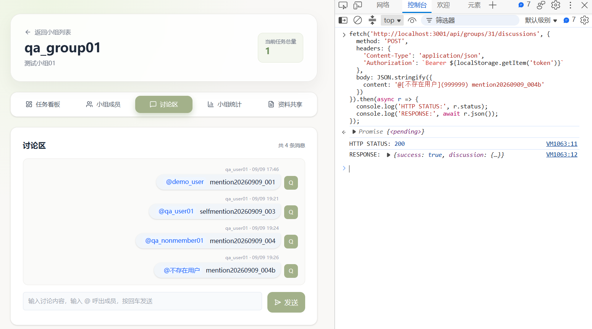

### RISK-DISC-MENTION-003：重复mention和重复消息不去重

#### 基本信息

| 项目 | 内容 |
| --- | --- |
| 所属模块 | 讨论区 `@` 提及、重复输入 |
| 关联场景 | DISC-MENTION-005 |
| 问题性质 | 业务规则待确认 / 风险候选 |
| 严重程度 | 待确认 |
| 优先级 | 待确认 |
| 状态 | 待需求确认 |

#### 实际执行结果

- 同一消息可连续选择两次 B，两个 `@[demo_user](20)` 均完整保存和高亮。
- 完全相同的消息再次 POST 仍返回 200。
- SQL id 135、136 内容相同，证明系统没有重复消息去重。
- 由于 mention 不生成 notifications，重复发送也没有产生重复 mention 通知。

#### 风险与待确认事项

当前没有明确要求去重同一接收者，也没有要求阻止用户连续发送相同文本。该行为可能造成讨论噪声，但在需求确认前不判 Bug。

#### 测试证据

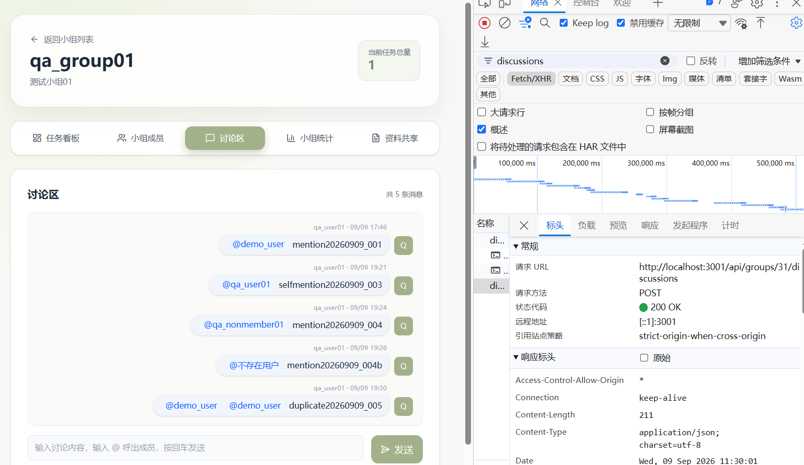

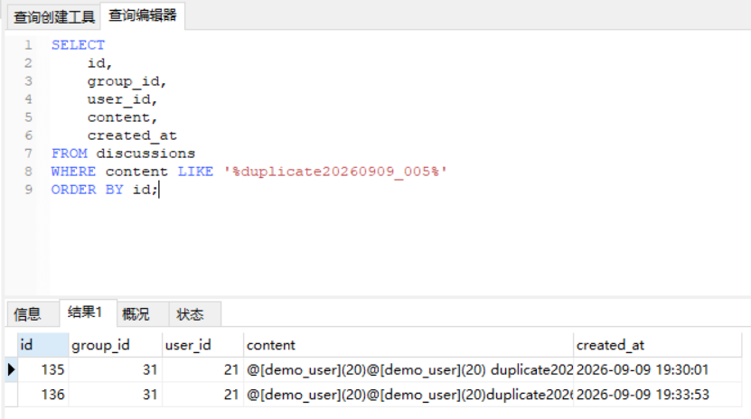

### RISK-NOTIF-001：pending邀请已读后仍计入“未读消息”

#### 基本信息

| 项目 | 内容 |
| --- | --- |
| 关联场景 | NOTIF-003 |
| 问题性质 | 业务语义待确认 / 风险候选 |
| 当前状态 | 待需求确认 |

#### 实际结果

- 进入通知页后，`PUT /api/notifications/mark-read`返回200。
- SQL确认pending invite的`is_read`已经持久化为1，刷新后仍为1。
- 页面“未读消息”和侧边栏红点仍显示1。

#### 判定边界

当前前端把pending邀请和未读通知同时计入红点。如果红点表示“待处理事项”，该行为可以成立；但页面文案明确写“未读消息”，与`is_read=1`存在语义冲突。需求尚未明确，因此不判确认缺陷。

#### 测试证据

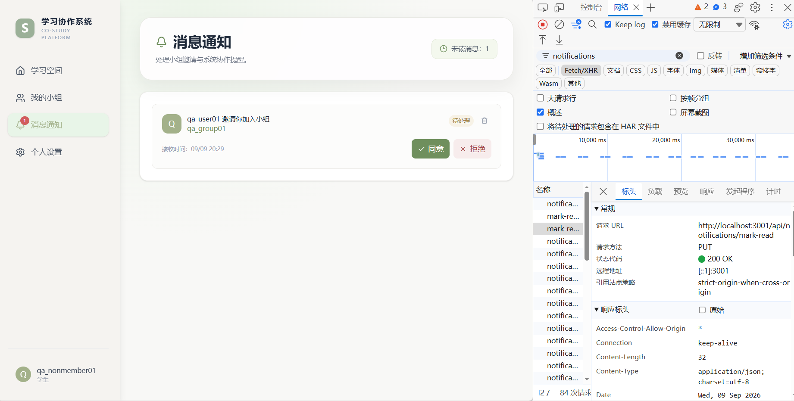

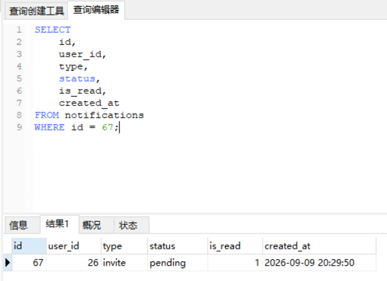

## 3. 问题统计

| 问题分类 | 数量 |
| --- | ---: |
| 已确认缺陷 | 21 |
| 业务规则缺口 / 可疑缺陷 | 1 |
| 需求待确认 / 权限与隐私风险候选 | 9 |
| **问题记录合计** | **31** |

21个已确认缺陷中，高严重程度8个、中严重程度13个。另有10个没有明确需求依据的问题：BUG-GR-001为小组名称规则缺口；RISK-PROF-001、RISK-GM-001、RISK-FILE-001、RISK-FILE-002、3个RISK-DISC-MENTION记录、RISK-NOTIF-001和RISK-ADMIN-001均属于需求待确认 / 风险候选。ADMIN-005的弱密码与非法邮箱分别扩展BUG-LR-002、BUG-LR-003，不重复计数；管理员用户ID宽松解析新增BUG-ADMIN-001，强制解散后残留物理文件新增BUG-ADMIN-002。本轮因此新增确认缺陷2个、风险候选1个。所有问题均未修改代码；当前也没有执行修复后的回归测试。

> 2026-09-17修复阶段追加说明：上段为发现阶段的历史汇总，原文保留。BUG-ADMIN-001现已修复并完成定向验证，详见该条目的追加记录；累计发现缺陷仍为21个、累计问题记录仍为31个。本次不调整README或历史测试执行统计。

> 2026-09-17后续追加：BUG-LR-002已修复并完成上述HTTP/SQL定向回归，原始缺陷历史完整保留；README及累计发现21个确认缺陷的统计未修改。

> 2026-09-17后续追加：BUG-LR-003已修复并完成上述复现、HTTP/SQL定向回归和数据清理，原始缺陷历史完整保留；README及累计发现21个确认缺陷的统计未修改。
