# 讨论区与实时消息模块测试执行报告

## 1. 测试范围

本报告记录 2026-09-08 完成的讨论区与实时消息测试，以及 2026-09-09 完成的 `@` 提及补充测试。所有结果均已实际执行并保留证据，覆盖历史消息、实时接收、未读角标、认证与非成员权限、输入和 group id 校验、mention 候选与高亮、notifications 联动及数据一致性。

- 测试小组：group 31（`qa_group01`）
- A 组长：`qa_user01`，user id 21
- B 普通成员：`demo_user`，user id 20
- C 非成员：`qa_nonmember01`，user id 26
- 执行方式：页面手工操作、DevTools Network/Console、匿名 Socket.IO 客户端、只读 SQL 校验
- 代码基线：`clean-main`；主模块开始时 HEAD 为 `c9930ad7c1f9c88b28853a07273d6ca1c173734d`，mention 补充测试收尾前 HEAD 为 `77d4a7c1697395abe64206569d35139daa4025a1`
- 本报告不把源码预测、未执行场景或当前不存在的功能计入实际执行统计。

当前讨论模块没有消息编辑、删除、撤回、回复、分页和管理员讨论监管功能；`@成员`只有前端选择与高亮，没有通知闭环。这些当前设计不作为本轮缺陷。

## 2. 执行环境

| 项目 | 环境 |
| --- | --- |
| 操作系统 | Windows |
| 前端 | React + Vite，`http://localhost:5173` |
| 后端 | Node.js + Express + Socket.IO，`http://localhost:3001` |
| 数据库 | 本地 MySQL |
| 浏览器与工具 | Chromium 内核浏览器、DevTools、PowerShell 匿名 Socket 客户端、SQL 查询工具 |

## 3. 执行结果总览

| 场景 | 分类 | 测试内容 | 结果 | 关联问题 |
| --- | --- | --- | --- | --- |
| DISC-001 | 正常业务、SQL一致性 | A 加载历史并发送消息 | Pass | — |
| DISC-002 | 普通成员协作、实时通信 | B 发送，A 不刷新实时收到 | Pass | — |
| DISC-003 | 实时协作 | A 离开讨论区时显示未读角标，进入后清零 | Pass | — |
| DISC-004 | 认证 | 无 token 获取讨论历史 | Pass | — |
| DISC-005 | 认证 | 无 token 发送消息 | Pass | — |
| DISC-006 | Socket权限、安全 | 匿名客户端加入 room 31 并监听消息 | Fail | BUG-DISC-002 |
| DISC-007 | REST权限、安全 | 非成员读取 group 31 历史讨论 | Fail | BUG-DISC-001 |
| DISC-008 | REST权限、安全、数据一致性 | 非成员发送消息并被自动加入小组 | Fail | BUG-DISC-001 |
| DISC-009 | 输入校验 | 空输入、纯空格和非字符串 content | Pass | — |
| DISC-010 | 资源ID校验 | 完全非法 group id `abc` | Pass | — |
| DISC-011 | 资源ID校验 | `31abc` 被解析为 group 31 | Fail | BUG-DISC-003 |
| DISC-012 | 资源存在性 | 不存在小组的 GET/POST 行为 | Fail | BUG-DISC-003 |
| DISC-013 | 历史加载、SQL一致性 | 刷新持久化、显示去重和单次落库 | Pass | — |

| 状态 | 数量 | 占比 |
| --- | ---: | ---: |
| 实际执行场景 | 13 | 100% |
| Pass | 8 | 61.5% |
| Fail | 5 | 38.5% |
| 需求待确认 / 风险候选 | 0 | 0% |

本轮讨论模块共有 26 张正式证据截图，全部位于 `docs/screenshots/` 并在本报告中引用。整理时整个截图目录共有 104 张图片。

## 4. 详细执行结果与证据

### DISC-001：A 正常加载历史并发送消息 — Pass

- 初始进入讨论区时，`GET /api/groups/31/discussions` 返回 200，页面显示0条历史消息。
- A 发送 `disc20260908_owner_001`，POST 返回 200，页面显示1条消息。
- SQL 确认生成 discussion id 126，`group_id=31`、`user_id=21`，发送者为 `qa_user01`，内容与页面一致。

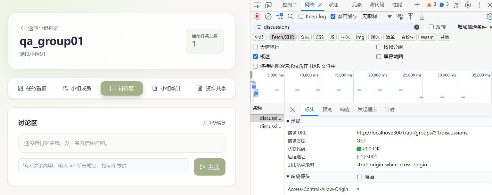

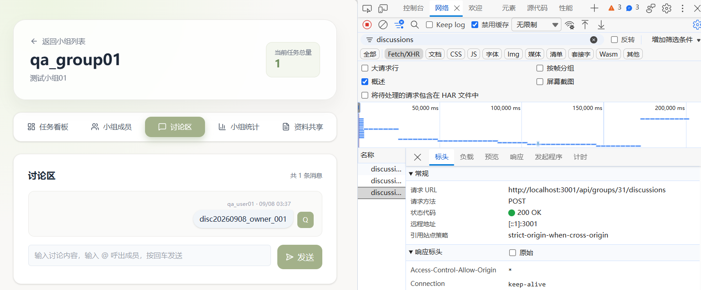

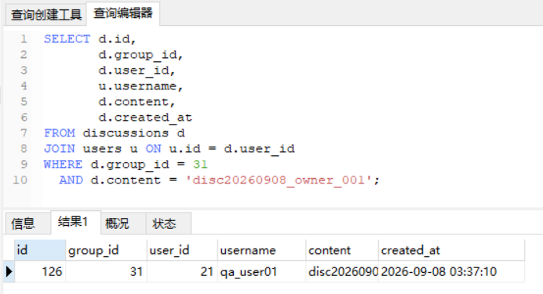

### DISC-002：B 发送，A 不刷新实时收到 — Pass

- B 发送 `disc20260908_member_realtime_001`，POST 返回 200。
- A 保持讨论页打开且没有刷新，页面自动出现 B 的新消息。
- 证明普通成员可以参与讨论，且 `new_message` 实时广播生效。

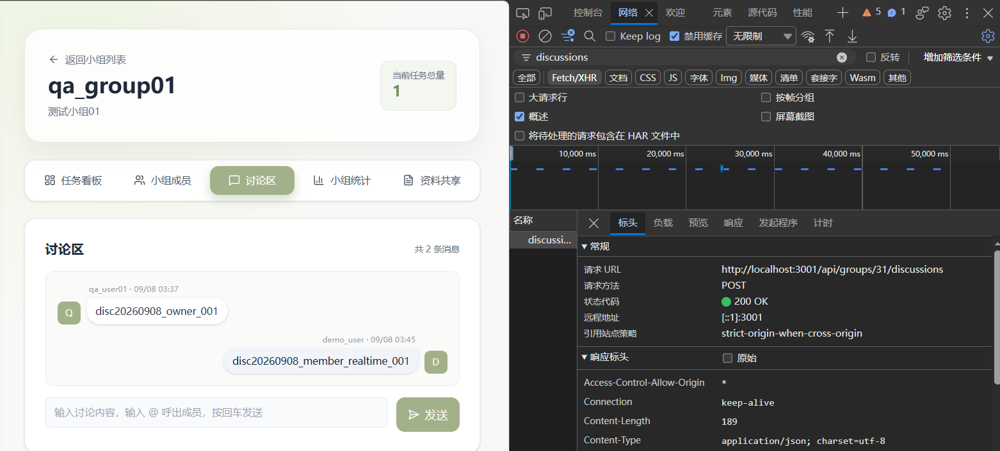

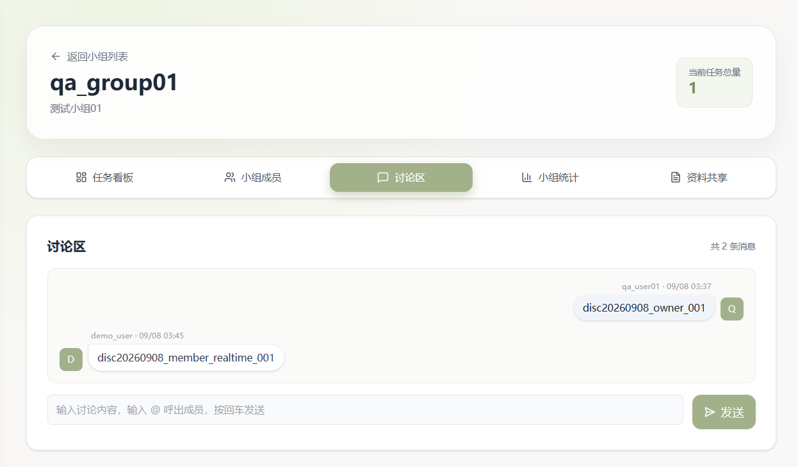

### DISC-003：未读角标与进入讨论区后清零 — Pass

- A 不在讨论区时，B 发送 `disc20260908_unread_001`。
- A 的 group 31 小组卡片出现未读角标1。
- A 进入讨论区后可以看到消息，未读角标清零。
- 本场景只验证当前会话内的未读逻辑，不把刷新后的持久化作为需求。

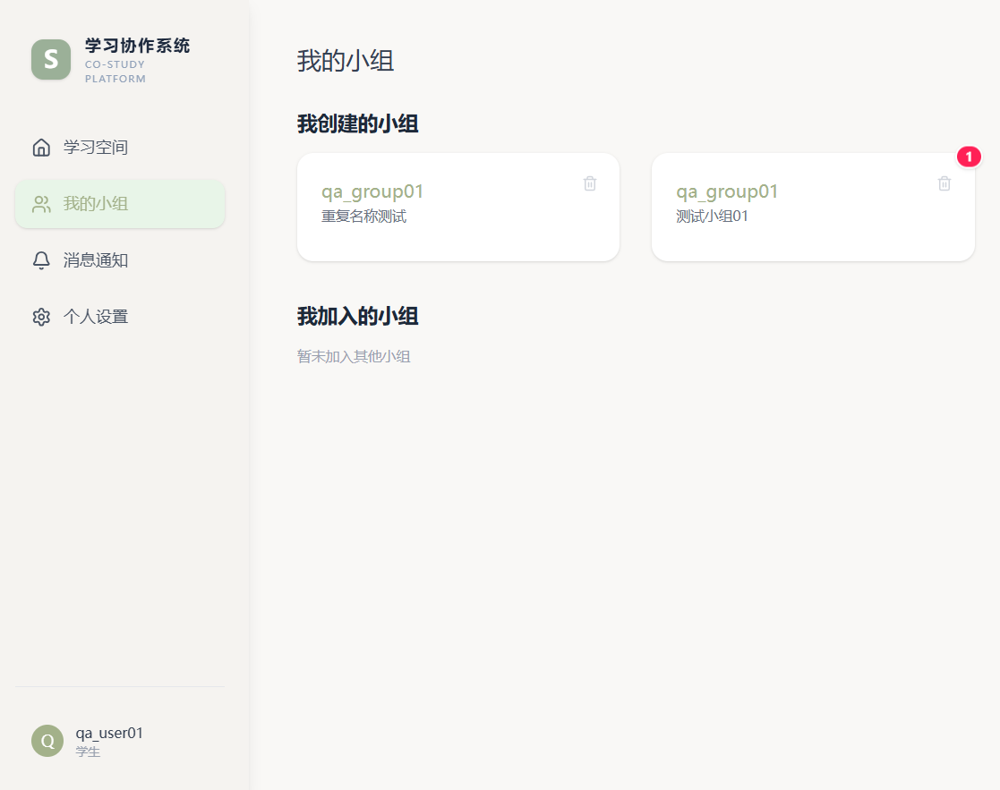

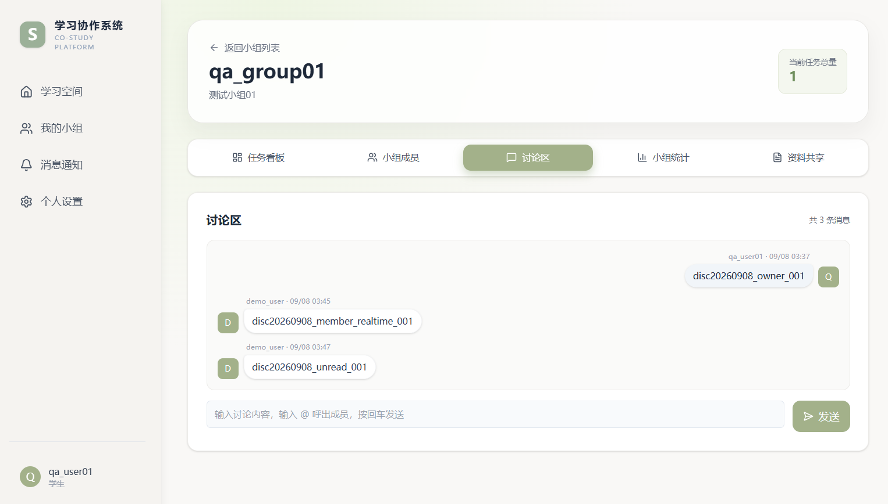

### DISC-004：无 token 获取讨论历史 — Pass

- 在请求中不携带 token，直接调用 `GET /api/groups/31/discussions`。
- 接口返回 401、`success:false`，提示“未登录或令牌无效”，没有返回讨论数据。

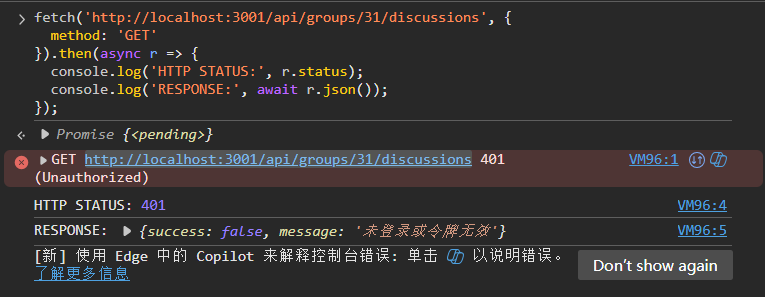

### DISC-005：无 token 发送消息 — Pass

- 不携带 token，向 group 31 POST `disc20260908_noauth_001`。
- 接口返回 401、`success:false`，提示“未登录或令牌无效”。
- 最终数据库检查确认该内容没有落库。

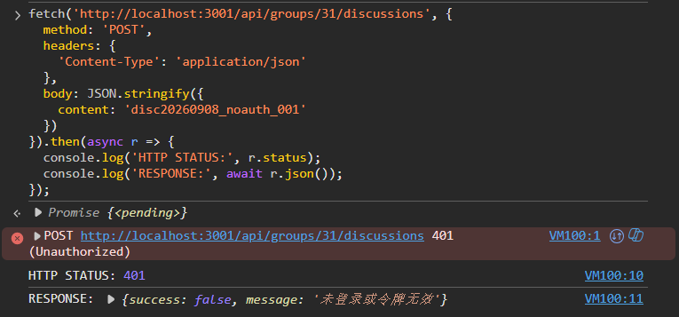

### DISC-006：匿名 Socket.IO 客户端监听 group 31 — Fail

- 匿名客户端没有携带 token，但成功连接 Socket.IO，并执行 `join_group(31)`。
- A 合法发送 `disc20260908_socket_probe_001`，POST 返回 200。
- 匿名客户端收到 `new_message`，内容中包含 group id、user id、用户名和讨论内容。
- 预期匿名客户端不能加入任何小组房间，也不能接收组内实时消息。

### DISC-007：C 非成员读取 group 31 历史讨论 — Fail

- SQL 先确认 `user_id=26` 不属于 group 31。
- C 使用有效登录状态直接请求 `GET /api/groups/31/discussions`。
- 接口返回 200、`success:true`，并返回4条 group 31 历史消息。
- 预期组内讨论只能由 owner 或成员读取，非成员应返回403。

### DISC-008：C 非成员发送消息并被自动加入小组 — Fail

- C 原本不是 group 31 成员，直接 POST `disc20260908_nonmember_autojoin_001`。
- 接口返回 200、`success:true`，生成 discussion id 130。
- SQL 确认消息真实写入 group 31，发送者为 `user_id=26`。
- SQL 同时确认后端新增 `group_id=31`、`user_id=26`、`role=成员` 的 group_members 记录，绕过邀请和接受流程。
- `成员` 与正常邀请流程使用的 `member` 取值不一致，作为同一越权缺陷的数据影响记录，不单独拆分Bug。

### DISC-009：空输入、纯空格和非字符串 — Pass

- A 在页面保持输入为空并点击发送，没有产生新的POST请求。
- 绕过页面提交纯空格 content，接口返回400和“消息内容不能为空”。
- 提交数字 `123` 作为 content，接口同样返回400。
- 最终SQL没有发现这些异常请求产生的讨论记录。

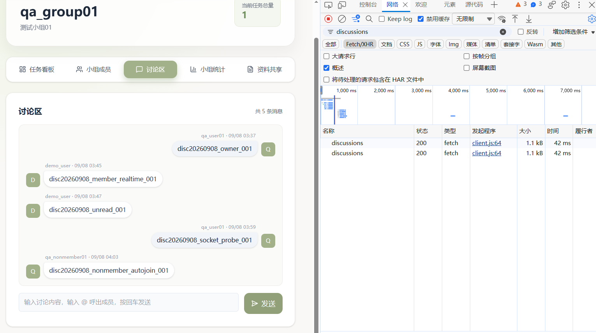

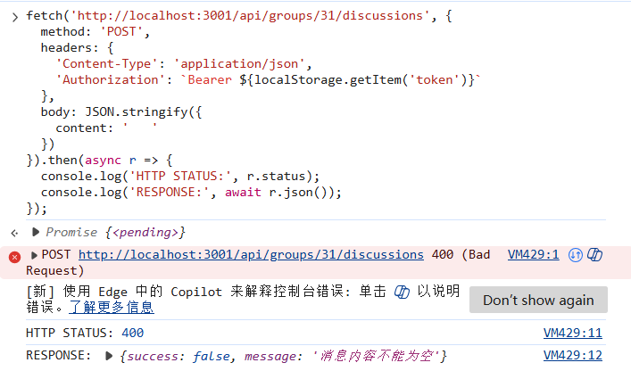

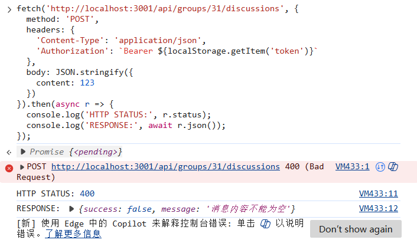

### DISC-010：完全非法 group id — Pass

- 分别向 `/api/groups/abc/discussions` 发送GET和POST。
- 两个请求均返回400，提示“无效的小组ID”，没有写入消息。

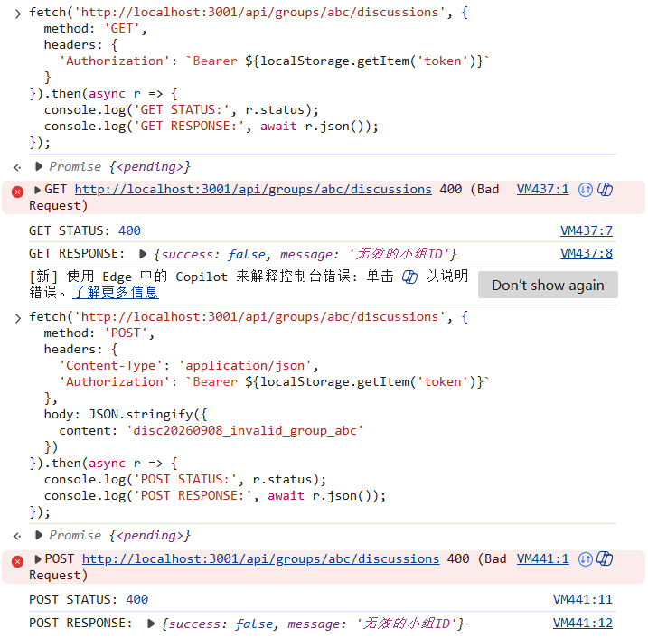

### DISC-011：数字前缀非法 group id — Fail

- 请求 `GET /api/groups/31abc/discussions`。
- 接口返回200、`success:true`，并返回group 31的5条讨论。
- 说明路径参数通过 `parseInt` 被宽松解析，`31abc` 被当作合法的31。

### DISC-012：不存在小组的GET/POST语义不一致 — Fail

- `GET /api/groups/999999/discussions` 返回200、`success:true` 和空数组。
- 对同一小组执行POST时返回404、`success:false`，提示“小组不存在”。
- 预期GET同样先确认小组资源存在，并对不存在资源返回404。

### DISC-013：刷新、历史、显示去重与SQL一致性 — Pass

- 刷新A的讨论页面，GET返回200，本轮5条消息仍全部存在并各显示一次。
- SQL确认 discussion id 126～130 的小组、发送者、内容和时间正确。
- 按内容分组统计时，每条 `row_count=1`，证明REST写入和Socket广播没有造成重复数据库记录。

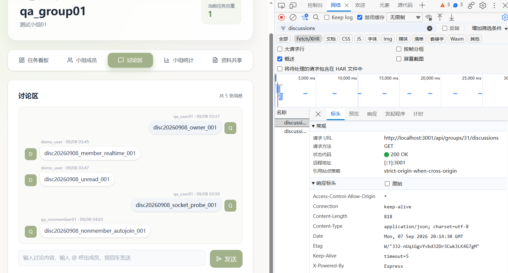

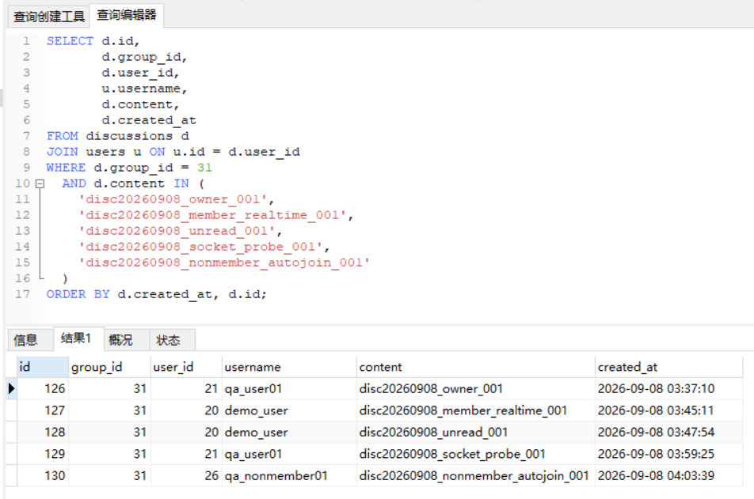

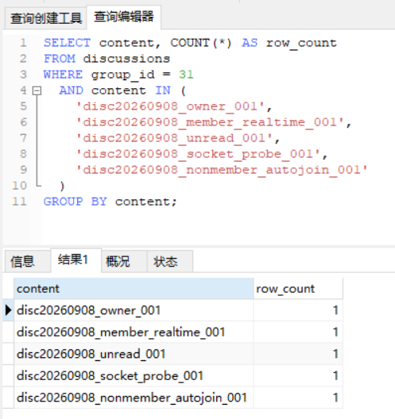

## 5. `@` 提及补充测试

本节只记录 2026-09-09 已实际执行的 6 个补充场景。统计口径为：DISC-MENTION-002 虽然验证结果是“没有 mention 专用通知”，但该结果符合当前代码设计，且现有需求没有规定 `@` 必须生成通知，因此作为说明性验证计 1 个 Pass；不登记 Bug。

### 5.1 执行结果总览

| 编号 | 场景 | 实际结果 | 判定 | 问题归属 |
| --- | --- | --- | --- | --- |
| DISC-MENTION-001 | A 通过候选列表正常 `@` B | 候选、请求格式、页面高亮及 SQL 均正确 | Pass | — |
| DISC-MENTION-002 | 核对 `@` 与消息通知联动 | 没有新增 notifications，通知红点不增加 | Pass（当前设计说明） | 不登记 Bug |
| DISC-MENTION-003 | A `@` 自己 | 可以选择、发送和高亮 | Risk / 业务待确认 | RISK-DISC-MENTION-001 |
| DISC-MENTION-004 | 候选限制与伪造 mention | 前端 UI 排除非成员/不存在用户；直接 API 可伪造并高亮 | Risk / 真实性校验待确认 | RISK-DISC-MENTION-002 |
| DISC-MENTION-005 | 重复 mention 及重复消息 | 两个 mention 均保存；相同消息可产生两条记录 | Risk / 业务待确认 | RISK-DISC-MENTION-003 |
| DISC-MENTION-006 | C 非成员向 group 31 发送 mention | 返回 200；消息落库；C 被自动加入小组 | Fail | BUG-DISC-001 |

本轮统计：实际执行 6，Pass 2，Fail 1，Risk / 需求待确认 3。

### 5.2 DISC-MENTION-001：A 正常 `@` B — Pass

- A 输入 `@demo`，候选列表出现 B：`demo_user`。
- 选择 B 后发送成功，POST `/api/groups/31/discussions` 返回 200。
- 请求内容为 `@[demo_user](20) mention20260909_001`。
- 页面把 `@demo_user` 显示为蓝色高亮。
- SQL 确认 discussion id 131、group id 31、user id 21，content 完整保存。

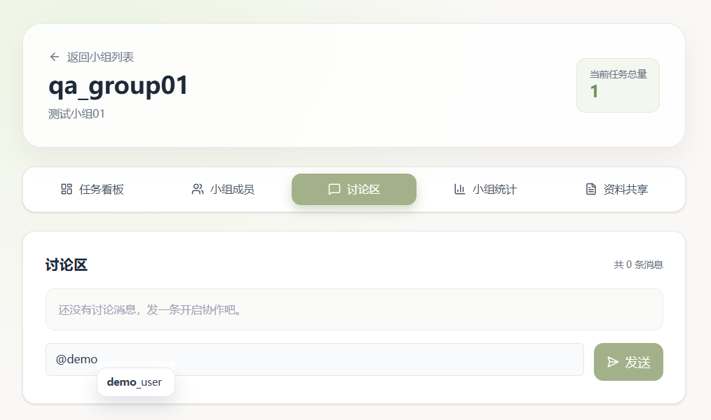

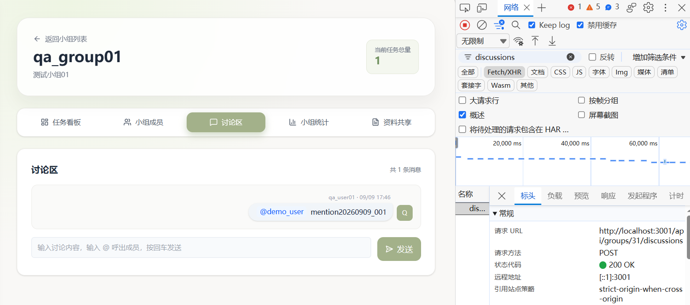

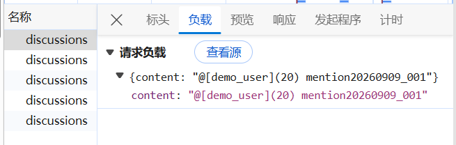

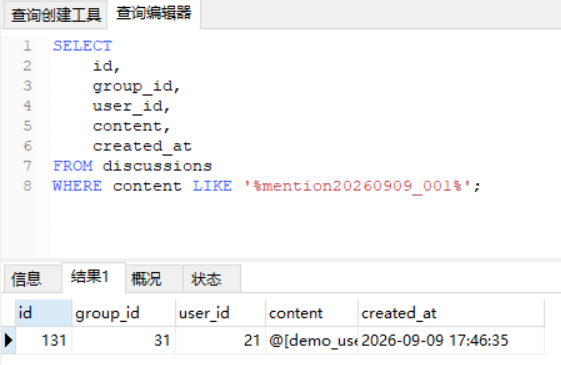

### 5.3 DISC-MENTION-002：`@` 与消息通知联动 — Pass（当前设计说明）

- B 在 A `@` 后，notifications 表没有新增记录。
- B 首页“消息通知”没有新增红点或数量。
- B 通知页仍只显示已有邀请与邀请结果通知。
- 当前“消息通知”和“小组讨论未读”是两套功能：前者来自数据库 notifications，后者来自前端 Socket 消息和内存状态。
- `@` 当前只作为 discussion 文本中的成员选择和高亮标记，不创建 mention 专用 notification。

现有需求没有明确规定 `@` 后必须生成专用通知，因此本场景计 Pass，不登记“通知缺失”Bug。如果后续需求补充该规则，应重新设计预期并执行测试。

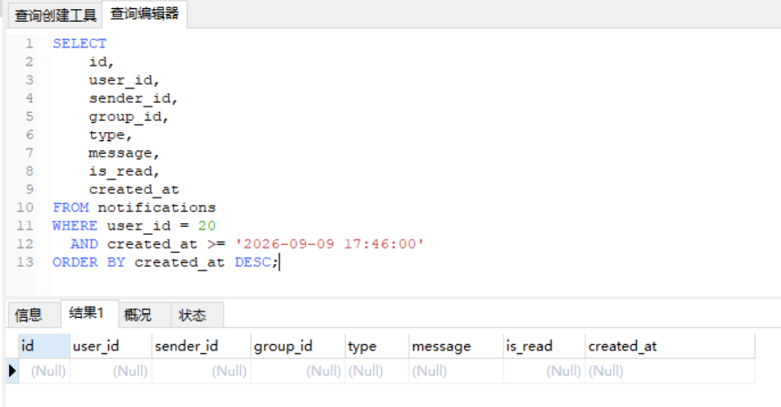

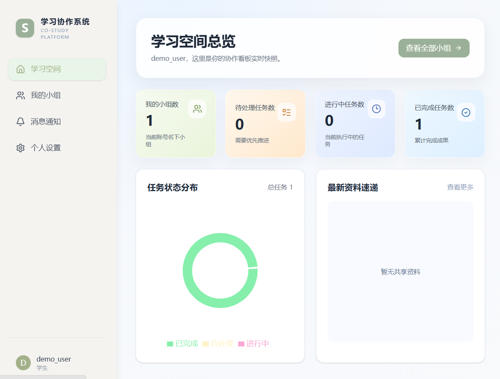

### 5.4 DISC-MENTION-003：`@` 自己 — Risk / 业务规则待确认

- A 输入 `@qa`，候选列表包含自己 `qa_user01`。
- 选择并发送 `@[qa_user01](21) selfmention20260909_003`，请求成功，页面正常高亮。
- 当前没有明确需求禁止 `@` 自己，因此不判 Bug。

### 5.5 DISC-MENTION-004：候选限制与 mention 真实性 — Risk

前端候选限制符合当前设计：输入 `@qa_non` 时没有 C `qa_nonmember01`，输入不存在用户名也没有候选。

绕过前端直接调用讨论 POST 后：

- `@[qa_nonmember01](26) mention20260909_004` 返回 200，页面高亮，SQL id 133 完整落库；
- `@[不存在用户](999999) mention20260909_004b` 返回 200，页面高亮，SQL id 134 完整落库。

后端把 mention 当作普通文本，不核对显示名、用户 ID 或成员关系。当前没有明确需求规定服务端必须验证 mention 真实性，因此先记录为风险候选，不新增确认缺陷；前端候选限制本身不判 Fail。

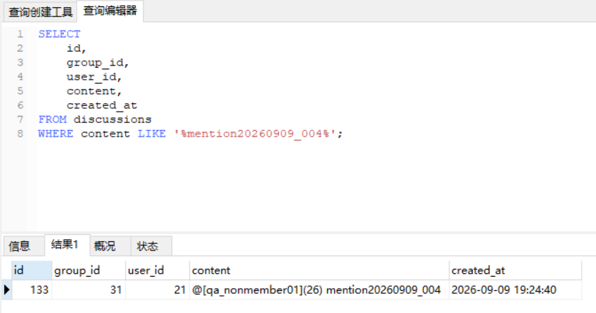

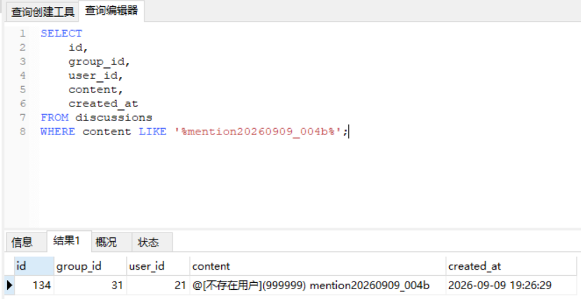

### 5.6 DISC-MENTION-005：重复 mention 与重复消息 — Risk / 业务规则待确认

- 同一消息选择 B 两次，请求内容为 `@[demo_user](20)@[demo_user](20) duplicate20260909_005`。
- 首次 POST 返回 200，页面显示两个高亮 `@demo_user`，SQL id 135 完整保存两个标记。
- 再次发送完全相同内容仍返回 200，SQL id 136 与 id 135 内容相同。
- 当前没有明确需求要求同一消息中的重复 `@` 去重，也没有要求拦截相同消息重复发送，因此不判 Bug。

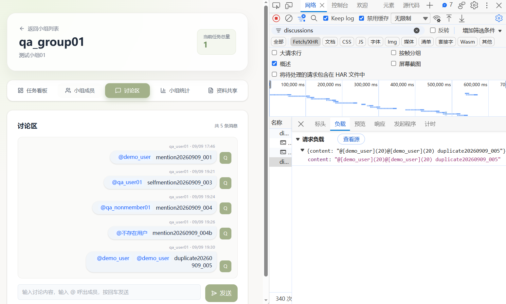

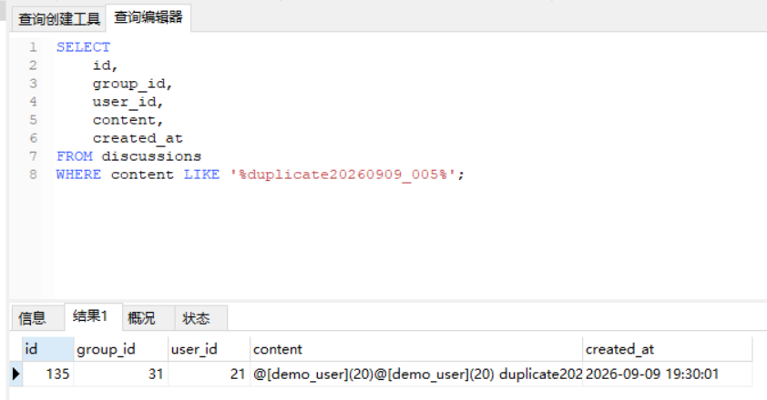

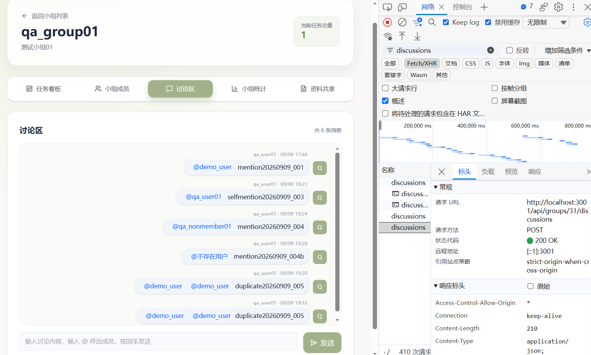

### 5.7 DISC-MENTION-006：非成员发送 mention 并被自动入组 — Fail

- SQL 预检查确认 C 不属于 group 31，C 首页小组数为 0。
- C POST `@[demo_user](20) mention20260909_006` 到 `/api/groups/31/discussions`，实际返回 200、`success:true`。
- SQL 确认 discussion id 137、group id 31、user id 26，内容真实落库。
- SQL 随后发现 `group_members` 新增 group 31、user 26、role `成员`。
- 测试结束时该异常成员关系已手工删除，复查为 0 行。

该结果与 DISC-008 属于同一根因：讨论 POST 不拒绝非成员，反而自动创建成员关系。因此继续归入 BUG-DISC-001，不新建重复 Bug。

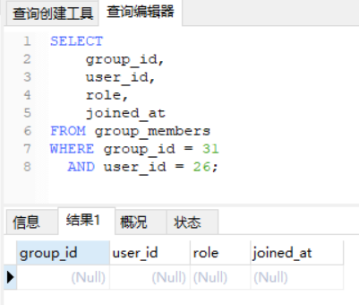

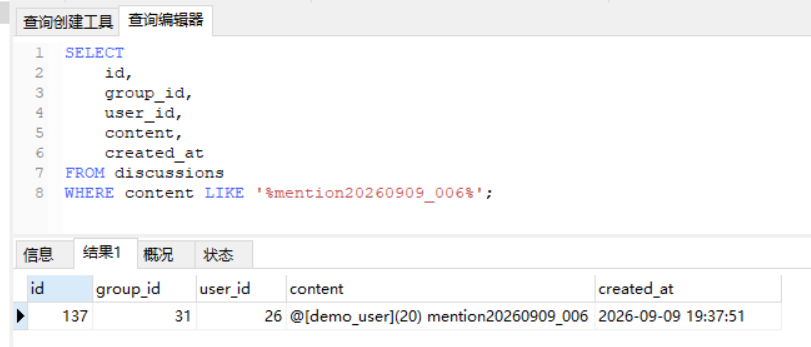

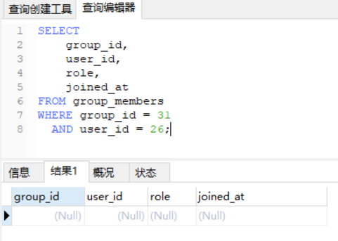

### 5.8 本轮证据与业务边界结论

- `@` 前端候选、正式 payload 格式和蓝色高亮已经实际验证。
- discussions POST 不解析或验证 mention，直接保存完整文本。
- notifications 不会因 `@` 新增记录，Socket.IO 也只有通用 `new_message`，没有 mention 专用事件。
- `@` 自己、mention 真实性、重复 mention 与重复消息均因缺少明确需求暂记风险，不判 Bug。
- 非成员发送和自动入组是已确认权限缺陷的补充复现，不增加缺陷数量。

## 6. 已确认缺陷映射

| 缺陷 | 覆盖场景 | 根因与影响 |
| --- | --- | --- |
| BUG-DISC-001 讨论REST接口缺少小组成员授权校验 | DISC-007、DISC-008、DISC-MENTION-006 | GET不校验成员；POST把非成员自动加入小组后允许发送，绕过邀请流程；mention补充场景再次复现 |
| BUG-DISC-002 Socket.IO缺少认证与房间成员授权 | DISC-006 | 匿名客户端可以连接、加入已知group room并监听实时消息 |
| BUG-DISC-003 讨论group id及资源存在性校验不完整 | DISC-011、DISC-012 | 数字前缀非法id被宽松解析；GET不存在小组返回200空数组 |

完整复现步骤和影响见 [`bug-report.md`](./bug-report.md)。

## 7. 测试数据清理

清理前已逐条确认本轮正式消息：

| discussion id | group_id | user_id | content |
| ---: | ---: | ---: | --- |
| 126 | 31 | 21 | `disc20260908_owner_001` |
| 127 | 31 | 20 | `disc20260908_member_realtime_001` |
| 128 | 31 | 20 | `disc20260908_unread_001` |
| 129 | 31 | 21 | `disc20260908_socket_probe_001` |
| 130 | 31 | 26 | `disc20260908_nonmember_autojoin_001` |

收尾操作只删除 discussions 126～130，共5行。清理后再次查询确认：

- discussions 126～130 均不存在；
- `disc20260908_noauth_001`、`disc20260908_invalid_group_abc`、`disc20260908_missing_group_001` 均未落库；
- `group_id=31/user_id=26` 的异常 group_members 关系为0行；该关系在正式执行过程中已经手工清理，本次没有再次删除；
- A、B 的正常成员关系未修改；
- group 31 清理后没有其他讨论记录，说明没有删除测试前已有讨论。

`@` 补充测试清理前，通过测试标记确认本轮共有 7 条 discussion：id 131～137。其中清单原先漏列的 id 132 包含 `selfmention20260909_003`，确认属于 DISC-MENTION-003，因此一并精确清理。

- 已删除 discussions 131、132、133、134、135、136、137；
- 清理后再次按 ID 和全部 mention 测试标记查询，结果为 0 行；
- `group_members(group_id=31,user_id=26)` 复查为 0 行；
- DISC-MENTION-002 没有新增 notifications，因此没有删除任何通知；
- 没有删除测试前已有 discussion、历史通知或正常成员关系。

## 8. 项目累计执行统计

| 测试报告 | 实际执行场景 | Pass | Fail | 需求待确认 / 风险候选 |
| --- | ---: | ---: | ---: | ---: |
| 登录注册 | 11 | 7 | 4 | 0 |
| 小组管理第一批 | 4 | 3 | 0 | 1 |
| 小组邀请与成员权限 | 8 | 7 | 0 | 1 |
| 任务管理 | 21 | 10 | 11 | 0 |
| 讨论与实时消息 | 13 | 8 | 5 | 0 |
| 文件上传、下载与资料共享 | 23 | 11 | 11 | 1 |
| 讨论区 `@` 提及补充 | 6 | 2 | 1 | 3 |
| 通知模块 | 10 | 8 | 1 | 1 |
| **累计** | **96** | **56** | **33** | **7** |

截至通知模块测试完成，项目累计记录18个已确认缺陷、1个业务规则缺口 / 可疑缺陷、6个需求待确认 / 风险候选，共25条问题记录。通知模块详情见 [`test-execution-notifications.md`](./test-execution-notifications.md)。

## 9. 本轮结论

讨论模块原有历史消息、A/B发送、实时接收、未读角标、认证和输入场景保持不变。本次进一步实际验证前端 `@` 候选与高亮、正式 payload、notifications 无联动、自我提及、伪造和重复 mention，以及非成员发送后自动入组。DISC-MENTION-006 补强 BUG-DISC-001 证据，其他未明确需求行为没有强判为 Bug。

本轮没有修改业务代码或修复缺陷，也没有把当前不存在的功能或源码预测计入执行结果。
