# 最终封版回归

## 1. 回归背景

高价值缺陷修复、定向验证和小范围影响回归完成后，对最终代码版本执行一次独立的核心流程回归。本轮只确认主流程、关键权限边界和近期修改模块没有退化，不重新累计此前124条正式功能测试。

## 2. 回归目标

- 验证普通用户与管理员登录、Dashboard、group31、通知和个人资料等核心入口。
- 验证任务、讨论和文件模块的合法成员流程与非成员权限边界。
- 验证文件上传、认证身份、实际获取、删除以及数据库/磁盘一致性。
- 确认临时数据全部清理，正式账号、group31和uploads基线保持不变。

## 3. 测试环境

| 项目 | 环境 |
| --- | --- |
| 执行日期 | 2026-09-18（UTC+8） |
| 最终业务代码基线 | `6d9a3e4baa9cdf38765100b678a02b63667fad8e` |
| 前端 | React 19、Vite，`http://localhost:5173` |
| 后端 | Node.js、Express、Socket.IO，`http://localhost:3001` |
| 数据库 | 本地 MySQL |
| 执行工具 | Chrome DevTools、真实HTTP请求、SQL查询、物理文件检查 |

## 4. 测试数据与账号角色

正式报告不记录账号密码、JWT或password hash。

| 角色 | 测试账号 | 用户ID | 基线关系 |
| --- | --- | ---: | --- |
| A：组长 | `qa_user01` | 21 | group31 owner |
| B：成员 | `demo_user` | 20 | group31 member |
| C：非成员 | `qa_nonmember01` | 26 | 不是group31成员 |
| 管理员 | `admin` | — | 管理后台合法账号 |

正式小组基线为 `group31 / qa_group01`。涉及创建、修改或删除的任务、讨论和文件使用独立的 `REG-FINAL-*` 临时数据；group31只进行读取、权限和基线核对。

## 5. REG-FINAL-001～015结果

| 编号 | 验证内容 | 关键结果 | 结果 |
| --- | --- | --- | --- |
| REG-FINAL-001 | A正常登录 | 登录成功，认证后普通接口可访问 | Pass |
| REG-FINAL-002 | admin登录与后台核心入口 | 管理员登录、数据大盘、用户和小组入口正常 | Pass |
| REG-FINAL-003 | Dashboard | 页面、小组、任务和最近资料正常加载 | Pass |
| REG-FINAL-004 | group31页面与基线 | 页面正常；group31为`qa_group01`，owner为A | Pass |
| REG-FINAL-005 | B合法成员访问 | B可正常读取group31任务、讨论和文件 | Pass |
| REG-FINAL-006 | C非成员受保护资源 | 任务读写、讨论读取、文件读取均返回403，无副作用 | Pass |
| REG-FINAL-007 | 任务正常生命周期 | 成员读取、创建、状态更新、删除均正常，清理后为0 | Pass |
| REG-FINAL-008 | 讨论正常流程 | 成员发送成功，刷新后消息仍存在，身份与小组归属正确 | Pass |
| REG-FINAL-009 | 讨论非成员权限 | 读取和发送均403，不新增discussion，不自动加入小组 | Pass |
| REG-FINAL-010 | 文件正常生命周期 | 成员上传、身份落库、后端文件获取和删除均正常 | Pass |
| REG-FINAL-011 | 文件非成员权限 | 列表、上传、删除均403，数据库和磁盘无副作用 | Pass |
| REG-FINAL-012 | 通知页面 | 通知列表或空状态正常加载 | Pass |
| REG-FINAL-013 | 个人资料 | 当前用户资料正常读取和展示 | Pass |
| REG-FINAL-014 | admin API权限隔离 | 普通用户访问用户、小组后台接口均返回403 | Pass |
| REG-FINAL-015 | 最终清理与基线 | 临时数据和文件清零，group31、成员关系与uploads恢复基线 | Pass |

> **最终封版回归：15 / 15 Pass**
>
> **通过率：100%**

该15条为修复后版本的最终验证，独立于原正式功能测试，**不并入原124条正式功能测试统计**。

## 6. 最近修复缺陷覆盖关系

| 已修复并验证缺陷 | 最终回归覆盖 |
| --- | --- |
| BUG-ADMIN-001：管理员用户ID严格校验 | admin核心入口和普通用户admin API隔离 |
| BUG-LR-002：密码最小长度后端校验 | 普通用户与admin合法登录、个人资料读取 |
| BUG-LR-003：邮箱格式后端校验 | 合法账号登录和资料读取 |
| BUG-ADMIN-002：强制解散小组清理物理文件 | 最终临时资源清理和uploads基线 |
| BUG-FILE-007：文件获取链接错误 | 实际后端URL获取TXT内容 |
| BUG-FILE-001 / BUG-FILE-002：文件权限与上传者身份 | 成员文件生命周期、非成员403、认证身份落库 |
| BUG-TASK-001：任务跨组越权 | 成员正常生命周期、非成员任务操作403 |
| BUG-DISC-001：讨论越权与自动入组 | 成员持久化、非成员读取/发送403、无自动入组 |

## 7. 权限边界验证

- B作为合法成员可正常读取group31的任务、讨论和文件。
- C对隔离小组的任务、讨论和文件受保护操作均返回403。
- C发送讨论失败后，`group_members`没有新增，成员数量保持不变。
- C的文件上传失败后没有数据库记录或物理文件；读取和删除也没有副作用。
- 普通用户访问 `/api/admin/users` 和 `/api/admin/groups` 均返回403。
- 本轮只回归合法Socket广播；BUG-DISC-002记录的Socket.IO认证与房间授权问题仍作为Known Issue保留。

## 8. 文件生命周期验证

合法成员上传唯一TXT文件后，数据库中的上传者为当前认证用户；“获取”链接指向后端3001，实际响应内容与源文件一致，不再返回前端HTML。合法删除后，`group_files`记录和对应物理文件均不存在。非成员列表、上传和删除请求全部返回403，且未改变数据库或uploads目录。

## 9. 临时数据清理

测试结束后，`REG-FINAL-*`临时小组、成员关系、任务、讨论、文件记录、通知及物理文件均已清零。清理只针对本轮记录的明确资源ID和真实文件路径，没有使用模糊批量删除。

## 10. group31最终基线

| 检查项 | 最终结果 |
| --- | --- |
| group31 | 存在 |
| 名称 | `qa_group01` |
| owner_id | 21（A） |
| user20（B） | 仍是成员 |
| user26（C） | 仍不是成员 |
| 正式数据 | 与回归前基线一致 |
| uploads | 回到回归前文件集合 |

## 11. 正式证据

以下13张截图均来自当前最终代码版本的实际执行：

| 覆盖内容 | 证据 |
| --- | --- |
| admin后台核心入口 | 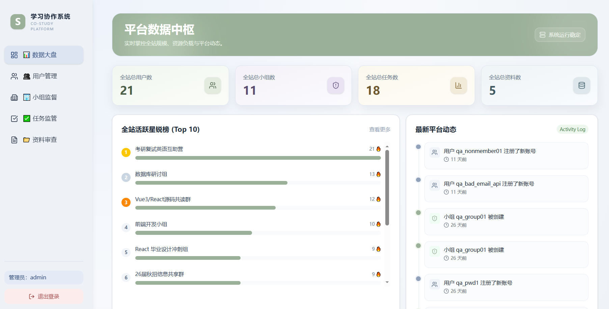 |
| Dashboard | 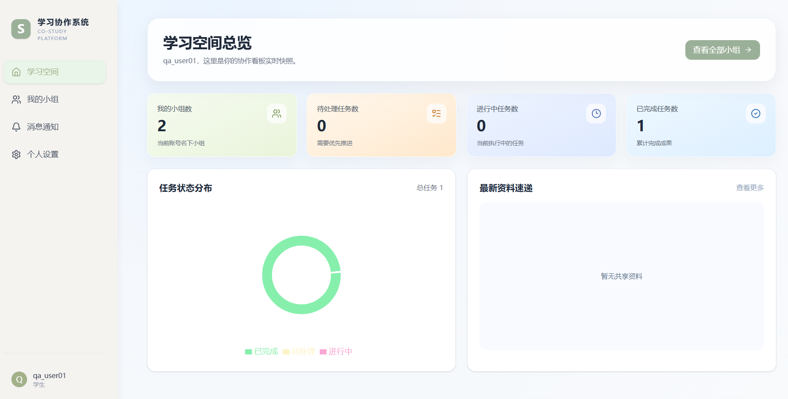 |
| group31页面 | 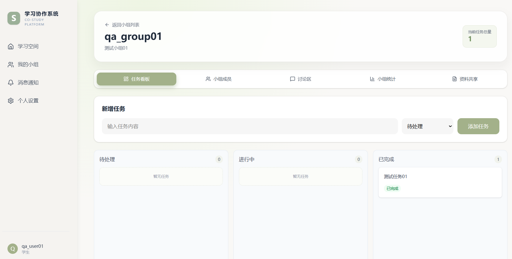 |
| 非成员任务、讨论、文件403 | 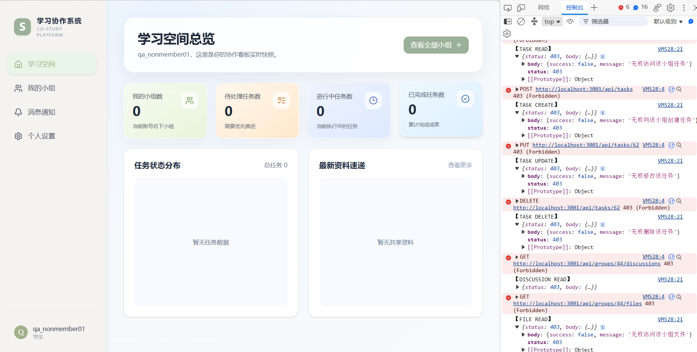 |
| 合法任务流程 | 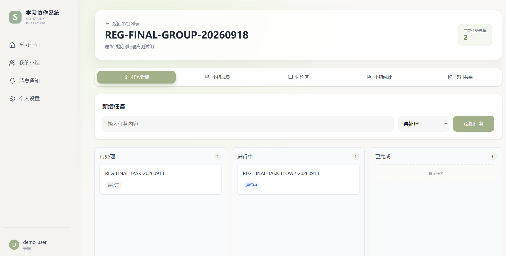 |
| 讨论持久化 | 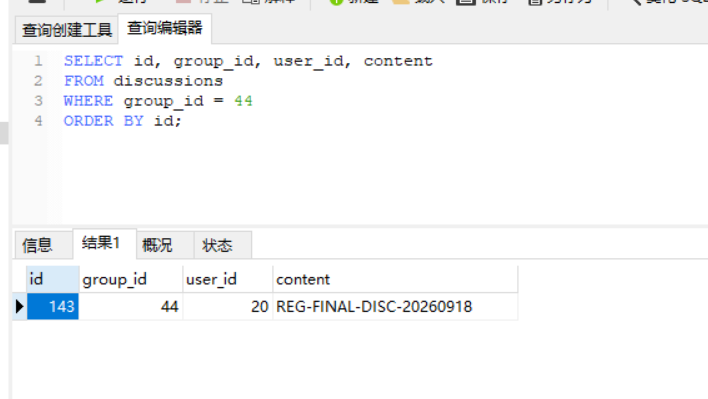 |
| 非成员讨论403 | 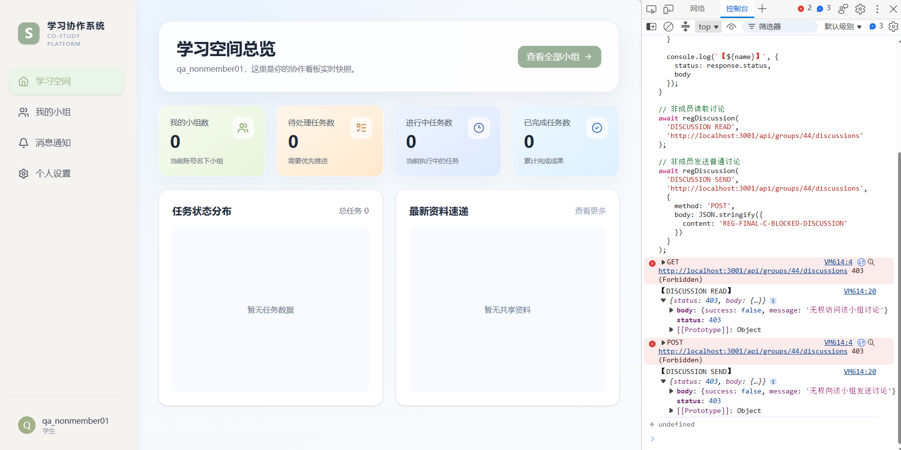 |
| 文件上传、获取和内容 | 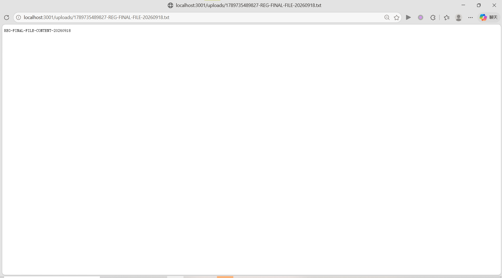 |
| 非成员文件读取和删除403 | 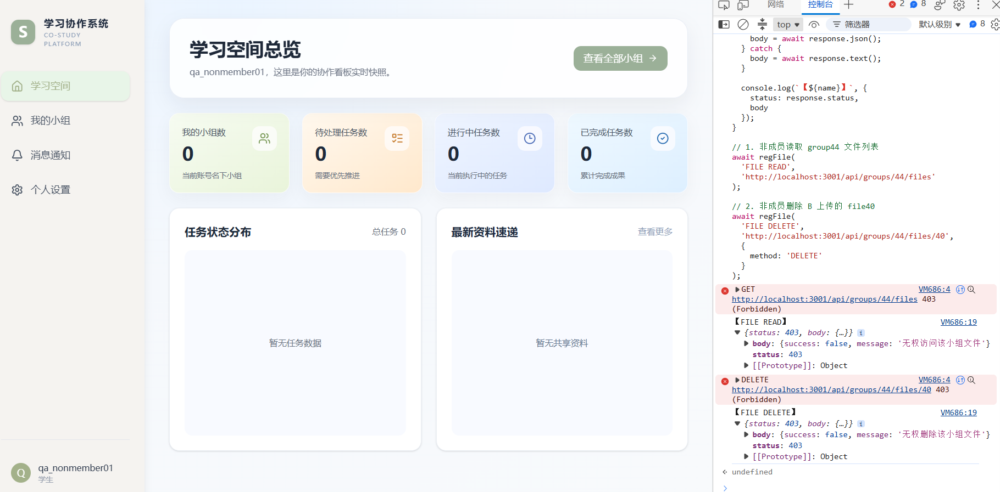 |
| 非成员文件上传403 | 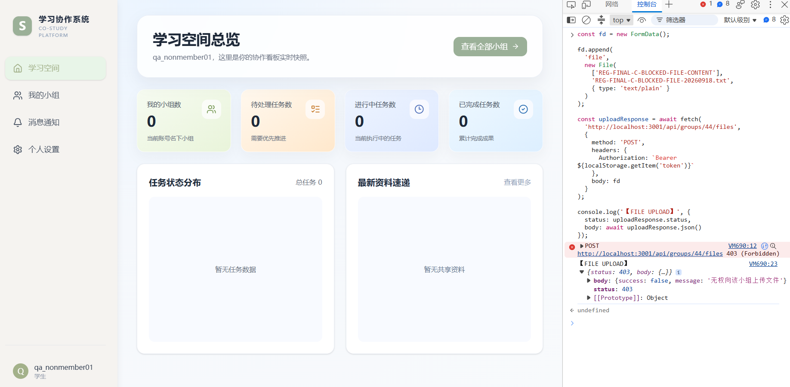 |
| 普通用户admin API 403 | 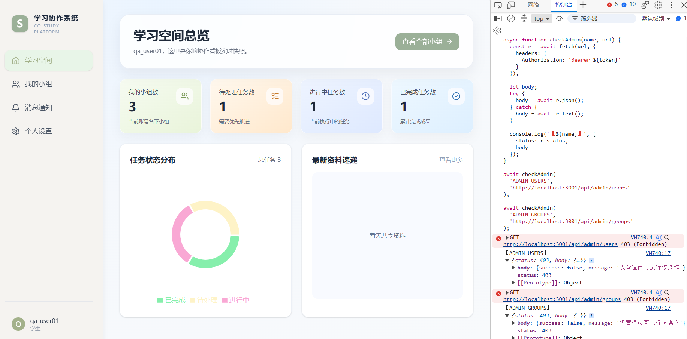 |
| group31最终基线 | 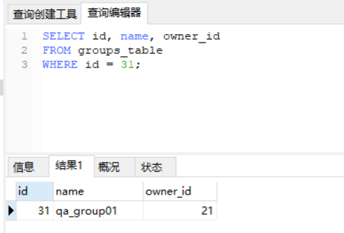 |
| 成员最终基线 | 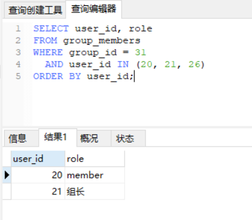 |

## 12. 最终结论

最终封版回归15条全部通过。核心正常流程、最近修复模块和关键REST权限边界没有出现回归；临时数据与物理文件已清理，正式账号、group31和uploads保持基线。本仓库当前定位为**软件测试求职作品集 / 本地演示项目**；仍存在的确认缺陷与风险透明保留在[缺陷与风险报告](./bug-report.md)中，不将其描述为公网生产安全版本。
