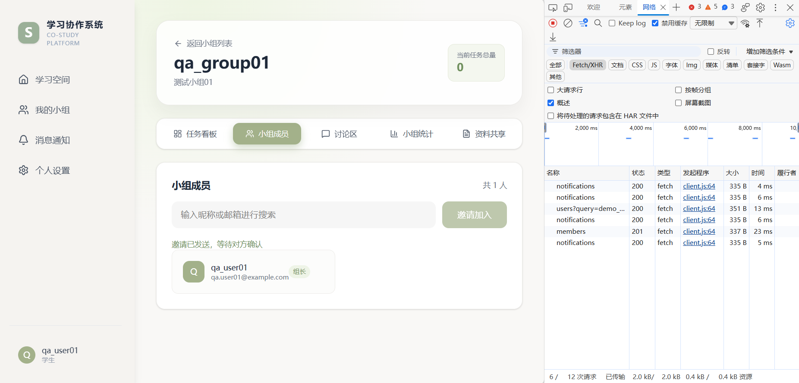
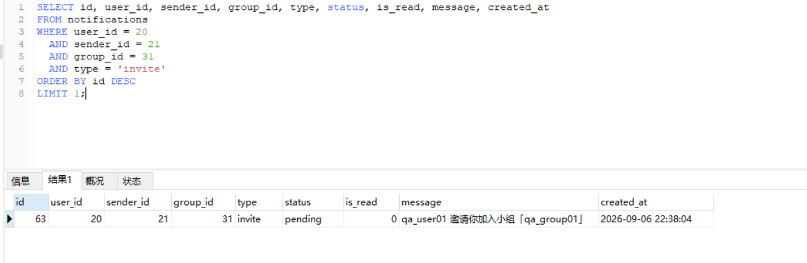
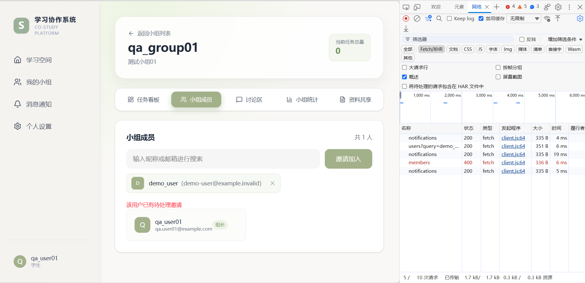
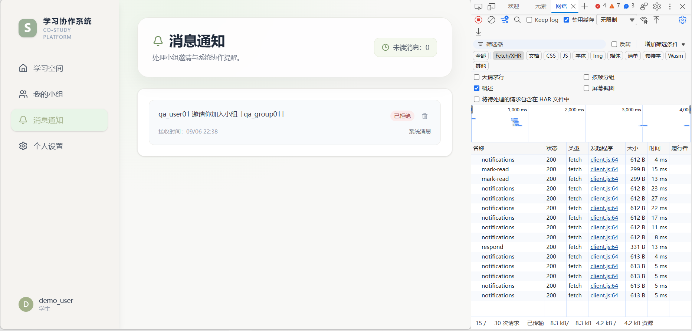
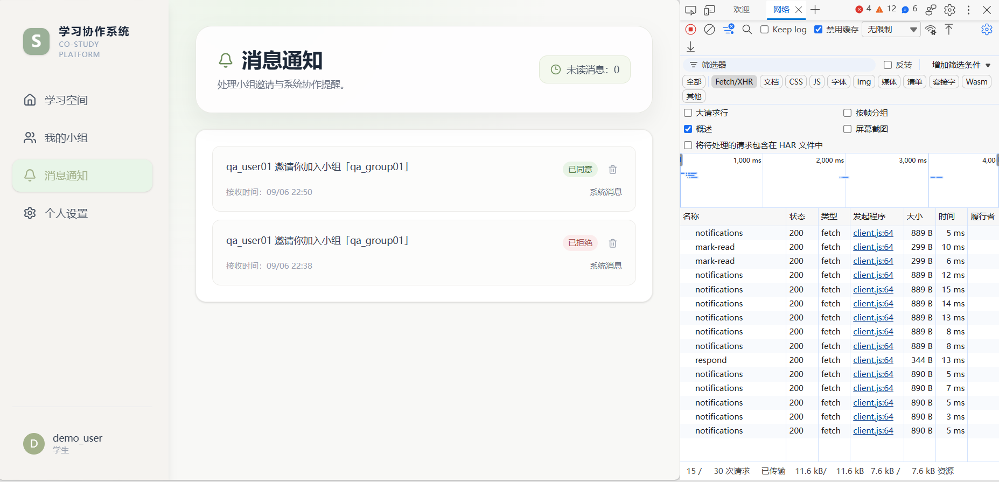
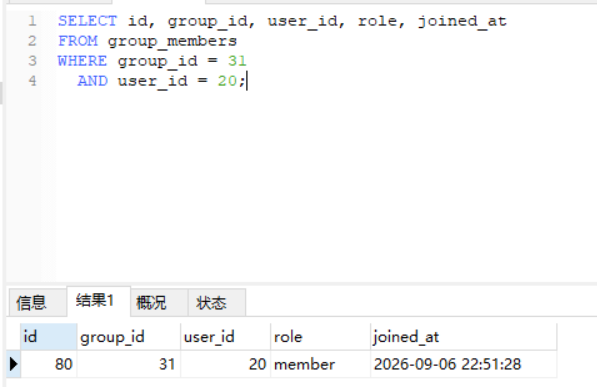
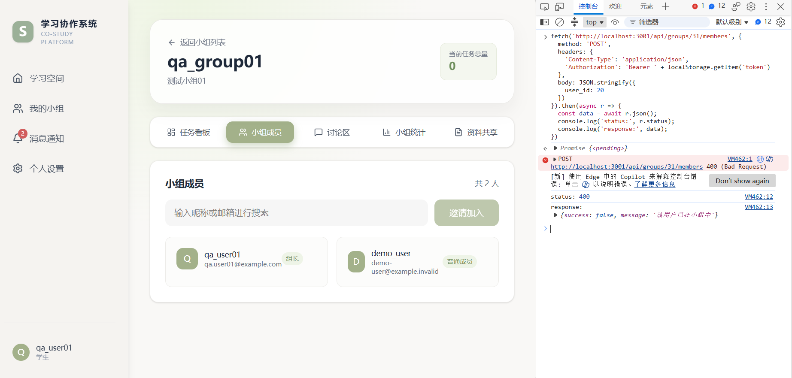
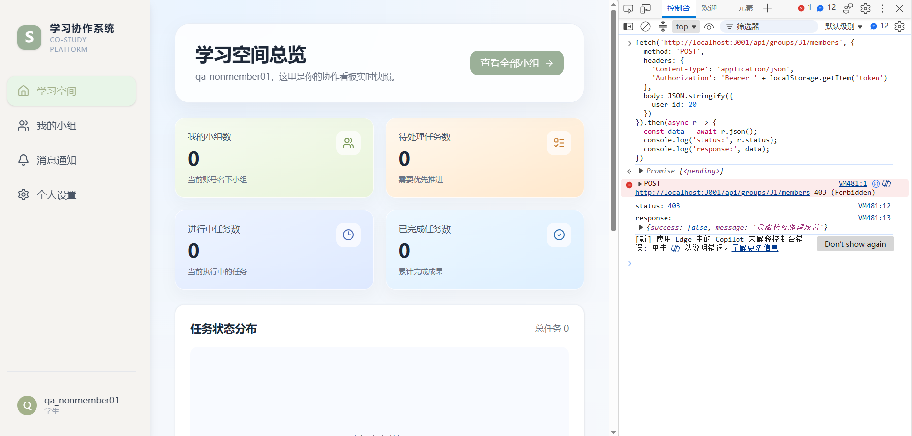
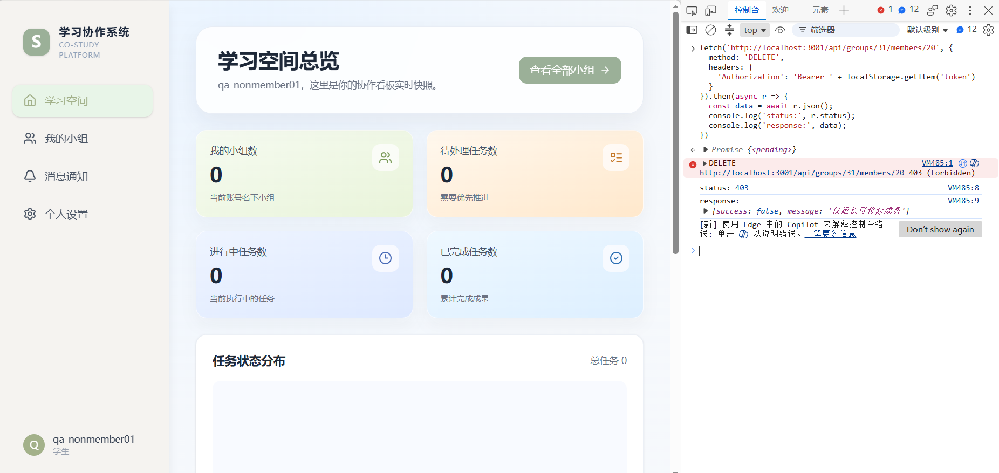
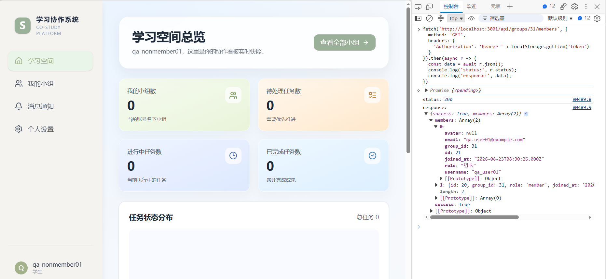

# 小组邀请与成员权限测试执行报告

## 1. 报告说明

本报告整理 2026-09-06 已经实际执行的小组邀请、邀请处理及成员接口权限测试。测试使用固定角色和 group 31，不使用同名的 group 32。

- 本轮共记录 8 个独立执行场景。
- `GROUP-PERM-001` 按三个实际请求拆分记录，不合并计算。
- Pass/Fail/待确认均来自本轮已确认结果，不把源码分析当作执行结果。
- `GROUP-PERM-001-3` 没有明确需求依据，记录为“需求待确认 / 权限与隐私风险候选”，不判 Pass、Fail 或已确认 Bug。
- 本轮没有修改业务代码、数据库、截图或测试结果，也没有修复问题。

## 2. 固定测试数据与环境

| 角色 | username | user id | 系统角色 | group 31 身份 |
| --- | --- | ---: | --- | --- |
| A：组长 | `qa_user01` | 21 | `user` | owner |
| B：普通成员 | `demo_user` | 20 | `user` | 邀请前非成员，接受后为成员 |
| C：非成员 | `qa_nonmember01` | 26 | `user` | 非成员 |
| D：管理员 | `admin` | 3 | `admin` | 本轮未参与操作 |

| 环境项 | 内容 |
| --- | --- |
| 执行方式 | 本地手工测试 |
| 前端 | React + Vite，`http://localhost:5173` |
| 后端 | Node.js + Express，端口 `3001` |
| 数据库 | 本地 MySQL |
| 观察工具 | Chromium 系浏览器开发者工具 Network、Console；数据库查询工具 |
| 目标小组 | group 31，名称 `qa_group01` |
| 执行日期 | 2026-09-06 |

## 3. 执行结果汇总

| 场景编号 | 测试内容 | 主要实际结果 | 判定 | 证据 |
| --- | --- | --- | --- | --- |
| GROUP-INV-001 | A 正常邀请 B | 搜索返回 200；邀请返回 201；新增 `invite/pending`，B 未立即加入成员表 | **Pass** | [GROUP-INV-001-invite-201.png](./screenshots/GROUP-INV-001-invite-201.png)、[GROUP-INV-001-sql-pending-invite.png](./screenshots/GROUP-INV-001-sql-pending-invite.png) |
| GROUP-INV-002 | pending 状态下重复邀请 | 第二次邀请返回 400；提示已有待处理邀请；pending 数量仍为 1 | **Pass** | [GROUP-INV-002-duplicate-400.png](./screenshots/GROUP-INV-002-duplicate-400.png) |
| GROUP-INV-003 | B 拒绝邀请 | respond 返回 200；原邀请变为 rejected；A 收到拒绝结果；B 未入组 | **Pass** | [GROUP-INV-003-reject-200.png](./screenshots/GROUP-INV-003-reject-200.png) |
| GROUP-INV-004 | A 再次邀请，B 接受 | 邀请返回 201；respond 返回 200；新增 `(31,20,member)`；A 收到接受结果 | **Pass** | [GROUP-INV-004-accept-200.png](./screenshots/GROUP-INV-004-accept-200.png)、[GROUP-INV-004-sql-member-added.png](./screenshots/GROUP-INV-004-sql-member-added.png) |
| GROUP-INV-005 | A 邀请已经是成员的 B | 页面搜索不到 B；直接请求返回 400；成员记录仍为 1，pending 邀请为 0 | **Pass** | [GROUP-INV-005-api-existing-member-400.png](./screenshots/GROUP-INV-005-api-existing-member-400.png) |
| GROUP-PERM-001-1 | C 越权邀请 B | 接口返回 403，提示“仅组长可邀请成员” | **Pass** | [GROUP-PERM-001-invite-forbidden-403.png](./screenshots/GROUP-PERM-001-invite-forbidden-403.png) |
| GROUP-PERM-001-2 | C 越权移除 B | 接口返回 403，提示“仅组长可移除成员” | **Pass** | [GROUP-PERM-001-remove-forbidden-403.png](./screenshots/GROUP-PERM-001-remove-forbidden-403.png) |
| GROUP-PERM-001-3 | C 读取 group 31 成员列表 | 接口返回 200 和 2 个成员，并暴露 email 等字段 | **需求待确认 / 权限与隐私风险候选** | [GROUP-PERM-001-members-email-exposed-200.png](./screenshots/GROUP-PERM-001-members-email-exposed-200.png) |

## 4. 详细执行记录

### GROUP-INV-001：A 正常邀请 B

- 前置状态：A 是 group 31 组长；B 不在 group 31；没有 B 的待处理邀请。
- 页面操作：A 在 `/groups/31` 的“小组成员”页面搜索并选择 `demo_user`，点击“邀请加入”。
- 实际结果：搜索用户请求返回 200；`POST /api/groups/31/members` 返回 201；页面提示“邀请已发送，等待对方确认”。
- SQL 结果：`notifications` 新增一条记录，`user_id=20`、`sender_id=21`、`group_id=31`、`type=invite`、`status=pending`、`is_read=0`。
- SQL 结果：此时 `group_members` 中没有 group 31、user 20 的成员记录。
- 判定：**Pass**。

### GROUP-INV-002：pending 状态下重复邀请

- 前置状态：GROUP-INV-001 的邀请仍为 `pending`，B 尚未处理。
- 操作：A 再次向 B 提交 group 31 邀请。
- 实际结果：第二次 `POST /api/groups/31/members` 返回 400；页面提示“该用户已有待处理邀请”。
- SQL 结果：`pending_invite_count=1`，没有新增第二条 pending 邀请。
- 判定：**Pass**。

### GROUP-INV-003：B 拒绝邀请

- 前置状态：B 有一条 group 31 的 pending 邀请，尚未加入该小组。
- 页面操作：B 使用 `demo_user` 登录，在 `/notifications` 找到邀请并点击“拒绝”。
- 实际结果：`POST /api/notifications/{id}/respond` 使用 `action=reject`，返回 200；页面显示“已拒绝”。
- SQL 结果：原 `invite` 状态变为 `rejected`；A 收到 `invite_result/rejected`；B 仍不在 group 31 的 `group_members` 中。
- 判定：**Pass**。

### GROUP-INV-004：A 再次邀请，B 接受

- 前置状态：上一条邀请已经拒绝，B 仍不是 group 31 成员，没有 pending 邀请。
- 操作一：A 再次邀请 B，`POST /api/groups/31/members` 返回 201。
- 操作二：B 在消息通知页面点击“同意”，respond 请求返回 200，页面显示“已同意”。
- SQL 结果：`group_members` 新增 `group_id=31`、`user_id=20`、`role=member` 的记录。
- SQL 结果：A 收到 `invite_result/accepted`；之前的 rejected 历史邀请仍保留。
- 判定：**Pass**。

### GROUP-INV-005：A 邀请已经是成员的 B

- 前置状态：B 已是 group 31 成员。
- 页面结果：搜索 `demo_user` 时显示“未找到可邀请的用户”。
- 接口操作：绕过页面直接提交 `POST /api/groups/31/members`，请求体使用 `user_id=20`。
- 实际结果：接口返回 400，响应提示“该用户已在小组中”。
- SQL 结果：`member_count=1`，`pending_invite_count=0`，没有重复成员或多余待处理邀请。
- 判定：**Pass**。

### GROUP-PERM-001-1：C 越权邀请 B

- 前置状态：C 已登录，但不是 group 31 的组长或成员。
- 操作：C 直接提交 `POST /api/groups/31/members`。
- 实际结果：接口返回 403，响应提示“仅组长可邀请成员”。
- 判定：**Pass**。

### GROUP-PERM-001-2：C 越权移除 B

- 前置状态：B 是 group 31 成员；C 已登录，但不是 group 31 组长或成员。
- 操作：C 直接提交 `DELETE /api/groups/31/members/20`。
- 实际结果：接口返回 403，响应提示“仅组长可移除成员”。
- 判定：**Pass**。

### GROUP-PERM-001-3：C 读取 group 31 成员列表

- 前置状态：C 已登录，且不属于 group 31。
- 操作：C 直接提交 `GET /api/groups/31/members`。
- 实际结果：接口返回 200，响应中的 `members` 为包含 2 个对象的数组。
- 返回字段包括：`email`、`username`、`role`、`id`、`group_id`、`joined_at`。
- 风险：仅登录但不属于目标小组的用户，可以读取组内成员邮箱及成员关系信息。
- 判定：**需求待确认 / 权限与隐私风险候选**。
- 判定边界：项目没有明确规定成员列表是否必须仅对组内成员可见，因此不直接判定为 Bug 或 Fail；需要确认成员邮箱的可见范围以及非成员访问规则。
- 风险记录：[`RISK-GM-001`](./bug-report.md#risk-gm-001非成员可读取小组成员邮箱等信息)。

## 5. 本轮统计

| 状态 | 数量 | 占比 |
| --- | ---: | ---: |
| 实际执行场景 | 8 | 100% |
| Pass | 7 | 87.5% |
| Fail | 0 | 0% |
| 需求待确认 / 风险候选 | 1 | 12.5% |

## 6. 项目累计执行统计

为保证分类互斥，原 GROUP-003 的“Fail（缺陷候选）”在累计统计中归入“需求待确认 / 风险候选”，不同时计入 Fail。

| 测试报告 | 实际执行场景 | Pass | Fail | 需求待确认 / 风险候选 |
| --- | ---: | ---: | ---: | ---: |
| 登录注册 | 11 | 7 | 4 | 0 |
| 小组管理第一批 | 4 | 3 | 0 | 1 |
| 小组邀请与成员权限 | 8 | 7 | 0 | 1 |
| 任务管理 | 21 | 10 | 11 | 0 |
| 讨论与实时消息 | 13 | 8 | 5 | 0 |
| 文件上传、下载与资料共享 | 23 | 11 | 11 | 1 |
| **累计** | **80** | **46** | **31** | **3** |

截至文件模块完成，项目累计记录17个已确认缺陷、1个业务规则缺口 / 可疑缺陷、2个需求待确认 / 风险候选，共20条问题记录。文件模块执行详情见 [`test-execution-files.md`](./test-execution-files.md)。

## 7. 本轮结论

本轮实际验证了邀请创建、pending 去重、拒绝、再次邀请后接受、已入组用户重复邀请，以及非组长邀请和移除接口的权限控制。上述 7 个场景均符合当前明确行为。另实际确认非成员 C 可以读取 group 31 的成员列表及邮箱等字段；由于可见范围缺少明确需求，该结果暂作为权限与隐私风险候选，不直接认定为 Bug。
