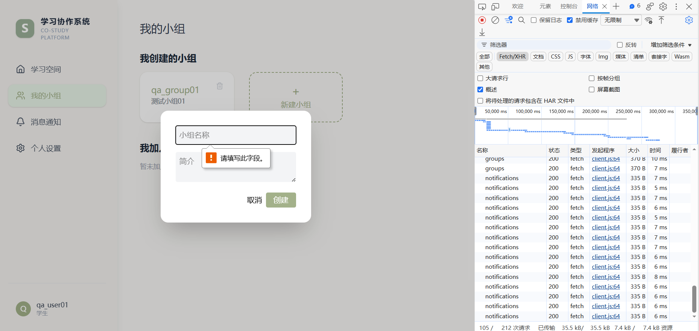
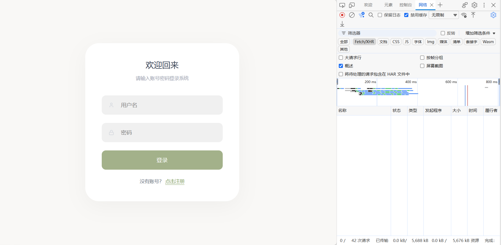

# 小组管理模块测试执行报告（第一批）

## 1. 报告说明

本报告基于当前项目源码、[`test-analysis.md`](./test-analysis.md) 和 [`screenshots/`](./screenshots/) 中的实际测试证据，整理第一批已经执行的小组管理功能测试。

- 只记录本轮实际执行的 4 条用例。
- Pass/Fail 使用本轮已经确认的结果。
- 未执行的小组邀请、成员移除、退出小组、删除小组等场景不在本报告中。
- GROUP-003 涉及的“小组名称是否必须唯一”在项目中没有明确需求，因此按“业务规则缺口 / 可疑缺陷”记录，不直接虚构唯一性规则。
- 本轮没有修改业务代码、截图或测试结果，也没有修复缺陷。

## 2. 测试范围

| 功能点 | 已执行内容 | 用例编号 |
| --- | --- | --- |
| 创建小组 | 使用合法名称和简介创建小组 | GROUP-001 |
| 必填校验 | 小组名称为空时提交创建表单 | GROUP-002 |
| 重复名称 | 已有同名小组时再次创建 | GROUP-003 |
| 页面访问控制 | 退出登录后直接访问小组详情页 | GROUP-004 |

## 3. 测试环境

| 项目 | 本轮环境 |
| --- | --- |
| 执行方式 | 本地手工测试 |
| 操作系统 | Windows |
| 测试账号 | 普通用户 `qa_user01` |
| 前端 | React + Vite，本地地址 `http://localhost:5173` |
| 后端 | Node.js + Express，本地端口 `3001` |
| 数据库 | 本地 MySQL |
| 观察工具 | Chromium 系浏览器开发者工具 Network 面板 |
| 执行日期 | 2026-08-23 |
| 浏览器/数据库精确版本 | 本轮证据未记录 |

## 4. 执行结果汇总

| 用例编号 | 测试内容 | 预期结果摘要 | 实际结果 | 结果 | 证据 |
| --- | --- | --- | --- | --- | --- |
| GROUP-001 | 正常创建小组 | 创建成功并进入新小组详情页 | 用户 `qa_user01` 成功创建 `qa_group01`；简介为“测试小组01”；进入 group id 31 的详情页；截图中相关请求为 200 | **Pass** | [GROUP-001-200.png](./screenshots/GROUP-001-200.png) |
| GROUP-002 | 小组名称为空 | 前端必填校验阻止提交，不发送新建请求 | 浏览器提示“请填写此字段”；表单未提交；本轮确认未产生新的创建小组请求 | **Pass** | [GROUP-002-required.png](./screenshots/GROUP-002-required.png) |
| GROUP-003 | 重复名称创建小组 | 项目应明确是否允许重名；若要求唯一，应拒绝重复创建 | 系统再次创建 `qa_group01` 成功，简介为“重复名称测试”，生成新 group id 32，没有覆盖 id 31 | **Fail（缺陷候选）** | [GROUP-003-duplicate-created.png](./screenshots/GROUP-003-duplicate-created.png) |
| GROUP-004 | 未登录访问 `/groups/32` | 不能进入小组详情页，应回到登录页 | 退出登录后手动访问 `/groups/32`，系统重定向登录页，没有进入详情页 | **Pass** | [GROUP-004-redirect.png](./screenshots/GROUP-004-redirect.png) |

## 5. 详细执行记录与证据

### GROUP-001：正常创建小组

#### 测试数据

| 字段 | 实际数据 |
| --- | --- |
| 登录用户 | `qa_user01` |
| 小组名称 | `qa_group01` |
| 小组简介 | `测试小组01` |
| 新小组 ID | `31` |

#### 实际结果

- 创建操作成功。
- 页面进入 `qa_group01` 的小组详情页，名称和简介显示正确。
- Network 面板中可见 `groups`、小组 `31`、`tasks?group_id=31`、`members`、`discussions`、`files` 等相关请求返回 200。
- 判定：**Pass**。

### GROUP-002：小组名称必填校验

#### 测试数据

| 字段 | 实际数据 |
| --- | --- |
| 登录用户 | `qa_user01` |
| 小组名称 | 空 |
| 小组简介 | 未作为本用例判断重点 |

#### 实际结果

- 点击创建时，浏览器在小组名称输入框显示“请填写此字段”。
- 创建表单没有提交。
- 本轮确认没有产生新的创建小组请求。
- 判定：**Pass**。

### GROUP-003：重复名称创建小组

#### 测试数据

| 字段 | 实际数据 |
| --- | --- |
| 登录用户 | `qa_user01` |
| 已有小组 | `qa_group01`，group id 31 |
| 再次创建名称 | `qa_group01` |
| 本次简介 | `重复名称测试` |
| 新小组 ID | `32` |

#### 实际结果

- 使用相同名称再次创建成功。
- 新页面显示名称 `qa_group01` 和简介“重复名称测试”。
- Network 面板中的详情和关联请求使用 group id 32，并返回 200。
- 第一次创建的小组为 id 31，本次为 id 32，说明系统新增了第二个同名小组，而不是覆盖原记录。
- 判定：**Fail（缺陷候选）**。
- 问题记录：[`BUG-GR-001`](./bug-report.md#bug-gr-001系统允许创建重复名称的小组)。

项目目前没有明确规定小组名称必须唯一，所以该结果先记录为业务规则缺口或可疑缺陷，需确认产品规则后再决定是否转为正式缺陷。

### GROUP-004：退出后访问小组详情页

#### 测试数据

| 字段 | 实际数据 |
| --- | --- |
| 登录状态 | 已退出 |
| 手动访问地址 | `/groups/32` |

#### 实际结果

- 手动访问 `/groups/32` 后，页面显示登录页。
- 没有进入小组详情页面。
- 截图中的 Fetch/XHR 列表为空，符合前端路由在发起小组数据请求前完成重定向的表现。
- 判定：**Pass**。

## 6. 统计总结

| 指标 | 数量 | 占比 |
| --- | ---: | ---: |
| 已执行用例 | 4 | 100% |
| Pass | 3 | 75% |
| Fail | 1 | 25% |
| 本轮缺陷候选 | 1 | — |

## 7. 本轮结论

第一批测试确认：登录用户可以正常创建小组；名称为空时浏览器必填校验可以阻止提交；退出后手动访问小组详情页会被前端路由重定向至登录页。系统同时允许同一用户创建两个名称相同但 ID 不同的小组，该行为已作为 `BUG-GR-001` 业务规则缺口 / 可疑缺陷记录，等待确认“小组名称是否要求唯一”。
