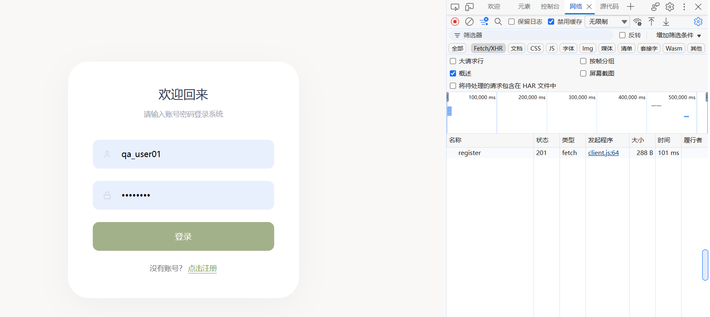
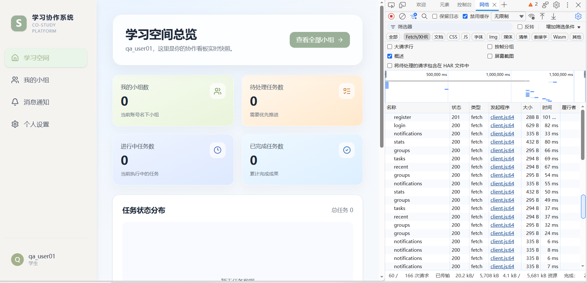
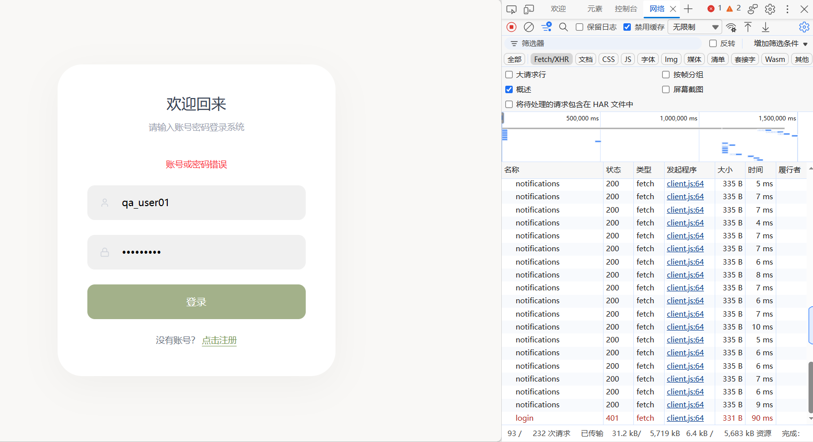
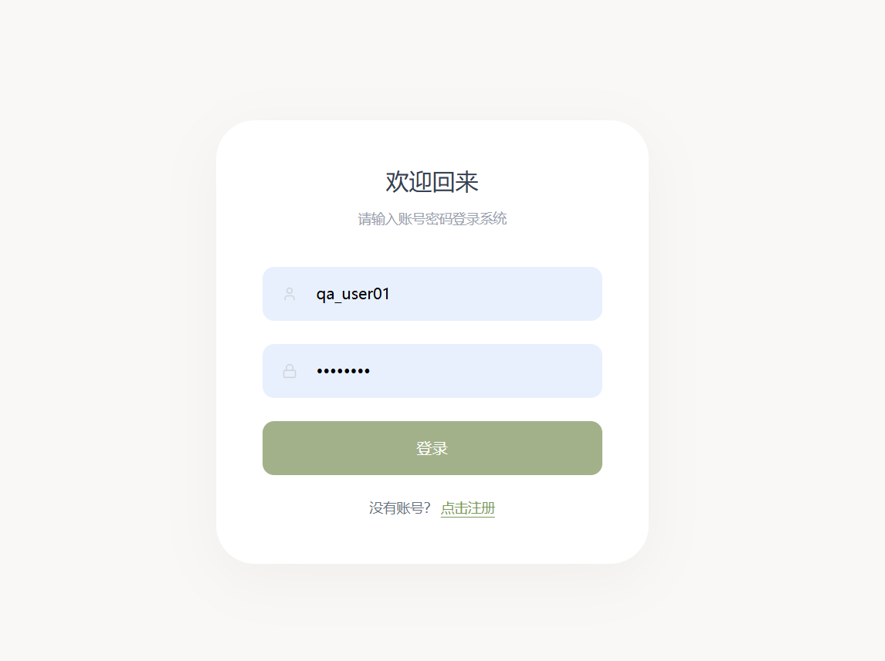
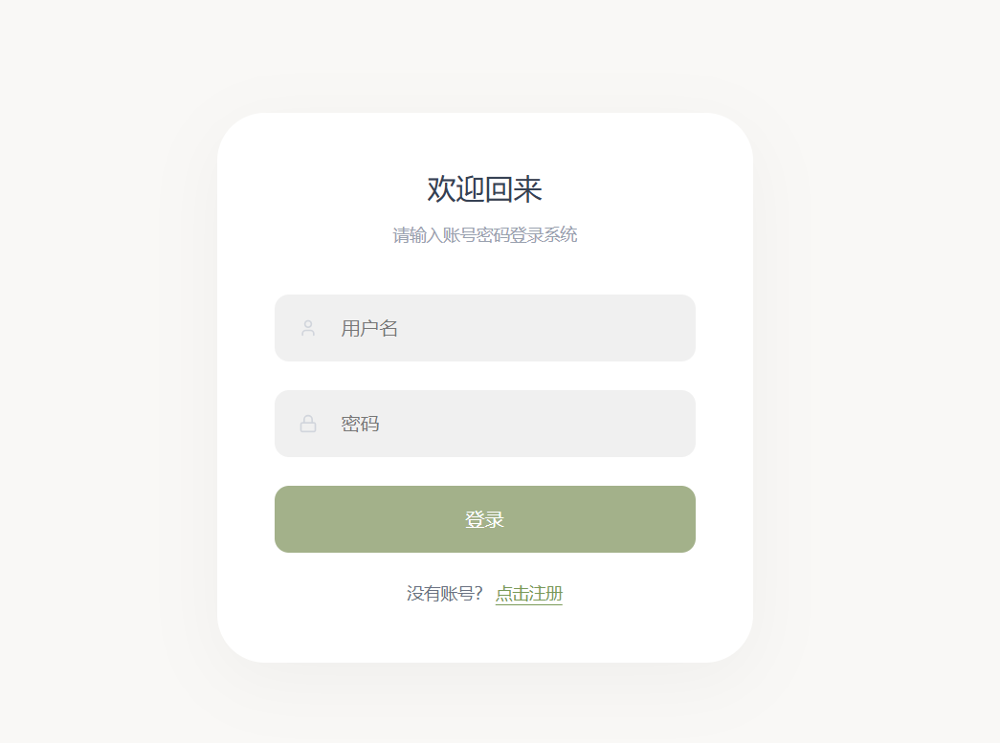
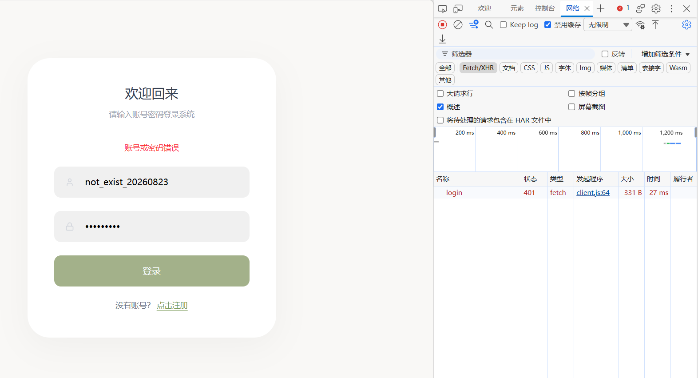
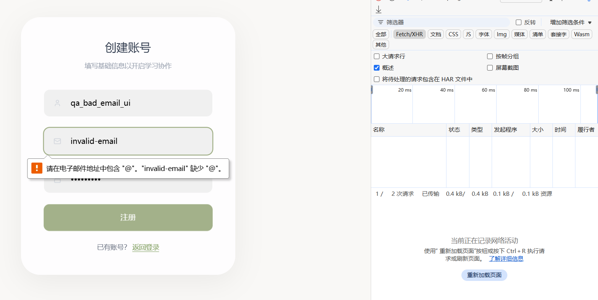
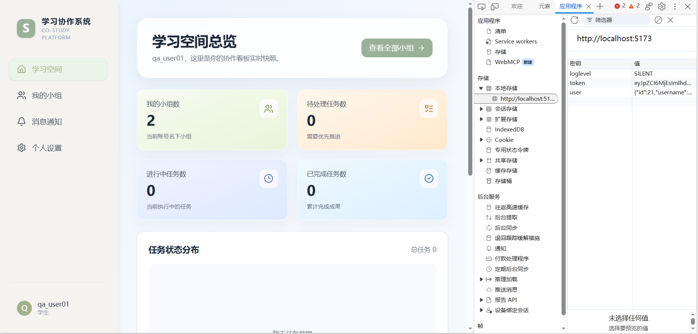

# 登录与注册功能测试执行报告

## 1. 报告说明

本报告累计整理已经实际执行的登录、注册功能测试，测试依据为 [`test-cases-login-register.md`](./test-cases-login-register.md)。结果来自手工测试确认和 [`screenshots/`](./screenshots/) 中的测试证据。

- 当前只记录已经执行的 11 条用例；35 条设计用例中尚未执行的 24 条不计入执行统计。
- Pass/Fail 使用实际确认结果，不根据源码推断未执行结果。
- 原有 6 条执行记录及证据均保留，本次补充 5 条实际执行记录。
- 本次未修改业务代码、截图或测试数据，也没有修复缺陷。

## 2. 测试范围

| 模块 | 已执行内容 | 用例编号 |
| --- | --- | --- |
| 注册 | 正常注册、重复用户名、重复邮箱、页面邮箱格式校验、绕过页面提交非法邮箱、1 位密码注册 | REGISTER-001、REGISTER-003、REGISTER-004、REGISTER-009、REGISTER-010、REGISTER-011 |
| 登录与退出 | 正常登录、错误密码、不存在用户名、刷新后登录状态保持、退出后访问受保护页面 | LOGIN-001、LOGIN-003、LOGIN-004、LOGIN-012、LOGIN-014 |

当前已覆盖登录和注册的主要正常流程、部分异常输入、前后端邮箱格式校验、登录状态保持及退出后的页面访问控制。空值、首尾空格、字段长度上限、特殊字符、重复提交、旧登录状态清理和服务重启后的 token 等场景尚未执行。

## 3. 执行环境

| 项目 | 执行环境 |
| --- | --- |
| 执行方式 | 本地手工测试 |
| 操作系统 | Windows |
| 前端 | React + Vite，本地地址 `http://localhost:5173` |
| 后端 | Node.js + Express，本地端口 `3001` |
| 数据库 | 本地 MySQL |
| 观察工具 | Chromium 系浏览器开发者工具 Network、Console、Application 面板 |
| 执行日期 | 第一批：2026-08-23；补充测试：2026-09-06 |
| 浏览器/数据库精确版本 | 现有证据未记录 |

## 4. 执行结果汇总

| 用例编号 | 测试内容 | 预期结果摘要 | 实际结果 | 结果 | 证据 |
| --- | --- | --- | --- | --- | --- |
| REGISTER-001 | 合法信息正常注册 | 注册返回 201，成功后进入登录页 | `register` 返回 201，页面跳转到登录页 | **Pass** | [REGISTER-001-201.png](./screenshots/REGISTER-001-201.png) |
| LOGIN-001 | 正确账号密码登录 | 登录返回 200，进入普通用户学习空间 | `login` 返回 200，成功进入“学习空间总览” | **Pass** | [LOGIN-001-200.png](./screenshots/LOGIN-001-200.png) |
| LOGIN-003 | 正确用户名配错误密码 | 登录返回 401，显示统一错误提示，不进入系统 | `login` 返回 401，页面提示“账号或密码错误”，仍停留登录页 | **Pass** | [LOGIN-003-401.png](./screenshots/LOGIN-003-401.png) |
| REGISTER-003 | 使用已存在用户名注册 | 不创建用户，接口应使用 409 表示重复冲突 | 页面提示用户名或邮箱可能已存在，但 `register` 实际返回 500 | **Fail** | [REGISTER-003-500.png](./screenshots/REGISTER-003-500.png) |
| REGISTER-011 | 使用 1 位密码注册并登录 | 注册阶段应有最小长度限制，拒绝过短密码 | 密码 `1` 注册返回 201；随后同一账号登录返回 200 并进入学习空间 | **Fail** | [REGISTER-011-201.png](./screenshots/REGISTER-011-201.png)、[REGISTER-011-login-200.png](./screenshots/REGISTER-011-login-200.png) |
| LOGIN-014 | 退出后访问受保护页面 | 退出回到登录页；直接访问 `/dashboard` 仍重定向登录页 | 退出后回到登录页；手动访问 `/dashboard` 后再次显示登录页 | **Pass** | [LOGIN-014-logout.png](./screenshots/LOGIN-014-logout.png)、[LOGIN-014-redirect.png](./screenshots/LOGIN-014-redirect.png) |
| LOGIN-004 | 不存在的用户名登录 | 返回 401 和统一错误提示，不进入受保护页面 | `login` 返回 401，页面提示“账号或密码错误”，未进入受保护页面 | **Pass** | [LOGIN-004-401.png](./screenshots/LOGIN-004-401.png) |
| REGISTER-004 | 使用已存在邮箱注册 | 不创建用户，接口不应返回服务器内部错误 | 页面提示用户名或邮箱可能已存在，但 `register` 实际返回 500 | **Fail** | [REGISTER-004-500.png](./screenshots/REGISTER-004-500.png) |
| REGISTER-009 | 注册页提交非法邮箱 | 浏览器格式校验阻止提交，不调用注册接口 | 页面显示邮箱格式提示，未产生 `POST /api/register` | **Pass** | [REGISTER-009-email-validation.png](./screenshots/REGISTER-009-email-validation.png) |
| REGISTER-010 | 直接向接口提交非法邮箱 | 返回 400，不创建非法邮箱用户 | `POST /api/register` 返回 201 和 `{ success: true }`，非法邮箱用户被创建 | **Fail** | [REGISTER-010-invalid-email-201.png](./screenshots/REGISTER-010-invalid-email-201.png) |
| LOGIN-012 | 登录成功后刷新页面 | 刷新后保持登录，仍可访问受保护页面，用户状态不丢失 | 刷新 `/dashboard` 后仍登录，可继续进入 `/groups`；Local Storage 中 `token` 和 `user` 仍存在 | **Pass** | [LOGIN-012-localstorage.png](./screenshots/LOGIN-012-localstorage.png) |

## 5. 详细执行记录与证据

### REGISTER-001：正常注册

- 实际数据：截图中注册后登录页显示账号 `qa_user01`；邮箱和密码明文未在证据中展示。
- 实际结果：Network 面板中的 `register` 请求状态为 201，页面已经跳转到登录页。
- 判定：**Pass**。

### LOGIN-001：正确账号密码登录

- 实际数据：用户名 `qa_user01`，密码在截图中已遮罩。
- 实际结果：Network 面板中的 `login` 请求状态为 200；页面进入“学习空间总览”，页面左下角显示当前用户 `qa_user01`。
- 判定：**Pass**。

### LOGIN-003：正确用户名加错误密码

- 实际数据：用户名 `qa_user01`，错误密码在截图中已遮罩。
- 实际结果：Network 面板中的 `login` 请求状态为 401；登录页显示“账号或密码错误”，没有进入系统。
- 判定：**Pass**。

### REGISTER-003：重复用户名注册

- 实际数据：已存在用户名 `qa_user01`；本次邮箱 `qa.user02@example.com`；密码在截图中已遮罩。
- 实际结果：页面显示“注册失败，用户名或邮箱可能已存在”，Network 面板中的 `register` 请求状态为 500。
- 与预期差异：重复用户名属于业务冲突，更合理的接口状态为 409 Conflict，而不是表示服务器内部错误的 500。
- 判定：**Fail**。
- Bug：[`BUG-LR-001`](./bug-report.md#bug-lr-001重复用户名或邮箱注册返回-500)。

### REGISTER-011：1 位密码注册并登录

- 实际数据：用户名 `qa_pwd1`；密码 `1`；注册邮箱未在截图中展示。
- 实际结果一：使用 1 位密码提交注册后，`register` 返回 201，并跳转登录页。
- 实际结果二：随后使用 `qa_pwd1` 和密码 `1` 登录，`login` 返回 200，进入“学习空间总览”。
- 与预期差异：注册端缺少密码最小长度校验，过短密码能够成为有效登录凭据。
- 判定：**Fail**。
- Bug：[`BUG-LR-002`](./bug-report.md#bug-lr-002允许-1-位密码注册并成功登录)。

### LOGIN-014：退出后访问受保护页面

- 实际数据：退出前登录用户为 `qa_user01`。
- 实际结果一：执行退出后回到登录页。
- 实际结果二：手动访问 `/dashboard` 后再次被重定向到登录页。
- 证据边界：本轮截图证明了页面跳转和路由保护结果，没有展示 Application 面板，因此本报告不额外声称已用截图验证 Local Storage 内容。
- 判定：**Pass**。

### LOGIN-004：不存在的用户名登录

- 实际数据：用户名 `not_exist_20260823`；使用任意非空密码，截图中密码已遮罩。
- 实际结果：`POST /api/login` 返回 401；页面显示“账号或密码错误”；没有进入受保护页面。
- 判定：**Pass**。

### REGISTER-004：重复邮箱注册

- 实际数据：新用户名 `qa_new_name`；已存在邮箱 `qa.user01@example.com`；密码在截图中已遮罩。
- 实际结果：注册失败，页面显示“注册失败，用户名或邮箱可能已存在”，`POST /api/register` 返回 500。
- 与预期差异：已存在邮箱属于唯一字段业务冲突，不应以 500 表示服务器内部错误，更合理的状态为 409 Conflict。
- 判定：**Fail**。
- Bug：与重复用户名场景属于相同的接口错误映射问题，合并记录于 [`BUG-LR-001`](./bug-report.md#bug-lr-001重复用户名或邮箱注册返回-500)。

### REGISTER-009：注册页提交非法邮箱

- 实际数据：用户名 `qa_bad_email_ui`；邮箱 `invalid-email`；密码在截图中已遮罩。
- 实际结果：浏览器基于邮箱输入框格式进行校验，页面显示邮箱格式提示；Network 面板未产生 `POST /api/register`。
- 判定：**Pass**。
- 证据边界：该结果只证明浏览器页面能够阻止本次非法邮箱提交，不能证明后端接口具备相同校验。

### REGISTER-010：绕过页面直接提交非法邮箱

- 实际数据：`{"username":"qa_bad_email_api","email":"invalid-email","password":"Test@1234"}`。
- 实际结果：直接调用 `POST /api/register` 后，接口返回 201，响应为 `{ success: true }`，非法邮箱用户被成功创建。
- 与预期差异：后端应独立校验邮箱格式，并对非法邮箱返回 400，而不能只依赖浏览器校验。
- 判定：**Fail**。
- Bug：[`BUG-LR-003`](./bug-report.md#bug-lr-003后端缺少邮箱格式校验可绕过前端创建非法邮箱账号)。

### LOGIN-012：登录成功后刷新页面

- 实际数据：已登录用户 `qa_user01`；Local Storage 中存在该会话的 `token` 和 `user`。
- 实际结果一：登录后刷新 `/dashboard`，页面仍保持登录。
- 实际结果二：刷新后能够继续进入 `/groups`。
- 实际结果三：刷新后 Local Storage 中的 `token` 和 `user` 仍存在。
- 判定：**Pass**。
- 证据说明：本用例只保留 `LOGIN-012-localstorage.png` 作为核心证据；截图可见当前处于已登录页面，且 Local Storage 中的 `token` 和 `user` 仍存在。

## 6. 统计总结

### 总体结果

| 指标 | 数量 | 占比 |
| --- | ---: | ---: |
| 已执行用例 | 11 | 100% |
| Pass | 7 | 63.6% |
| Fail | 4 | 36.4% |
| 登录注册已确认 Bug | 3 | — |

### 按模块统计

| 模块 | 已执行 | Pass | Fail |
| --- | ---: | ---: | ---: |
| 登录与退出 | 5 | 5 | 0 |
| 注册 | 6 | 2 | 4 |
| **合计** | **11** | **7** | **4** |

### 用例设计与实际执行覆盖

| 模块 | 已设计 | 已执行 | 尚未执行 |
| --- | ---: | ---: | ---: |
| 登录与退出 | 17 | 5 | 12 |
| 注册 | 18 | 6 | 12 |
| **合计** | **35** | **11** | **24** |

## 7. 当前结论

累计手工测试确认：正常注册、正常登录、错误密码、不存在用户名、注册页邮箱格式校验、刷新后的登录状态保持以及退出后的页面访问控制符合对应测试用例预期。当前已确认三个登录注册缺陷：用户名或邮箱重复时接口返回 500、允许 1 位密码注册并登录、后端接受非法邮箱注册。尚未执行的 24 条设计用例不能根据当前结果推断为通过。
