# 个人资料与密码修改模块测试执行报告

## 1. 测试范围

本报告只记录已实际执行并保留证据的个人资料与密码场景，覆盖：

- 当前用户资料加载及页面、API、数据库一致性；
- 昵称、简介、头像修改后的 Sidebar、localStorage 和刷新持久化；
- 空昵称、重复用户名、跨用户修改与伪造 `user_id`；
- 旧 `/api/users/:id` 接口的邮箱格式和重复邮箱处理；
- 密码前端校验、旧密码校验、正常修改、旧 token、弱密码绕过；
- 测试结束后的账号资料与密码恢复。

未执行场景和仅由源码推测的问题不计入本报告。密码输入截图均为测试账号专用数据，不包含个人真实密码、数据库口令或生产 token。

## 2. 测试环境与账号

| 项目 | 实际环境 |
| --- | --- |
| 项目路径 | `D:\my-study-system` |
| 分支 | `clean-main` |
| 前端 | Vite，`http://localhost:5173` |
| 后端 | Express，`http://localhost:3001` |
| 数据库 | MySQL 本地测试库 |
| 页面 | `/profile`、`/login` |
| 主要账号 C | `qa_nonmember01`，user id 26，role=user |
| 权限对照账号 A | `qa_user01`，user id 21，role=user |

## 3. 实际执行结果

| 编号 | 场景 | 实际结果摘要 | 结论 | 关联问题 |
| --- | --- | --- | --- | --- |
| PROF-001 | 当前资料基线 | GET profile 返回200，页面、API、SQL三边一致 | Pass | — |
| PROF-002 | 修改昵称、简介、头像并刷新 | PUT 返回200；Sidebar、localStorage、刷新页与SQL同步；最终恢复基线 | Pass | — |
| PROF-003 | 空昵称与重复用户名 | 纯空格被前端拦截且未发PUT；重复 `qa_user01` 返回409 | Pass | — |
| PROF-004 | 跨用户修改与伪造 user_id | 修改A返回403；profile请求体伪造id仍不修改A或C | Pass | — |
| PROF-005 | 旧接口邮箱校验和错误语义 | 非法邮箱返回200并落库；重复邮箱被DB阻止但仍返回HTTP 200服务器错误 | Fail | BUG-LR-003、BUG-PROF-001 |
| PWD-001 | 前端密码规则 | 少于4位及两次密码不一致均被页面拦截，未发送PUT | Pass | — |
| PWD-002 | 错误原密码 | PUT profile 返回400并提示原密码不正确，密码未改变 | Pass | — |
| PWD-003 | 正常修改密码与恢复 | 正确旧密码修改成功；旧密码失败、新密码成功；最终恢复原密码 | Pass | — |
| PWD-004 | 改密后旧 token 有效性 | 改密前 token 继续 GET profile，返回200 success:true | Risk / 待确认 | RISK-PROF-001 |
| PWD-005 | 接口绕过最小密码长度 | 后端接受1位新密码并可实际登录；最终恢复原密码 | Fail | BUG-LR-002 |

## 4. 详细执行记录与证据

### 4.1 PROF-001：当前资料基线 — Pass

C登录后进入 `/profile`，`GET /api/user/profile` 返回200。页面、响应中的 id 26 用户资料与SQL查询一致。

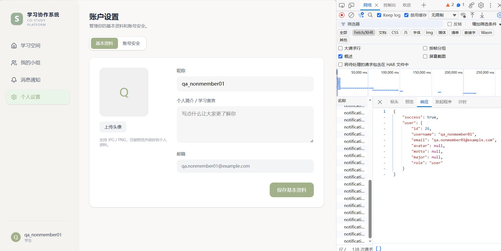

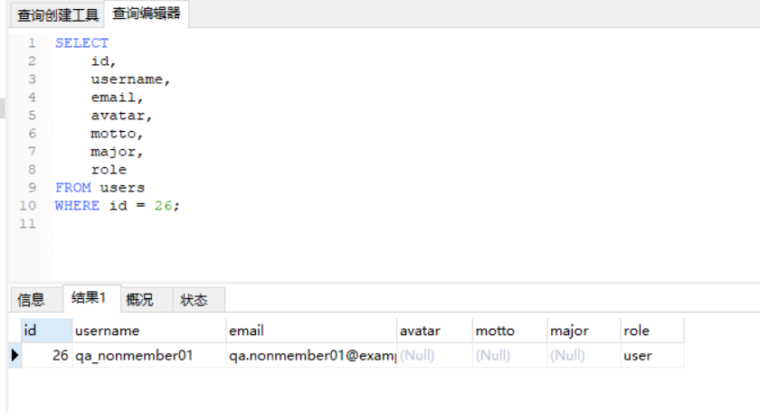

### 4.2 PROF-002：资料修改、前端同步与持久化 — Pass

C将昵称临时修改为 `qa_nonmember01_tmp`，简介修改为 `PROF-002 profile update test`，并上传测试头像。资料与头像保存请求均返回200；Sidebar、localStorage、刷新后的页面和SQL均反映最新值。

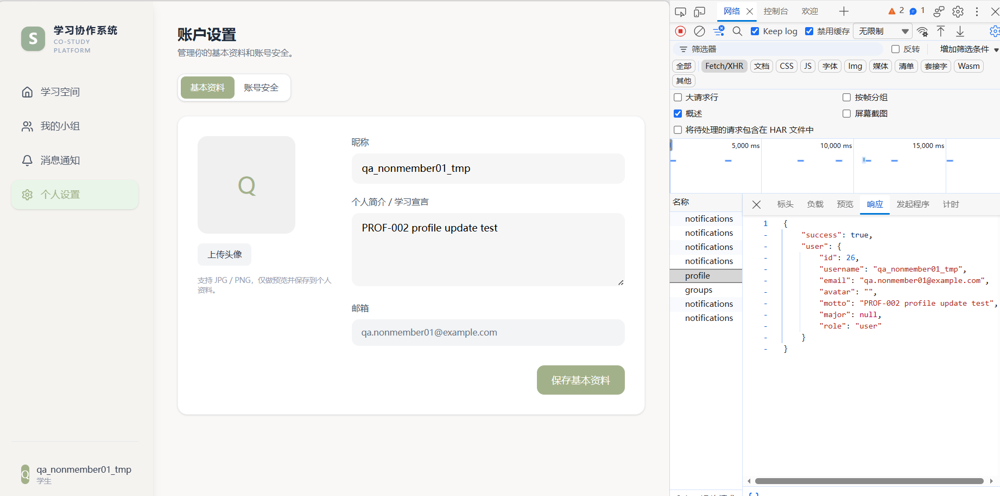

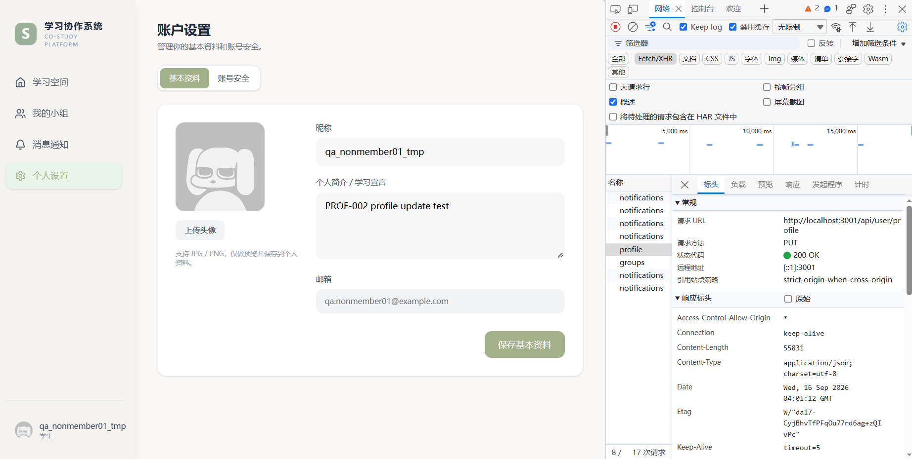

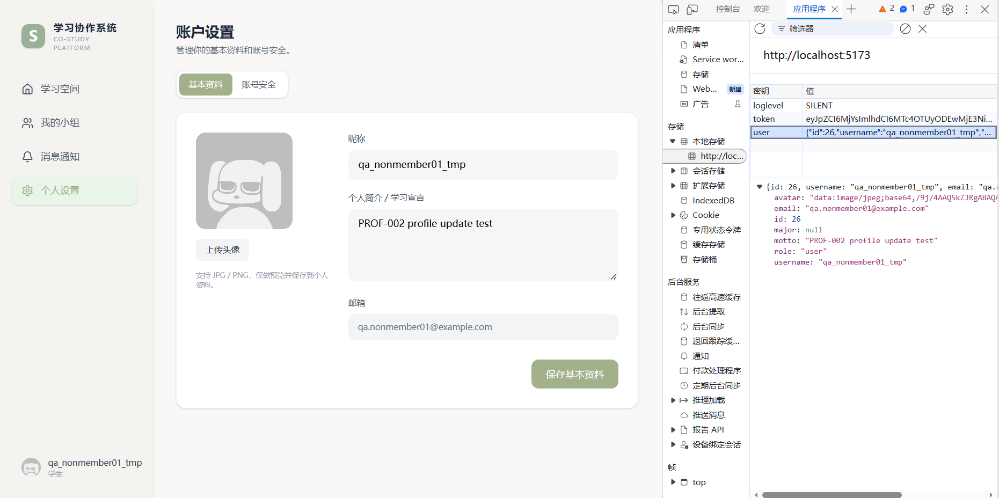

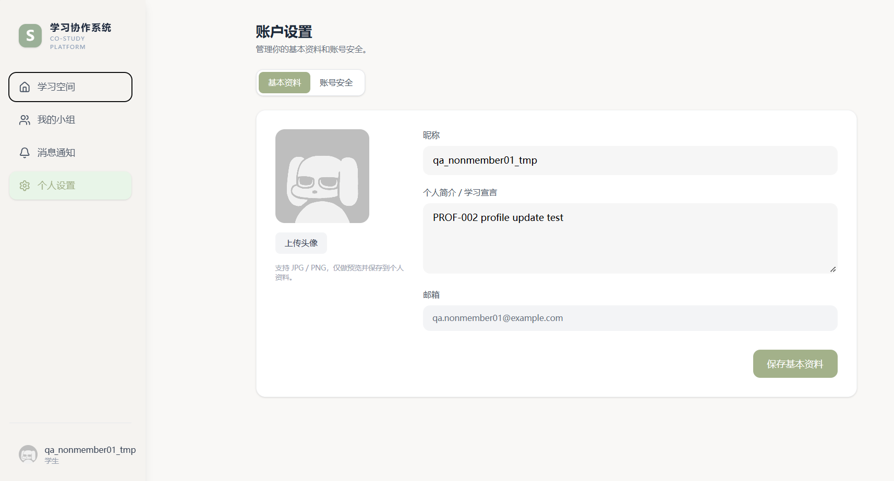

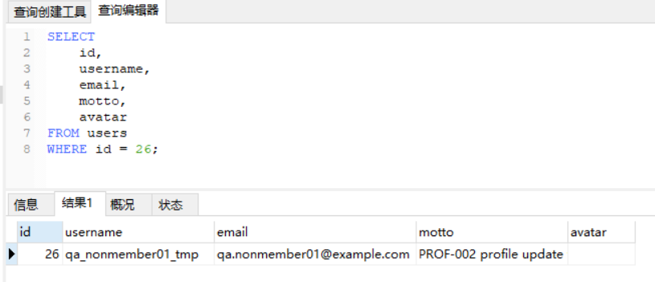

测试结束后，昵称、简介和头像均恢复为原始基线。

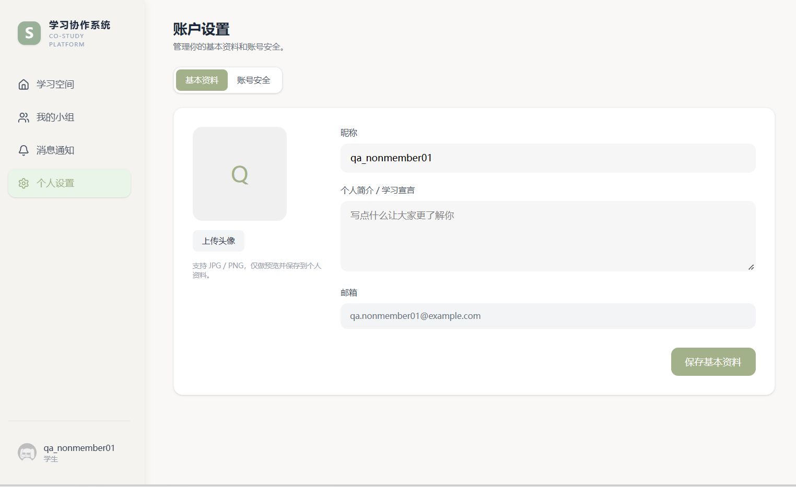

### 4.3 PROF-003：空昵称与重复用户名 — Pass

- 昵称只输入空格时，页面提示“昵称不能为空”，未发送PUT请求。
- 使用已存在用户名 `qa_user01` 时，PUT返回409 Conflict。
- C的用户名没有被错误修改。

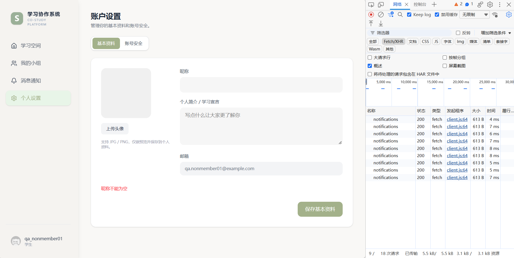

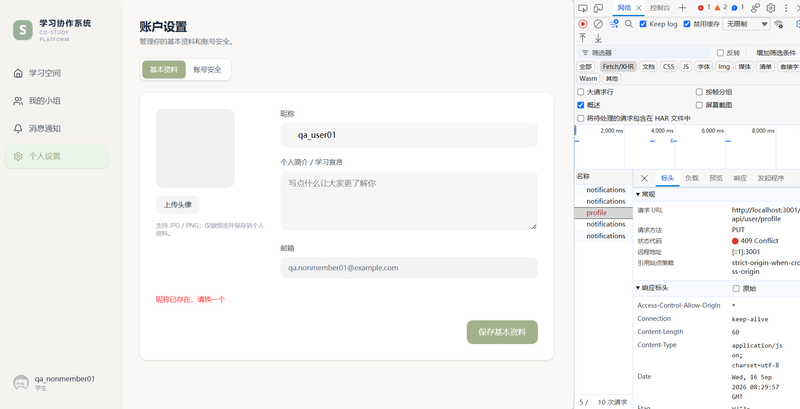

### 4.4 PROF-004：当前用户权限与 user_id 伪造 — Pass

C使用自己的 token 调用 `PUT /api/users/21`，接口返回403。随后向 `/api/user/profile` 请求体加入伪造的 `user_id=21`，后端没有采用该字段；SQL确认A和C均未发生越权修改。

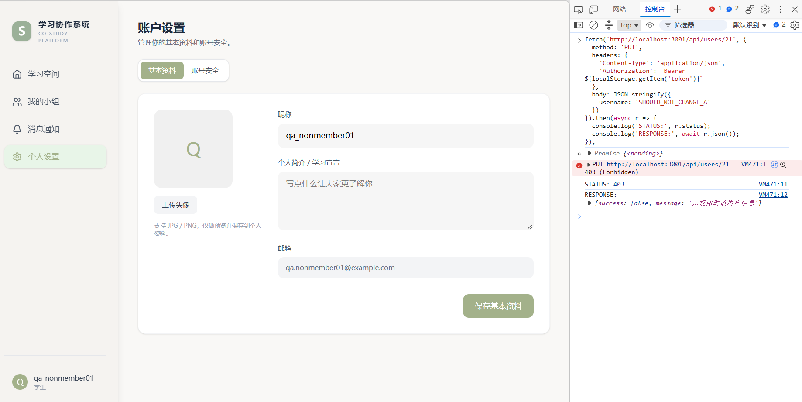

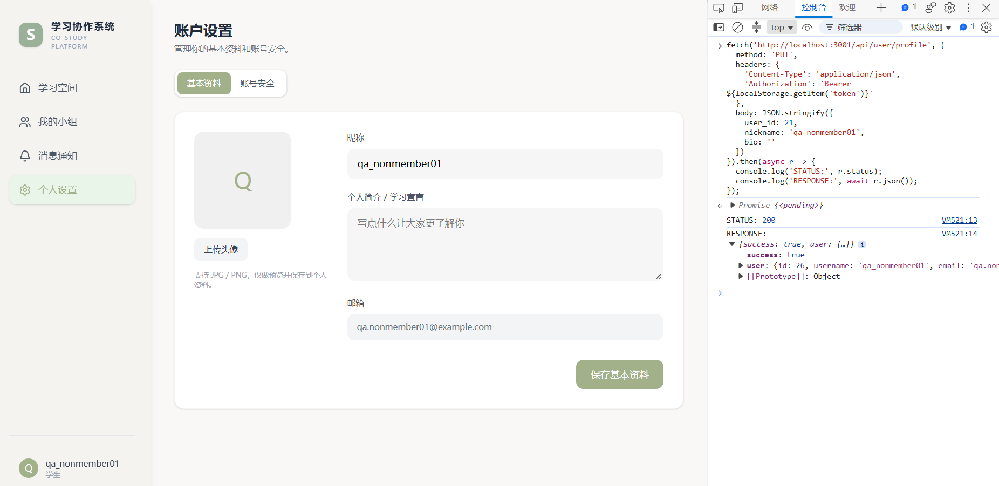

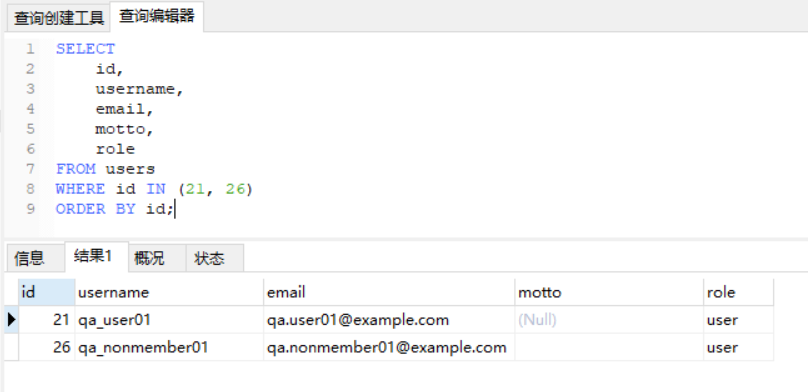

### 4.5 PROF-005：旧接口邮箱校验与错误状态码 — Fail

直接调用旧 `PUT /api/users/26` 接口提交 `not-an-email`：

- 接口返回200和 `success:true`；
- SQL确认非法邮箱真实写入 `users` 表；
- 测试后已恢复为 `qa.nonmember01@example.com`。

继续提交已被A使用的 `qa.user01@example.com`：

- 数据库唯一约束阻止写入；
- 接口却返回HTTP 200、`success:false` 和“服务器错误”；
- C的邮箱没有被重复值覆盖。

非法邮箱部分与 REGISTER-010 同为后端缺少邮箱格式校验，扩展已有 BUG-LR-003；重复邮箱的HTTP状态码语义单独记录为 BUG-PROF-001。

### 4.6 PWD-001：前端密码规则 — Pass

新密码少于4位、两次新密码不一致时，页面均直接提示并阻止提交，Network中没有新增PUT请求。

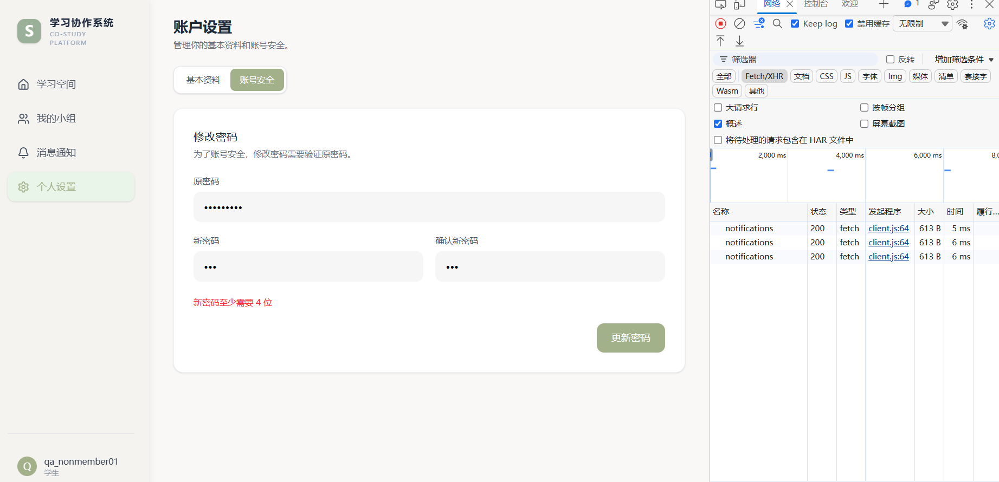

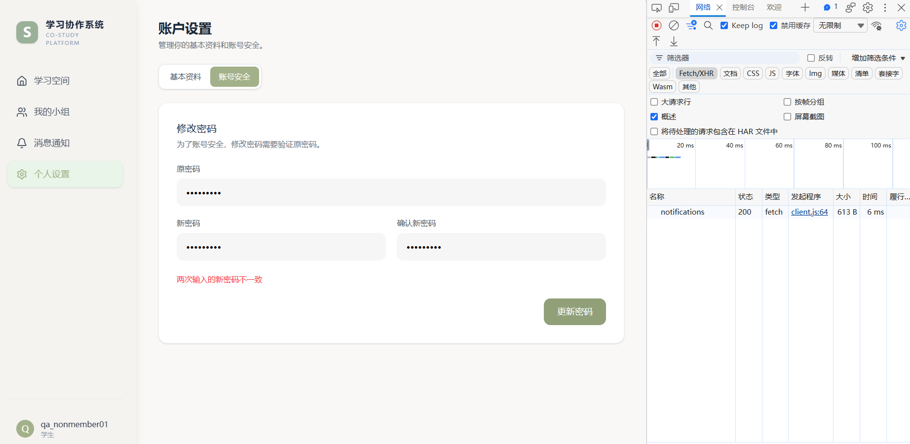

### 4.7 PWD-002：错误原密码 — Pass

提交错误原密码和合法新密码时，`PUT /api/user/profile` 返回400，页面提示“原密码不正确”，账号密码没有改变。

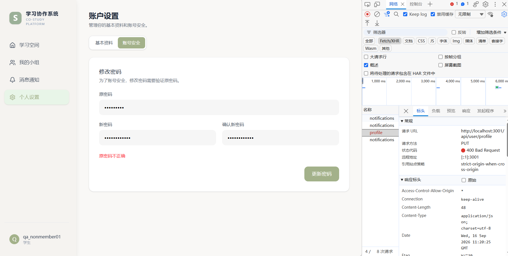

### 4.8 PWD-003：正常修改密码并恢复 — Pass

C使用正确原密码将密码临时修改为专用测试密码，PUT返回200。随后验证旧密码登录失败、新密码登录成功；测试结束时再次通过正常流程恢复原密码，并确认原密码可以登录。

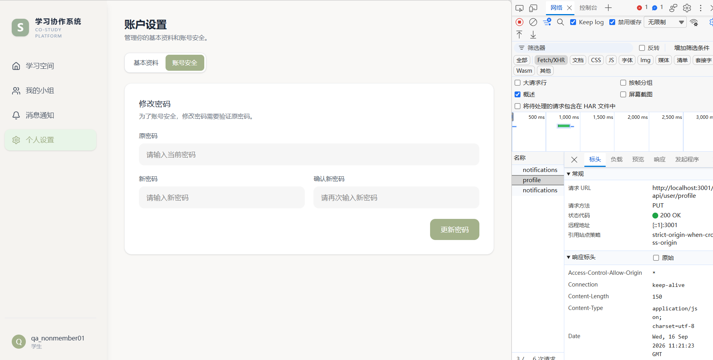

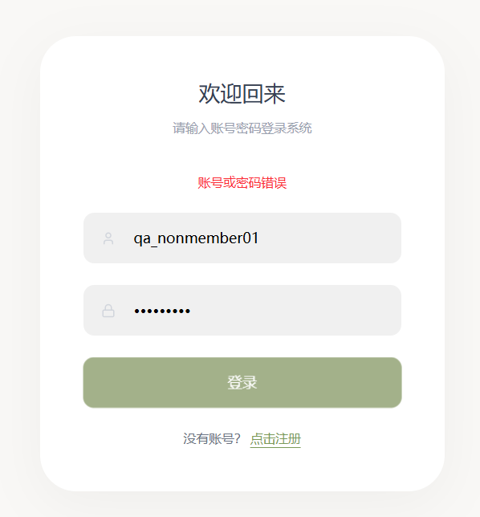

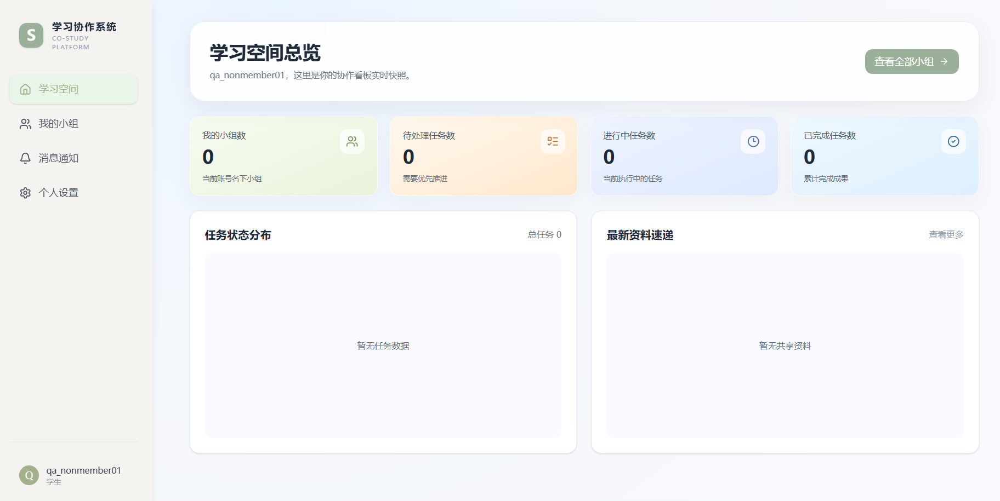

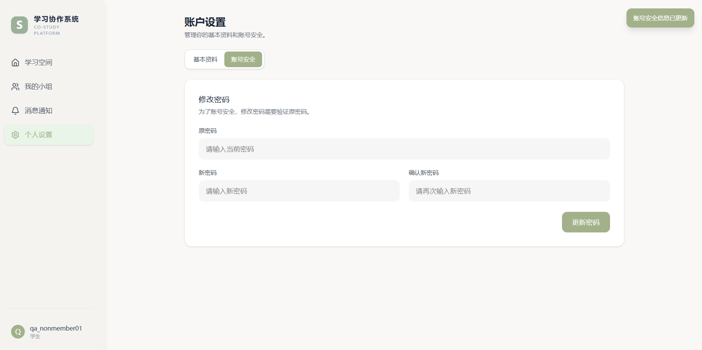

### 4.9 PWD-004：改密前 token 仍有效 — Risk

保留密码修改前签发的 token。密码修改成功后继续使用该 token 请求 `GET /api/user/profile`，接口返回200和 `success:true`。当前需求没有明确要求改密后注销全部旧会话，因此记录为 RISK-PROF-001，不直接判 Bug。

### 4.10 PWD-005：接口接受1位新密码 — Fail

绕过页面直接请求 `PUT /api/user/profile`，后端接受1位新密码并返回200；使用该密码可以实际登录。该结果证明后端没有执行页面已有的“至少4位”规则，与 REGISTER-011 属于同一根因，因此扩展 BUG-LR-002，不重复新增缺陷。

测试后已恢复原密码，并再次确认原密码可以登录。

## 5. 缺陷与风险归类

| 记录 | 性质 | 关联场景 | 处理方式 |
| --- | --- | --- | --- |
| BUG-LR-002 | 已确认缺陷 | REGISTER-011、PWD-005 | 扩展影响范围：注册和个人改密接口均缺少后端最小长度校验 |
| BUG-LR-003 | 已确认缺陷 | REGISTER-010、PROF-005 | 扩展影响范围：注册和旧用户更新接口均可写入非法邮箱 |
| BUG-PROF-001 | 新增已确认缺陷 | PROF-005 | 旧用户资料接口数据库失败仍返回HTTP 200和笼统服务器错误 |
| RISK-PROF-001 | 新增风险候选 | PWD-004 | 改密后既有token仍有效，是否应撤销会话需要需求确认 |

本轮新增确认缺陷1个、风险候选1个；另外两个Fail分别扩展已有同根因缺陷，不重复计数。

## 6. 测试数据恢复

- C用户名已恢复为 `qa_nonmember01`；
- C邮箱已恢复为 `qa.nonmember01@example.com`；
- C的 `motto` 已恢复为空；
- C的 `avatar` 已恢复为空/默认；
- C密码已恢复为本轮开始前的测试密码，并确认可以正常登录；
- A用户 `qa_user01` 未被修改；
- 本轮没有修改业务代码或数据库结构。

## 7. 测试统计

### 7.1 个人资料与密码模块

| 状态 | 数量 | 占比 |
| --- | ---: | ---: |
| 实际执行场景 | 10 | 100% |
| Pass | 7 | 70% |
| Fail | 2 | 20% |
| Risk / 待确认 | 1 | 10% |

### 7.2 项目累计

| 测试报告 | 实际执行场景 | Pass | Fail | 需求待确认 / 风险候选 |
| --- | ---: | ---: | ---: | ---: |
| 登录注册 | 11 | 7 | 4 | 0 |
| 小组管理第一批 | 4 | 3 | 0 | 1 |
| 小组邀请与成员权限 | 8 | 7 | 0 | 1 |
| 任务管理 | 21 | 10 | 11 | 0 |
| 讨论与实时消息 | 13 | 8 | 5 | 0 |
| 文件上传、下载与资料共享 | 24 | 11 | 11 | 2 |
| 讨论区 `@` 提及补充 | 6 | 2 | 1 | 3 |
| 通知模块 | 10 | 8 | 1 | 1 |
| Dashboard 数据联动 | 9 | 9 | 0 | 0 |
| 个人资料与密码 | 10 | 7 | 2 | 1 |
| 管理员模块 | 8 | 5 | 2 | 1 |
| **累计** | **124** | **77** | **37** | **10** |

截至管理员模块完成，项目累计有21个已确认缺陷、1个业务规则缺口 / 可疑缺陷、9个需求待确认 / 风险候选，共31条问题记录。详情见 [`test-execution-admin.md`](./test-execution-admin.md)。

## 8. 本轮结论

个人资料正常读取、资料修改、页面与localStorage同步、刷新持久化、重复用户名处理、当前用户权限和正确/错误旧密码流程均符合预期。实际确认旧用户资料接口缺少邮箱格式校验且数据库错误状态码不规范，个人改密接口也可绕过前端设置1位密码。改密后旧token仍有效在需求明确前只记录风险。

所有临时资料和密码均已恢复，未修改或修复业务代码。
