# 任务管理模块测试执行报告

## 1. 测试范围

本报告只记录 2026-09-07 已实际执行并保留证据的任务管理测试。测试覆盖小组任务新增、三种状态流转、普通成员协作、非成员越权、输入校验、页面与数据库一致性，以及管理员任务监管权限。

- 目标小组：group 31（`qa_group01`）
- 保留的基线任务：task 44（`测试任务01`）
- 三种真实状态值：`待处理`、`进行中`、`已完成`
- 测试角色：A 组长 `qa_user01`（id 21）、B 普通成员 `demo_user`（id 20）、C 非成员 `qa_nonmember01`（id 26）、D 管理员 `admin`（id 3）
- 执行方式：页面手工操作、浏览器 DevTools 请求检查、只读 SQL 校验
- 本报告不把未执行的源码风险或只有 UI、缺少必要 API 证据的操作计入正式统计。

管理员登录凭据不写入公开测试文档；报告只记录角色与实际授权结果。

## 2. 执行环境

| 项目 | 环境 |
| --- | --- |
| 操作系统 | Windows |
| 前端 | React + Vite，`http://localhost:5173` |
| 后端 | Node.js + Express，`http://localhost:3001` |
| 数据库 | 本地 MySQL |
| 浏览器与工具 | Chromium 内核浏览器、DevTools Network/Console、SQL 查询工具 |
| 代码基线 | `clean-main`；测试开始前已确认与 `origin/main` 业务代码一致 |

## 3. 本轮结果总览

TASK-013 的 A～F 是六个独立请求和独立判定，因此分别计入执行场景。TASK-012 同时检查了页面空值拦截和接口纯空格输入，但按原测试设计整体计为一条；由于接口仍接受纯空格并写入数据库，整体判定为 Fail。

| 场景 | 测试内容 | 角色 | 结果 | 关联问题 |
| --- | --- | --- | --- | --- |
| TASK-001 | 正常新增待处理任务 | A 组长 | Pass | — |
| TASK-002 | 待处理拖动至进行中 | A 组长 | Pass | — |
| TASK-003 | 进行中拖动至已完成 | A 组长 | Pass | — |
| TASK-004 | 普通成员拖动公共任务 | B 成员 | Pass | — |
| TASK-005 | 普通成员创建并删除任务 | B 成员 | Pass | — |
| TASK-006 | 非成员读取 group 31 任务 | C 非成员 | Fail | BUG-TASK-001 |
| TASK-007 | 非成员向 group 31 创建任务 | C 非成员 | Fail | BUG-TASK-001 |
| TASK-008 | 非成员修改 task 44 | C 非成员 | Fail | BUG-TASK-001 |
| TASK-009 | 非成员删除 group 31 任务 | C 非成员 | Fail | BUG-TASK-001 |
| TASK-010 | 普通接口不传 group_id 获取全站任务 | C 非成员 | Fail | BUG-TASK-001 |
| TASK-011 | POST/PUT 使用非法 status | C 非成员 | Pass | — |
| TASK-012 | 空内容与纯空格内容 | A 组长 / 接口 | Fail | BUG-TASK-002 |
| TASK-013-A | 新建任务缺少 status | A 组长 / 接口 | Pass | — |
| TASK-013-B | 新建任务缺少 content | A 组长 / 接口 | Fail | BUG-TASK-003 |
| TASK-013-C | 新建任务缺少 group_id | A 组长 / 接口 | Fail | BUG-TASK-003 |
| TASK-013-D | PUT 不存在 task id | 已登录用户 | Fail | BUG-TASK-003 |
| TASK-013-E | DELETE 不存在 task id | 已登录用户 | Fail | BUG-TASK-003 |
| TASK-013-F | group_id 使用非法字符串 | 已登录用户 | Fail | BUG-TASK-004 |
| TASK-014 | 小组看板、全局任务、控制台与 SQL 一致 | A 组长 | Pass | — |
| TASK-015 | 管理员查看、编辑、删除全站任务 | D 管理员 | Pass | — |
| TASK-016 | 普通用户访问管理员任务接口 | B 成员 | Pass | — |

| 状态 | 数量 | 占比 |
| --- | ---: | ---: |
| 实际执行场景 | 21 | 100% |
| Pass | 10 | 47.6% |
| Fail | 11 | 52.4% |
| 需求待确认 / 风险候选 | 0 | 0% |

本轮任务模块共有 50 张正式证据截图，均位于 `docs/screenshots/` 并在本报告中引用。整理完成时，整个截图目录共有 78 张图片。

## 4. 详细执行结果与证据

### TASK-001：正常新增待处理任务 — Pass

- A 在 group 31 任务看板输入任务内容并选择“待处理”。
- 页面新增成功，任务出现在待处理列；创建请求成功。

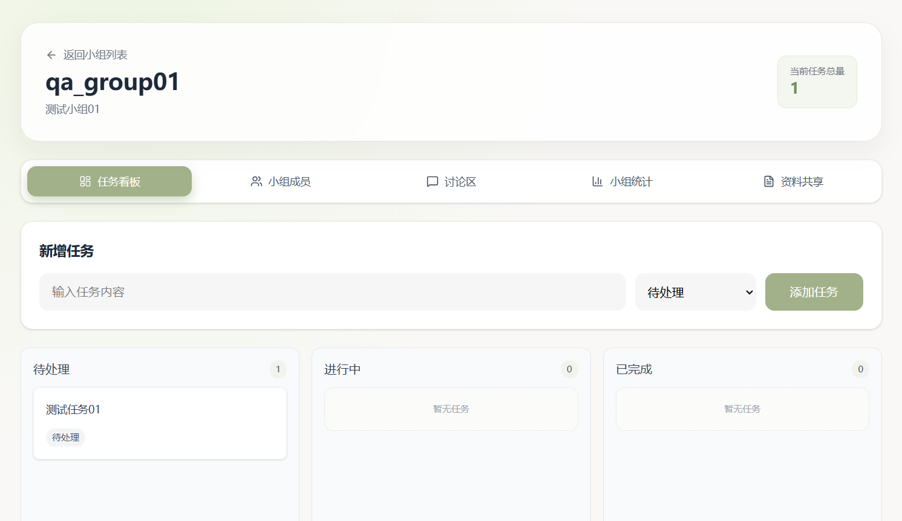

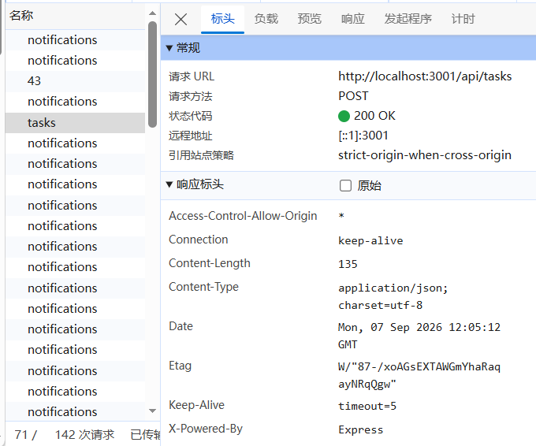

### TASK-002：待处理 → 进行中 — Pass

- A 将 TASK-001 的任务从“待处理”拖到“进行中”。
- 页面列位置随之更新，状态更新请求成功。

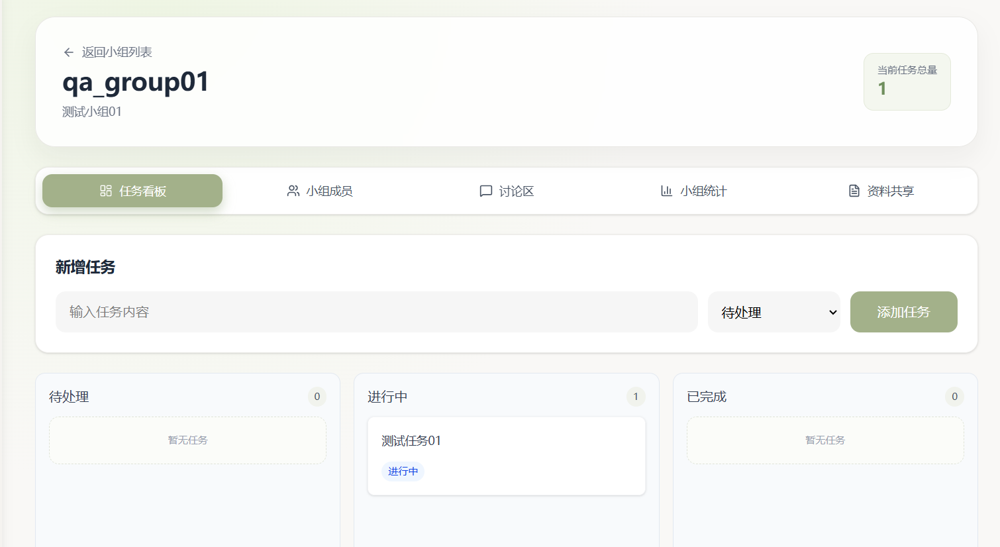

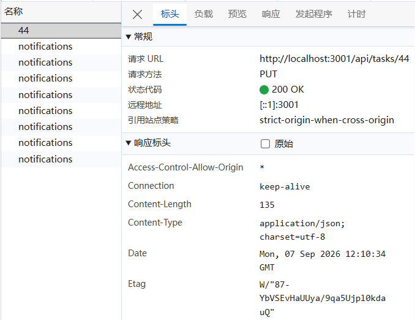

### TASK-003：进行中 → 已完成 — Pass

- A 将同一任务从“进行中”拖到“已完成”。
- 页面列位置随之更新，状态更新请求成功。

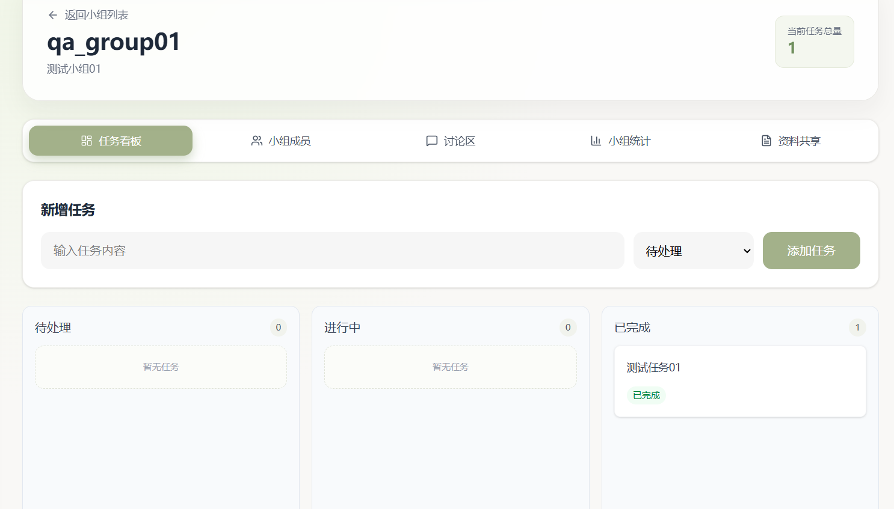

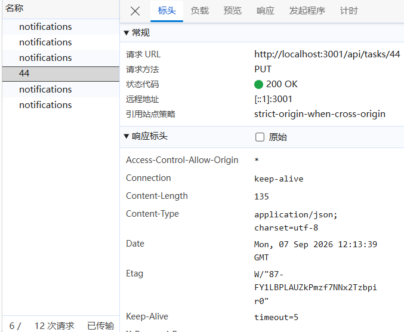

### TASK-004：普通成员拖动公共任务 — Pass

- B 已是 group 31 的普通成员。
- B 在共享任务看板拖动任务，接口返回 200；SQL 查询确认状态与页面一致。
- 说明普通成员协作修改公共任务状态是当前系统实际支持的正常业务。

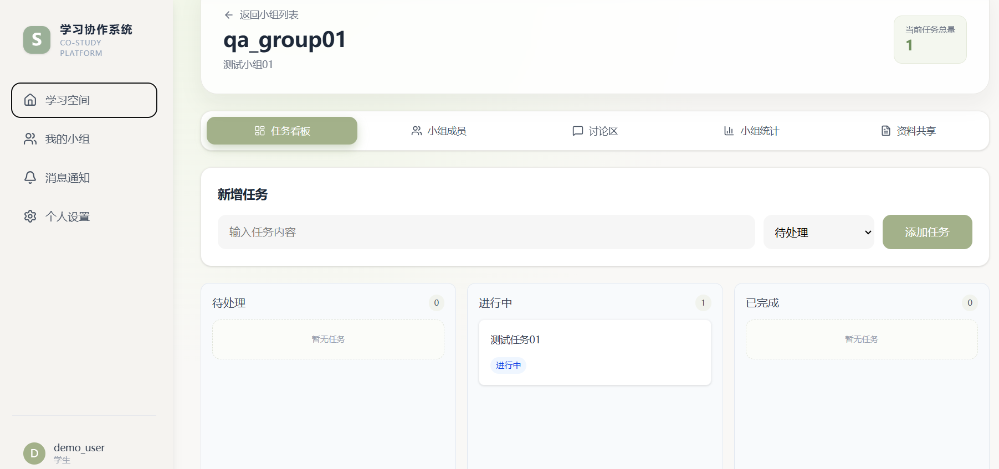

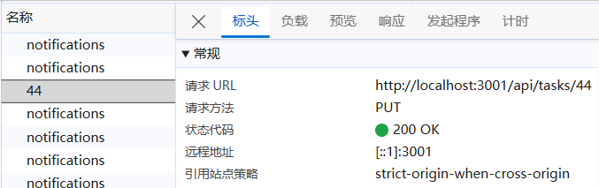

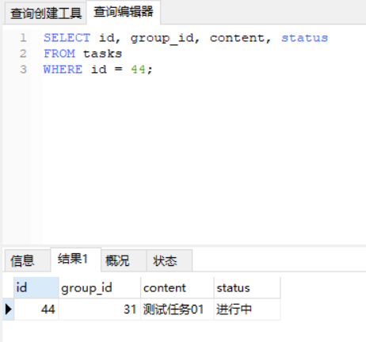

### TASK-005：普通成员创建并删除任务 — Pass

- B 在 group 31 创建任务，接口返回 200，页面显示新任务，SQL 确认生成 task 45。
- B 随后删除该任务，接口返回 200，SQL 确认 task 45 已不存在。
- 当前系统允许普通小组成员创建和删除小组公共任务。

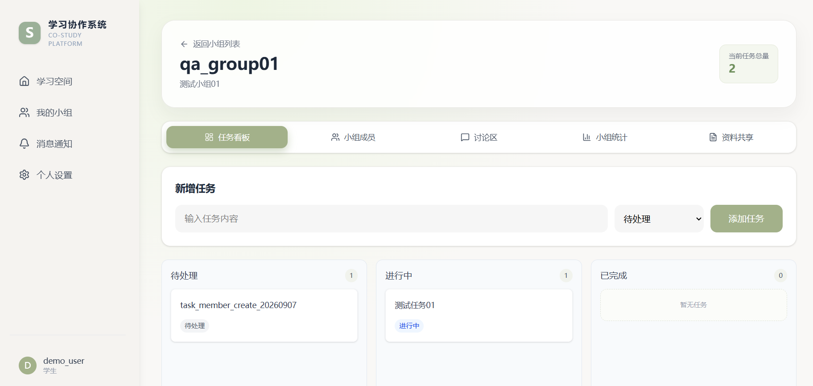

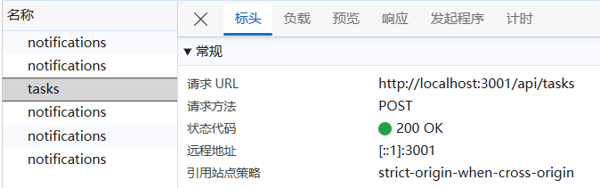

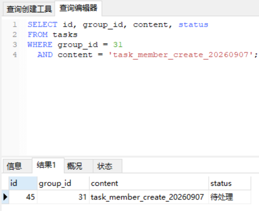

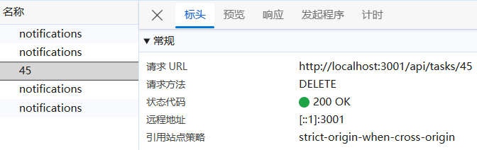

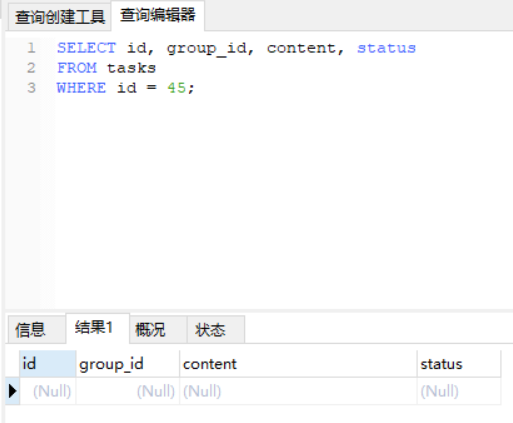

### TASK-006：非成员读取 group 31 任务 — Fail

- SQL 先确认 C 不属于 group 31。
- C 直接请求 `GET /api/tasks?group_id=31`，接口仍返回 200 和该组任务。
- 预期：非成员不应读取目标小组任务，应返回 403 或不暴露数据。

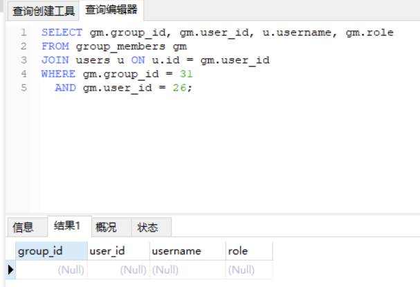

### TASK-007：非成员向 group 31 创建任务 — Fail

- C 直接向普通任务接口提交 group 31 和内容 `task_cross_create_20260907`。
- 接口返回 200、`success: true` 并生成 task 48；SQL 确认记录真实落库。
- 预期：后端应验证调用者属于目标小组并拒绝非成员创建。

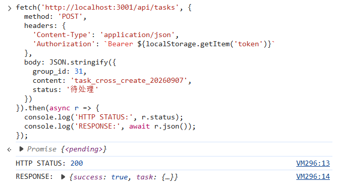

### TASK-008：非成员修改 task 44 — Fail

- C 已知 task 44 后直接提交状态更新请求。
- 接口返回 200、`success: true`；SQL 确认 task 44 被更新为“已完成”。
- 预期：后端应先按 task 所属小组验证成员关系，非成员应返回 403。

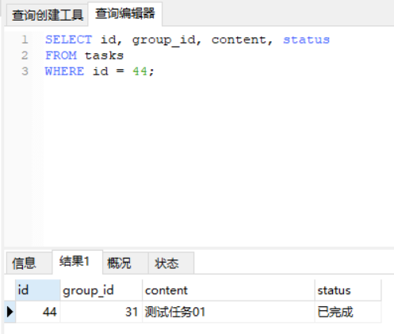

### TASK-009：非成员删除 group 31 任务 — Fail

- A 创建用于删除权限验证的 task 49，C 随后凭已知 id 直接删除。
- 删除接口返回 200、`success: true`；SQL 确认 task 49 已不存在。
- 预期：非成员不能删除目标小组任务，应返回 403。

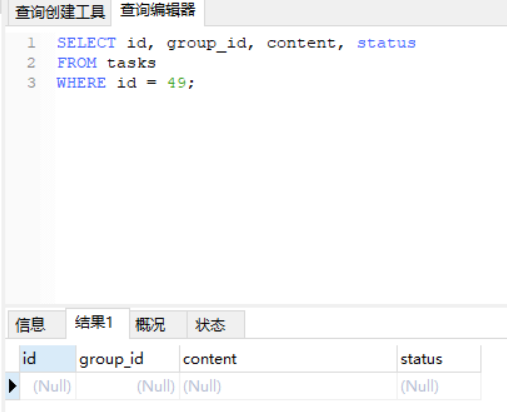

### TASK-010：不传 group_id 获取全站任务 — Fail

- C 请求 `GET /api/tasks`，接口返回 200 和 21 条任务。
- SQL 对照显示全站任务数为 21，而 group 31 只有 4 条。
- 预期：普通用户接口只能返回其创建或加入小组的任务，不应因缺少 group_id 而返回全站数据。

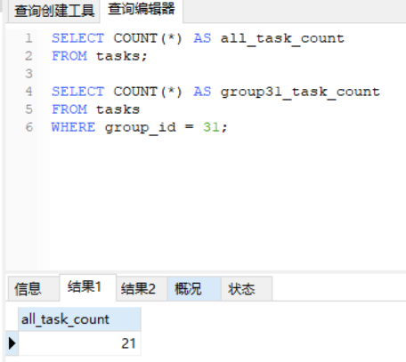

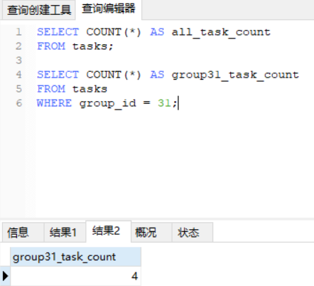

### TASK-011：非法 status — Pass

- POST 新建和 PUT 修改分别使用不属于三种状态的非法值。
- 两个请求均返回 400；SQL 确认没有非法状态任务，原 task 44 状态未被非法值改变。

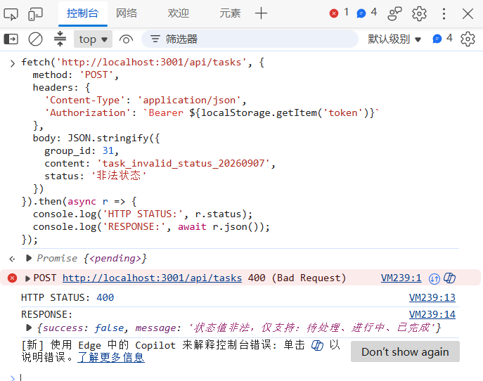

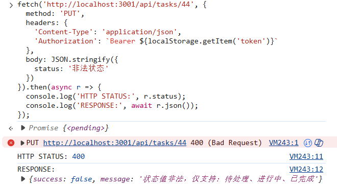

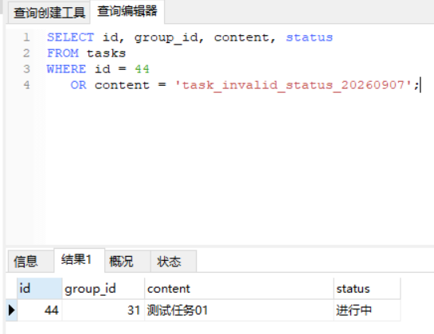

### TASK-012：空内容与纯空格内容 — Fail

- 页面空内容提交被前端阻止，没有产生新请求，该子检查符合预期。
- 绕过页面直接向接口提交纯空格内容时，接口返回 200、`success: true`，生成 task 46；SQL 确认纯空格已落库。
- 因后端可被绕过，TASK-012 整体判定为 Fail。

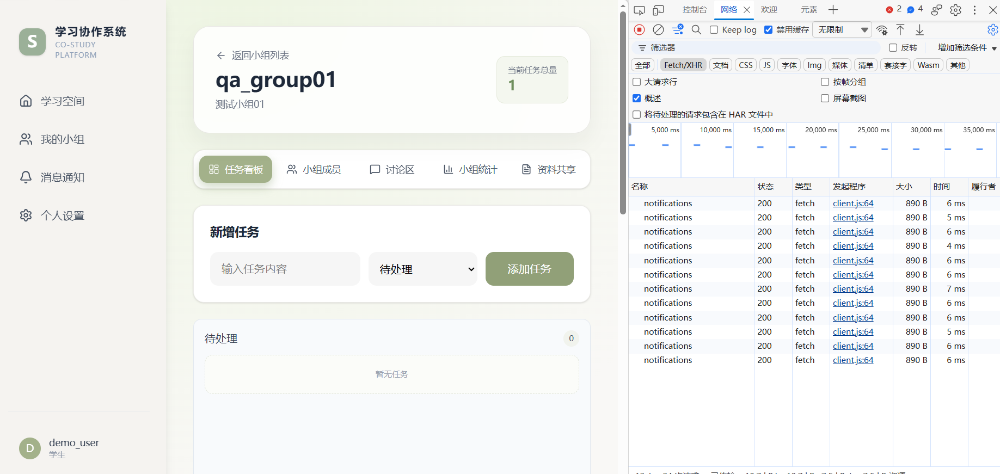

### TASK-013-A：缺少 status — Pass

- 创建任务时不提供 status，接口返回 200、`success: true`。
- SQL 确认生成 task 47，数据库默认状态为“待处理”。
- 该结果符合 tasks 表的默认值设计。

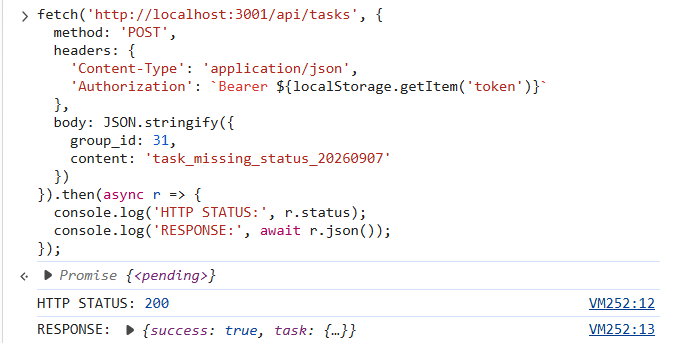

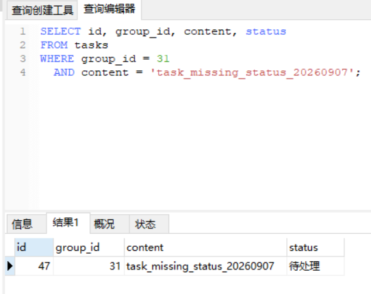

### TASK-013-B：缺少 content — Fail

- 接口使用 HTTP 200 返回 `success: false`。
- 预期：请求参数缺失属于客户端输入错误，应返回 400。

### TASK-013-C：缺少 group_id — Fail

- 接口使用 HTTP 200 返回 `success: false`。
- 预期：请求参数缺失应返回 400。

### TASK-013-D：PUT 不存在 task id — Fail

- 修改 task 999999 时，接口使用 HTTP 200 返回 `success: false`。
- 预期：不存在的资源应返回 404。

### TASK-013-E：DELETE 不存在 task id — Fail

- 删除 task 999999 时，接口使用 HTTP 200 返回 `success: false`。
- 预期：不存在的资源应返回 404。

### TASK-013-F：group_id 非法类型 — Fail

- 新建任务时提交字符串 `abc` 作为 group_id。
- 接口使用 HTTP 200 返回 `success: false`，并把 MySQL 的列名和数据类型错误文本返回给客户端。
- 预期：后端应在访问数据库前校验类型并返回 400，不应暴露底层数据库错误。

### TASK-014：跨页面与 SQL 数据一致性 — Pass

- group 31 在小组看板、全局任务中心和个人控制台均显示总任务 4：待处理 3、进行中 0、已完成 1。
- SQL 分组统计与三个页面一致。

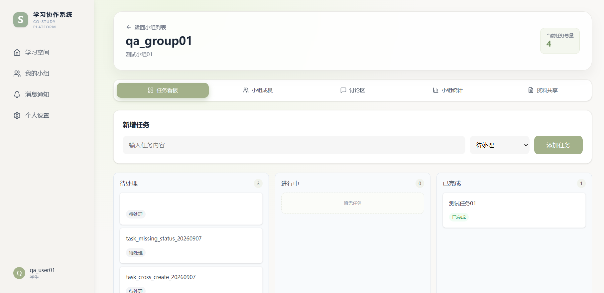

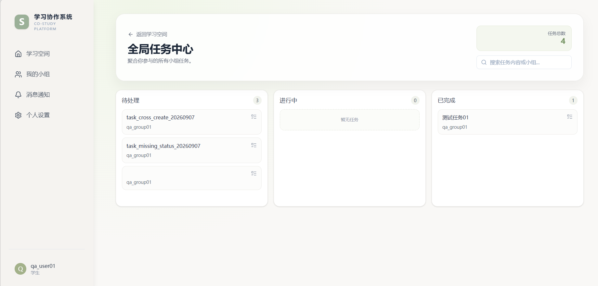

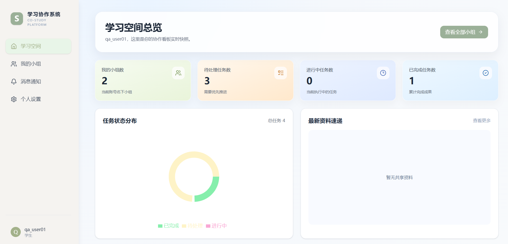

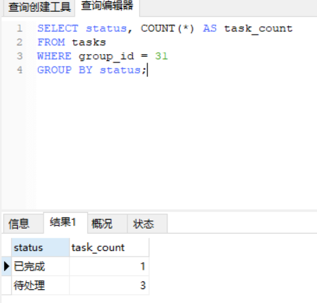

### TASK-015：管理员任务监管 — Pass

- D 登录管理员端后可以打开全站任务监管页面。
- `GET /api/admin/tasks` 返回 200；页面显示全站任务。
- 管理员将测试 task 50 从“待处理”改为“已完成”，PUT 返回 200，SQL 状态同步。
- 管理员随后删除 task 50，DELETE 返回 200，SQL 确认记录不存在。

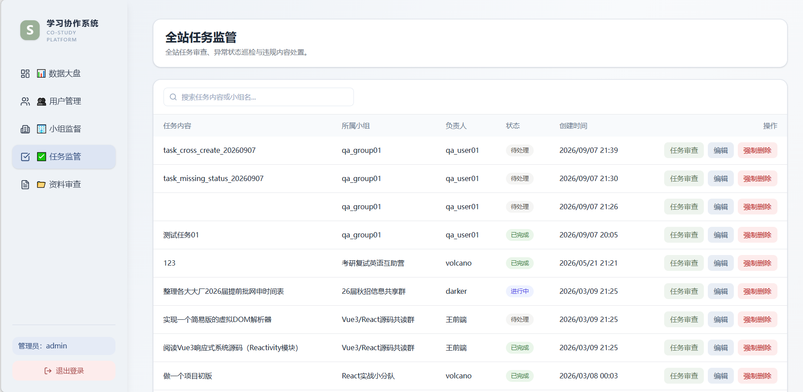

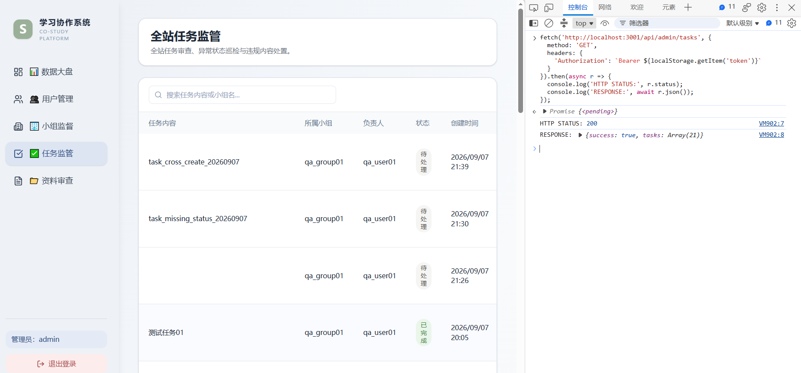

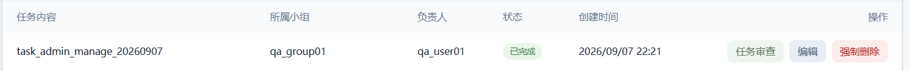

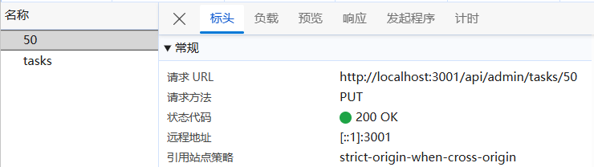

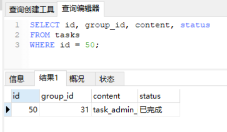

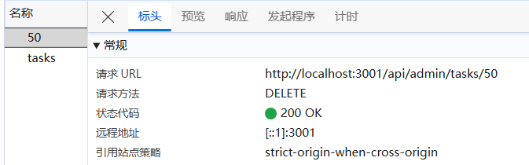

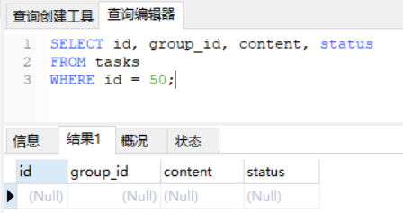

### TASK-016：普通用户访问管理员任务接口 — Pass

- B 使用普通成员账号直接请求 `GET /api/admin/tasks`。
- 接口返回 403，响应提示仅管理员可执行该操作；没有进入管理员任务数据。

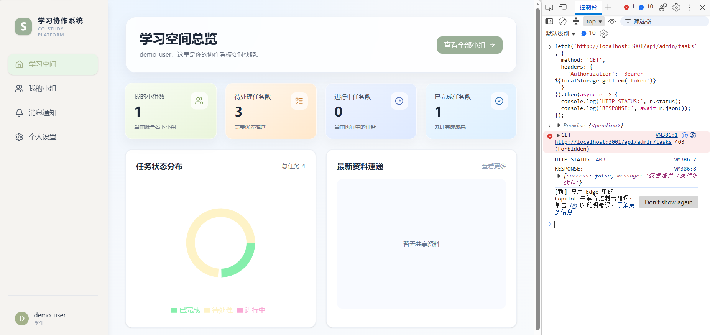

## 5. 已确认缺陷映射

| 缺陷 | 实际证据 | 核心影响 |
| --- | --- | --- |
| BUG-TASK-001 普通任务接口缺少小组成员权限校验 | TASK-006～TASK-010 | 任意已登录用户可能读取全站或指定组任务，并跨组创建、修改、删除任务 |
| BUG-TASK-002 后端允许纯空格任务内容 | TASK-012 | 可绕过页面校验写入无有效内容的任务 |
| BUG-TASK-003 普通任务接口错误状态码语义不正确 | TASK-013-B～E | 参数缺失和资源不存在均返回 HTTP 200，调用方难以可靠判断错误 |
| BUG-TASK-004 非法 group_id 未提前校验并暴露数据库错误 | TASK-013-F | 客户端收到数据库内部错误文本，且 HTTP 状态码仍为 200 |

完整复现步骤和影响见 [`bug-report.md`](./bug-report.md)。

## 6. 测试数据收尾

在保留测试证据后，已按已知测试数据范围清理本轮临时任务：

- 已删除：task 46（纯空格内容）、task 47（`task_missing_status_20260907`）、task 48（`task_cross_create_20260907`）。
- 已确认先前不存在：task 45、task 49、task 50，它们已在对应正式测试中删除。
- 已保留：task 44（`测试任务01`），当前状态为“已完成”。
- 清理后 group 31 只保留 task 44；没有删除其他小组或未知业务任务。

截图仍保留测试发生时的真实数据库状态，因此清理临时数据不会改变测试结论。

## 7. 项目累计执行统计

| 测试报告 | 实际执行场景 | Pass | Fail | 需求待确认 / 风险候选 |
| --- | ---: | ---: | ---: | ---: |
| 登录注册 | 11 | 7 | 4 | 0 |
| 小组管理第一批 | 4 | 3 | 0 | 1 |
| 小组邀请与成员权限 | 8 | 7 | 0 | 1 |
| 任务管理 | 21 | 10 | 11 | 0 |
| 讨论与实时消息 | 13 | 8 | 5 | 0 |
| **累计** | **57** | **35** | **20** | **2** |

截至讨论与实时消息模块测试完成，项目累计记录10个已确认缺陷，以及2个需求待确认 / 风险候选。讨论模块执行详情见 [`test-execution-discussions.md`](./test-execution-discussions.md)。

## 8. 本轮结论

任务三状态流转、普通成员协作、状态枚举校验、跨页面统计一致性和管理员接口角色限制均已得到实际证据。任务模块最主要的问题是普通任务 API 只要求登录，没有验证调用者与目标小组的成员关系；该问题已经通过跨组读取、创建、修改、删除和无范围列表五种操作实际复现。输入层面还确认了纯空格内容落库、错误场景继续返回 HTTP 200，以及非法 group_id 暴露数据库错误。

本轮未改动业务代码、未修复缺陷，也未把未执行的源码风险计入测试结果。
